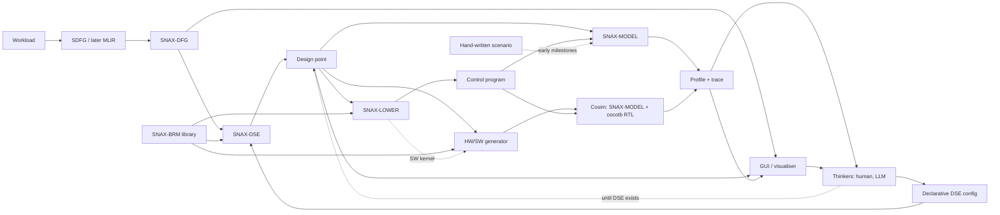

# SNAX-FORGE Architecture (Skeleton v1.1)

> This is the main skeleton of SNAX-FORGE: what the system is, its components,
> their contracts, and the order in which they are built. It is expected to
> evolve. Changes are recorded in the Decision Log (section 10) rather than by
> silently editing sections.
>
> Markers: **[OPEN]** = undecided. **[DEFAULT]** = working assumption, adopted
> unless a real kernel shows otherwise.
>
> Task-level breakdown, dependencies and acceptance criteria live in
> `docs/STATUS.md`.

---

## 1. Purpose

SNAX-FORGE is a platform for exploring how domain-specific accelerators perform
when plugged into a SNAX compute cluster, before committing to RTL.

A user brings a workload and a set of accelerator models. SNAX-FORGE maps the
workload onto a configurable model of the cluster, runs it in a fast
cycle-level Python simulation, and returns profiles, traces and visualisations.
A human or an LLM uses these to decide the next design iteration. The chosen
design can then be generated as hardware and software and checked against real
RTL through cosimulation.

The goal is insight into how to design domain-specific accelerators for compute
clusters: where cycles are lost, which banks conflict, which accelerators
starve, and what a design change actually buys.

## 2. Positioning

SNAX-FORGE is complementary to analytical design-space exploration frameworks
such as ZigZag and Stream (KU Leuven MICAS). What distinguishes it:

- **Cycle-level cluster microarchitecture.** Bank arbitration, affine
  streamers, FIFO back-pressure, DMA and register-level control are modelled
  explicitly rather than abstracted into analytical cost terms.
- **Arbitrary dataflow graphs**, not only DNN layers: PolyBench-style kernels,
  stencils, reductions, and later HDC workloads.
- **RTL-backed accelerator models.** Every block model has a hardware binding,
  and the model is checked against real RTL through cosim.
- **A shared task sequence.** The same lowering logic drives both the model and
  the real hardware.
- **Human- and LLM-in-the-loop by design.** All artefacts are text-based and
  self-describing.

[OPEN] Refine this positioning with the ZigZag/Stream authors' view, and decide
whether SNAX-FORGE can consume or produce their formats.

## 3. Guiding Principles

1. **Model first.** Python models are the primary artefact; hardware is
   generated from, or checked against, them. SNAX-MODEL is built before the
   components that feed it, and their contracts follow from what it needs
   (D24, D26).
2. **One slice before generality.** Every component is first built in the
   simplest form that carries `vecadd` end to end, then generalised only when a
   real kernel requires it. SNAX-MODEL is kernel-agnostic by construction: it
   only executes control programs (D6, D11).
3. **Anchor to reality early.** The model's cycle counts are validated against
   real SNAX RTL on a simple kernel before the design space is explored at
   scale (section 7).
4. **Decisions are separate from derivations.** SNAX-DSE decides; SNAX-LOWER
   derives command sequences; SNAX-MODEL measures. No stage does another's job.
5. **Everything is text and diffable.** SNAX-DFG, BRMs, configs, design points,
   control programs, scenarios, profiles and traces are serialised,
   versionable and readable by humans and LLMs.
6. **Extend without editing the core.** New node kinds, attributes and
   accelerator models are added by registration, not by changing core classes.

## 4. System Overview

**Inner loop** (core, Python only):
DFG → DSE → LOWER → MODEL → feedback → thinkers → config → DSE.

Until SNAX-DSE exists, thinkers close the loop by editing the design point
directly (D27).

**Outer path** (commit and check): HW/SW generator → cosim → feedback.

## 5. Components and Contracts

Each component is defined by what it consumes and what it produces. The
artefacts between components are the contracts and must stay stable and
versioned. Until the contract freeze (M6), contracts are Python dataclasses
with plain JSON files; versioned schemas follow once two kernels have used them
(D26).

| Component | Consumes | Produces |
|---|---|---|
| Workload analysis | workload via SDFG (later MLIR) | SNAX-DFG |
| SNAX-BRM library | user-supplied block models | BRMs |
| SNAX-DSE | SNAX-DFG, BRMs, DSE config | design point |
| SNAX-LOWER | design point, BRMs | control program (later also C kernel) |
| SNAX-MODEL | design point, control program (or a scenario) | profile, trace, output data |
| Reference executor | SNAX-DFG, input data | golden output data |
| Visualiser | SNAX-DFG, design point, profile, trace | HTML views |
| HW/SW generator | design point, BRMs, SNAX-LOWER | accelerator RTL, SW kernel |
| Cosim | design point, control program, RTL | profile, trace, mismatch report |

### 5.1 SNAX-DFG

SNAX-FORGE's own serialisable dataflow graph (JSON or equivalent), independent
of DaCe classes.

- **SDFG-inspired base** so SDFG → SNAX-DFG translation is direct: data
  containers, compute nodes, map/loop scopes with symbolic ranges, memlets
  (data-movement edges), and control/state ordering.
- **Coarse node kinds on top**, most importantly the *accelerated node*, which
  replaces a subgraph with a bound BRM instance. Replacement can be nested.
- **Extensibility [DEFAULT]:**
  - The core element schema is only `id`, `kind`, `inputs`, `outputs`, `attrs`.
  - Node kinds are registered entries (name, attribute schema, optional Python
    behaviour), never subclasses.
  - `attrs` uses namespaced keys (`loop.*`, `mem.*`, `hw.*`, `user.*`). Tools
    read the namespaces they know and pass the rest through untouched.
  - Each kind validates its own attributes against its registered schema.
- **Visualisable** before and after DSE.

### 5.2 Reference Executor [DEFAULT]

A small NumPy interpreter that executes a SNAX-DFG directly and produces the
golden output. SNAX-MODEL output (computed through each BRM's Python function)
and later cosim output are compared against it. DaCe's CPU reference is
optional.

### 5.3 SNAX-BRM: Block Runtime Model

The primary definition of an accelerator block, supplied by the user or taken
from the library. A BRM has six parts:

1. **Interface**: ports, direction, data types and widths, per-port element
   rate (elements consumed or produced per beat, so reductions and
   elementwise blocks share one interface, D25), CSR map, parameters (e.g.
   lanes `W`, trip count `T`), and interconnect ports needed per port.
2. **Dataflow**: per port, an exact affine loop nest giving the order in which
   elements are consumed or produced. Streamer configuration is derived from
   it. [OPEN] exact notation.
3. **Timing**: cycles as a function of parameters (latency `L`, initiation
   interval `II`, throughput per beat), analytic or measured from RTL; always
   user-supplied.
4. **Function**: a Python implementation that produces real output data.
5. **Pattern**: the SNAX-DFG subgraph shape the block can replace, with its
   predicate and parameter extraction.
6. **Hardware binding** (optional): how to obtain RTL, e.g. a Chisel generator
   with parameters, or hand-written SystemVerilog.

The interface, timing and function parts fill the accelerator interface that
SNAX-MODEL defines (section 5.6). A BRM is accepted when, plugged into the
model, it gives the same cycles and data as the matching generic stub.

The existing Chisel elementwise modules (loop, spatial, tiled-spatial) and the
accumulator are the reference implementations for the first BRMs.

### 5.4 SNAX-DSE: Design Space Exploration

SNAX-DSE only makes decisions. It never computes register values or command
sequences.

**Inputs**: SNAX-DFG, BRM library, declarative DSE config written by the
thinkers. [OPEN] config format (YAML, TOML or JSON) and whether one config
describes a single design point or a sweep.

**Decisions** (extensible):

- which subgraphs are replaced by which BRMs
- BRM parameters (lanes, tiling)
- accelerator instance count and concurrency
- chaining between accelerators
- buffer placement across banks, double buffering
- cluster parameters (section 5.6)

**Output: the design point**:

1. optimised SNAX-DFG
2. memory allocation plan (L1 addresses and banks, L2 addresses)
3. accelerator instances with BRM parameters
4. cluster configuration

Exploration is manual (config-driven) first. Automated search comes later.

### 5.5 SNAX-LOWER: Lowering

A separate step between SNAX-DSE and SNAX-MODEL, comparable to a compiler
backend. It turns a design point into a generated sequence of tasks. It:

- orders tasks by the dependencies and execution order of the optimised SNAX-DFG
- computes streamer registers from each BRM's per-port affine loop nest and the
  memory plan
- computes accelerator register values from BRM parameters
- inserts L2↔L1 DMA transfers required by the memory plan
- inserts a wait at every dependency crossing an accelerator or DMA boundary

**Output: the control program**, a JSON list of commands:

- `csr_write`
- `csr_read`
- `wait`, which either polls a block's `busy` register or blocks on its
  completion signal

There is no separate `start` or `dma` command: every block (streamer,
accelerator, DMA) is programmed through the uniform register interface
(section 5.6, D36), and writing 1 to its `start` register launches it
(D37).

Its first acceptance test is reproducing the hand-written `vecadd` scenario used
for the anchor (section 7).

**Later**, a C backend emits the SW library kernel for real hardware from the
same logic, so the model and the chip are driven by the same task sequence.
It maps the model's register blocks by name onto the real interfaces:
ReqRspManager CSRs for streamers and accelerators, iDMA instructions for the
DMA (open item 9).

### 5.6 SNAX-MODEL: Cluster Model

A pure-Python model of the SNAX cluster. There is no CPU; a controller executes
the control program through the register interface. The model has no knowledge
of kernels: it runs whatever the control program and cluster configuration
describe.

**Time model.** Cycle-level and event-driven. Each component with pending work receives a per-cycle tick, and cycle ranges with no pending work are skipped. Round-robin arbitration is resolved exactly. Each cycle runs in fixed phases (control, compute, request, arbitrate, memory, response). A component may take part in several phases. Components compute their next state during ticks and apply it in a commit at the end of the cycle; shared elements such as FIFOs commit the same way (D29).

**Sub-models, in build order:**

1. **L1 memory banks.** RTL-like SRAM: one access per bank per cycle; configurable count, width and read latency; replaceable address-to-bank map (default word-interleaved); base address configurable, 0 by default. A shared element touched by its requester, not a ticked component (D30).
2. **Interconnect.** TCDM-like: parallel access to distinct banks, round-robin
   arbitration on conflicts. Ports have a width: a narrow port (64 bits)
   reaches one bank, a wide port an aligned group of banks (512 bits = one
   superbank of 8 banks, used by the DMA). Wide port with per-cycle
   superbank priority: wider wins per cycle and per bank group, so narrow
   ports to other superbanks, and to the same superbank in cycles the wide
   port does not use it, proceed (D31, D33). Every conflict and stall is
   recorded, with stalls caused by a wider grant counted separately.
3. **Streamers.** One per accelerator port, configured by raw register values
   (base, bounds and strides per loop). Affine address generation, FIFO
   buffering (configurable depth), valid/ready interface, configurable
   interconnect ports per streamer.
4. **Accelerator models.** Instances of the accelerator interface (ports with
   per-port element rate, `L`, `II`, Python function), advancing according to
   their timing and producing data through their function. Generic
   elementwise and reduce stubs exist before any BRM. An accelerator sits
   between its streamers' FIFOs; its L-stage pipeline stalls globally on a
   full output (D35).
5. **DMA and L2.** A flat L2 with fixed read latency and a DMA between L2
   and L1 on one wide port of the interconnect. Source and destination are
   affine beat patterns; timing is per beat for now (D34).
6. **Register interface and controller.** A uniform register interface: every
   block (streamer, accelerator, DMA, any later block) has an aligned window
   with `start`, `busy` and `busy_cycles` at offsets 0–2 and buffered
   configuration registers after them, listed by a per-kind adapter (D36).
   The controller executes `csr_write`, `csr_read` and `wait` one at a time,
   each with a per-kind cost, and keeps control overhead separate from
   waiting (D37).

**Scenario runner.** Before the upstream components exist, the model is driven
by hand-written scenario files: cluster configuration, initial memory contents
and a control program. It dumps the profile, trace and final memory.

**Model-side contracts (D26).** The cluster configuration, streamer register
layout, accelerator interface and control program are written down once the
model works (task MOD10 in STATUS.md). They define what SNAX-BRM, SNAX-DSE and
SNAX-LOWER must produce.

**Data granularity.** The unit of transfer is a bank word; in v1 one element
occupies one word. Element type and elements per word are part of the data
model from the start, so sub-word packing (e.g. int8 in 64-bit banks) can be
enabled later without restructuring.

**Configurable cluster parameters**:

- bank count, width, and read latency
- port bandwidths: port widths (64 to `wide_bits`, 512 by default)
- interconnect ports per streamer
- FIFO depth and number of streamer loops
- L2 size and latency
- DMA bandwidth (`beat_interval`), startup and latencies

**Performance path [DEFAULT]:**

- The exact sequential simulator is the source of truth.
- Internal state is kept as struct-of-arrays so later acceleration is possible
  without changing results.
- Later options, in order:
  1. precomputed affine address and bank streams
  2. vectorised conflict estimates that assume no back-pressure, used as bounds
     for pruning
  3. batched lockstep simulation across design points (GPU via JAX or PyTorch)
  4. steady-state extrapolation of periodic phases

### 5.7 Feedback and Visualisation

**Profile** (`snax_model/profile.py`, built from the components' own
counters, D38):

- total latency
- per component (accelerator, streamer, DMA, controller) its cycle classes;
  per accelerator utilisation (busy / total = firing rate)
- per bank reads, writes, grants, conflicts, stalls and cycles blocked by a
  wider grant; per interconnect port grants, stalls and stalls caused by a
  wider grant
- FIFO occupancy per lane: max, time-weighted mean and histogram (D40)
- DMA traffic in beats and bytes, L2 reads and writes
- control overhead (controller command cycles), reported apart from wait
  cycles and every wait listed
- functional check result against the reference executor (empty until E2E1)

**Trace** (`snax_model/trace.py`, D39): a JSON event log with cycle
timestamps, at a level chosen per run: off, task (commands, starts, dones,
cycle-class intervals) or beat (adds L1 grants and stalls with address,
banks and row, accelerator firings, DMA beats, polls, FIFO count changes).
Cycle-class intervals are stored per component beside the events. The
compressed summary for LLM use is VIS7.

**Visualiser** (Python-generated HTML), with views for:

- SNAX-DFG (original and optimised)
- the design point (memory map, accelerator instances)
- a timeline
- utilisation
- bank conflicts
- a diff between two runs (design point and profile; config changes once
  SNAX-DSE exists)

The visualiser is built right after `vecadd` closes (M4), so one full manual
loop is possible before `dot`. Until the contract freeze, views read the same
Python dataclasses as the model rather than raw JSON.

### 5.8 Thinkers

Humans and a commercial LLM (Claude, ChatGPT, Gemini) read the feedback and
edit the DSE config, closing the loop. Until SNAX-DSE exists, they edit the
design point directly (D27).

### 5.9 Outer Path (later)

- **HW/SW generator.** Accelerator RTL through each BRM's hardware binding
  (Chisel first), grouped into one accelerator top. The SW kernel comes from
  SNAX-LOWER's C backend. The SNAX cluster itself is not generated.
- **Cosim.** SNAX-MODEL with accelerator models replaced by RTL through cocotb
  (Verilator, Questasim). It reports functional and cycle mismatches between
  each BRM and its RTL.
- **HW cost estimator.** Post-synthesis, technology-dependent, from a cost
  database. Built last.

## 6. Correctness Strategy

Three levels, each checked against the one above it:

1. **Reference executor**: golden output of the workload (SNAX-DFG in NumPy).
2. **SNAX-MODEL**: the same workload through BRM functions, streamers and
   memory. Its output must match level 1 exactly.
3. **Cosim**: the same design point with RTL accelerators. Output must match;
   cycle deviations from the BRM timing are reported.

**Reductions [DEFAULT] (D28).** Exact matching with floating point depends on
accumulation order. Reductions use integer types first; for floating point, the
BRM defines its accumulation order and the reference executor follows it.

## 7. Model Validation Anchor

SNAX-MODEL is only useful if its cycle counts track reality. The anchor runs
right after the model is built (M2), using a hand-written `vecadd` scenario,
before any upstream component exists:

- run `vecadd` on the real SNAX cluster RTL (existing SNAX simulation flow) and
  record the cycle counts per phase
- run the same configuration in SNAX-MODEL
- document the deviation and its causes

The RTL counts include CSR programming by the Snitch core, which SNAX-MODEL
does not model (D6). The report compares accelerator-active phases separately
from control overhead.

This is repeated for `dot` once reductions are supported. [OPEN] acceptable
error target.

## 8. Build Order (milestones, not a schedule)

See `docs/STATUS.md` for the task breakdown of each milestone.

**M1: SNAX-MODEL, kernel-agnostic.** Scheduler, banks, interconnect,
streamers, accelerator interface with elementwise and reduce stubs, DMA/L2,
CSRs and controller, profile and trace, scenario runner. Ends with the
model-side contracts written down.

**M2: Anchor.** Hand-written `vecadd` scenario validated against real SNAX RTL
(section 7), with a regression test.

**M3: Build backwards to close `vecadd`.** Elementwise-add BRM, design point,
SNAX-LOWER, minimal SNAX-DFG and reference executor. Each is accepted when it
reproduces an input hand-written in M1 or M2.

**M4: Visualiser and first manual loop.** Timeline, utilisation, bank
conflicts, design point, DFG and diff views; LLM trace summary; one documented
design iteration on `vecadd`.

**M5: `dot`.** Reduction in SNAX-DFG and the reference executor, accumulator
BRM, chaining waits and DMA insertion in SNAX-LOWER, anchor repeated.

**M6: Contract freeze.** Package layout and CI conventions, versioned schemas
for all contracts, registries and namespaced attributes.

**M7: SDFG front end.** SDFG → SNAX-DFG translation, reusing the existing
ingest.

**M8: DSE via config.** Declarative configs, pattern-based replacement,
parameter and memory-plan choices, sweeps.

**M9: `jacobi1d`.** Stencil reuse and double buffering.

**M10: Outer path.** HW/SW generator from BRM bindings, cocotb cosim.

**Later:**

- MLIR front end
- automated search
- GPU-batched simulation
- sub-word packing
- HW cost estimator
- HDC workloads

## 9. Non-Goals (for now)

- Modelling a RISC-V core or executing real software on one.
- Generating the SNAX cluster itself.
- Automated design-space search before manual exploration works.
- Bit-level accuracy inside SNAX-MODEL; that is the job of cosim.

## 10. Decision Log

| # | Decision | Round |
|---|---|---|
| D1 | SNAX-DFG is its own serialisable, SDFG-inspired, extensible format | 1 |
| D2 | Node granularity starts at SDFG level, with coarse accelerated nodes on top | 1 |
| D3 | BRM = interface + dataflow + timing + function + pattern + optional HW binding | 1 |
| D4 | Model first: the RTL library is folded into BRM hardware bindings | 1 |
| D5 | Cycle numbers are user-supplied, analytic or measured | 1 |
| D6 | SNAX-MODEL is Python with banks, TCDM interconnect, streamers, DMA/L2, CSRs; no CPU | 1 |
| D7 | Cluster parameters are part of the design space | 1 |
| D8 | AI thinker = commercial LLM; all artefacts text-based | 1 |
| D9 | First targets: vecadd, dot, then jacobi1d | 1 |
| D10 | Time model: cycle-level events, ticking only components with pending work | 2 |
| D11 | Control program: JSON; wait by CSR polling or completion signal | 2 |
| D12 | One streamer per accelerator port; interconnect ports per streamer configurable | 2 |
| D13 | Unit of transfer = bank word; 1 element per word in v1, packing-ready data model | 2 |
| D14 | Thinkers act through declarative config files; GUI shows design-point diffs | 2 |
| D15 | Per-port exact affine loop nest in BRMs (notation to iterate) | 2 |
| D16 | SNAX-DFG is visualisable | 2 |
| D17 | DaCe CPU reference is optional; correctness via Python and later cosim | 2 |
| D18 | Control program produced by SNAX-LOWER, which later also emits the SW kernel | 3 |
| D19 | Extensibility by core schema + registered kinds + namespaced attrs [DEFAULT] | 4 |
| D20 | NumPy reference executor of SNAX-DFG as golden output [DEFAULT] | 4 |
| D21 | Exact sequential simulator first, array-friendly state, acceleration later [DEFAULT] | 4 |
| D22 | Vertical `vecadd` slice first; model validated against real RTL early | 4 |
| D23 | Positioned as complementary to ZigZag/Stream (cycle-level, RTL-backed) | 4 |
| D24 | Build order: kernel-agnostic SNAX-MODEL first (incl. DMA/L2), anchor next, upstream built backwards to close `vecadd`, visualiser before `dot`, contract freeze after `dot`. Refines how D22 is carried out | 5 |
| D25 | Accelerator interface has per-port element rates, so reductions and elementwise blocks share it | 5 |
| D26 | Model-side contracts are defined by SNAX-MODEL; dataclasses + plain JSON until the M6 freeze, versioned schemas after | 5 |
| D27 | Until SNAX-DSE exists, thinkers edit the design point directly (interim to D14) | 5 |
| D28 | Reductions use integer types first; float reductions follow a BRM-defined order [DEFAULT] | 5 |
| D29 | RTL-like cycle semantics: fixed phases per cycle; reads see previous-cycle state and wires from earlier phases; components and touched shared elements commit at cycle end; next_wake answers must not depend on when they are asked | 6 |
| D30 | L1 banks are a shared state element touched by their requester, not a ticked component; read data is held keyed by its ready cycle; a same-bank double access at the L1 is an error, and arbitration and stalling belong to the interconnect | 7 |
| D31 | Interconnect copies the SNAX SparseInterconnect per-bank arbiter: priority mask, then round-robin with pointer = last selection (reset on an idle bank cycle), lock on a refused selection; no added latency. It is a Component awake exactly when one of its port owners is; a refused request must be held unchanged | 8 |
| D32 | Streamer copies the SNAX readerWriter timing: ports advance independently (per-port address queue and credit); a reader port may have `fifo_depth` reads in flight or buffered, and a pop frees credit in the same cycle; FIFOs are touched per-lane elements with flow = false, pipe on the reader side only; start in s gives the first request in s+2; `busy` drops the cycle after the last grant. A reader blocked on credit wakes with its FIFO's consumer. Not copied yet: dynamic TCDM priority, reader repeat on temporal stride 0 | 9 |
| D33 | Multi-width interconnect ports (extends D31): a w-bit port covers the aligned group of w / bank-width banks (64 = 1, 128 = 2, 256 = 4, 512 = 8); w is a power-of-two multiple of the bank width and at most `L1Config.wide_bits` = 512, and `n_banks` must be a multiple of the group (checked per port). Arbitration works on bank sets in one xbar method (`_priority`): wider wins absolutely, per cycle and per group (as mem_wide_narrow_mux); equal widths use the D31 arbiter per (width, group); a request refused by a wider grant locks as in D31. D30 reads with it: the xbar passes at most one access per bank per cycle, and a wide grant is one access on each bank of its group. `block_bank` is removed; stalls caused by a wider grant are counted separately | 10 |
| D34 | DMA: a Component on one `wide_bits` port (never refused under the default policy), started by `start(descriptor, cycle)`, busy from cycle + 1. Descriptor = direction (L2→L1 or L1→L2) plus source and destination affine beat patterns (base, bounds, strides; `address_stream`), equal beat counts, every beat aligned to the wide beat. Per-beat timing first: decoupled read and write sides, one beat per `beat_interval`, `startup`, source latency, `done_latency`; for N uncontended beats, done − start = startup + Ls + k(N − 1) + 2 + done_latency. L2 = flat element touched by its requester, one read and one write per cycle, fixed read latency. snax_alu's DMA is the Snitch iDMA; its burst cost and 2D shape are not copied yet (open item 7) | 10 |
| D35 | Accelerator sits between FIFOs as a COMPUTE component: per port direction, lanes (= streamer n_ports) and rate (one beat every `rate` firings, int or start parameter); stubs are configs. Join on inputs as in snax_alu; pipeline of L slots with a global stall (head cannot be pushed → nothing advances, fires or pops); II counts wall-clock cycles; start in s gives busy from s+1, done the cycle after the last push. Cycle classes busy > stall_out > idle (II gap) > stall_in > idle; drain after the last firing is idle. Not copied yet: per-stage ready, the Accumulator's drain cycle | 10 |
| D36 | Uniform register interface (builds on D11; does not copy ReqRspManager or iDMA instructions). Every block is a register block with the same shape in an aligned window of `window` registers (default 32, one word each, addresses are register indices): `start` (write-only, 1 launches the block) at offset 0, `busy` and `busy_cycles` (read-only) at 1 and 2, configuration registers from 3. Configuration registers are buffered: a start copies them, so the next task can be programmed while the block runs; start while busy is an error. A per-kind adapter in ctrl.py lists the configuration registers from the component's config and decodes them into its start argument (streamer: base, temporal bounds and strides, spatial strides, spatial bounds design-time and given to the adapter; accelerator: `n` and named rates; DMA: direction and source/destination loops for `DmaConfig.dims`); component classes do not change. Register names are the contract; `RegisterMap.to_dict` lists them, and mapping them onto the real SNAX interfaces is left to SNAX-LOWER's C backend (D18, GEN2) | 11 |
| D37 | Controller timing: a Phase.CONTROL component executing the program in order from cycle 0, one command at a time. A command beginning in t with cost c covers [t, t+c−1] and takes effect in its last cycle; costs per command kind, write and read costs settable per block kind, all placeholders until ANC2. A start landing in w calls `start(arg, w)` (busy from w+1). Reads sample committed state; `busy_cycles` = min(r, done) − start − 1. Wait poll: sample i in t + iP + c_r − 1, ending on the first 0; wait signal: [t, max(t, done) + S − 1]. Poll and signal give the same data; the cycle difference follows from these formulas. Cycle classes command (control overhead) / wait / idle. While blocked on a signal the controller sleeps (next_wake None) and wakes from the block's committed `done_cycle`, without calling the block's next_wake | 11 |
| D38 | Profile from counters, trace cross-checked: `build_profile(cluster)` only reads the counters the components already keep (cycle classes, L1 reads/writes, xbar bank and port counts, DMA beats and max_buffered, L2 reads/writes, controller spans, waits, reads and polls) and never recounts. The trace is an independent event log written from each cycle's final wires in commit; tests check it against the counters. Profile and trace are dataclasses with `to_dict` / `from_dict` (D26); writing files and the CLI are MOD9. Both are identical with skipping on and off, and results are identical with tracing off, task or beat. `skip_idle` is not part of the profile. The accelerator has no firing count: a busy cycle is a firing cycle. The functional check is an empty field until E2E1 | 12 |
| D39 | Trace levels and events: off (default), task (`cmd`, `start`, `done` and the class intervals), beat (adds `grant`, `stall`, `fire`, `dma_beat`, `poll`, `fifo`). Each event is a flat dict `t`, `k`, `src`, then its fields. An action event carries the cycle it happens in (`cmd`: its first cycle, with `last`); a state change (`done`, `fifo`) the first cycle its new state is visible. Order inside a cycle: state changes, then phase, then source in registration order, then emission order. `grant` / `stall` are the L1 accesses (`mem`, `w`, `addr` of lane 0, `banks`, `row` from the run's address map); no separate L1 access event, since the xbar serves a grant in the same cycle (D31, D33). Components emit through `_trace` only in commit (or when a start lands), so no tick, touch or next_wake changes. Kinds are added with `register_event` | 12 |
| D40 | Class intervals and FIFO occupancy under skipping: `cycles` is a `ClassLog`; commit and on_gap both call `add(cls, start, stop)`, which keeps the totals and, when traced, the merged runs `[cls, start, stop)`, raising if a range does not continue the previous one. Runs cover [0, total) and are identical with skipping on and off; they are stored per component in `Trace.intervals`, not as events, because on_gap reports a gap only when it ends. FIFO occupancy: per lane a histogram of cycles per count, updated in `Fifo.commit` (the only place counts change, in both skip modes) and closed at `total` on a copy; the profile reports max, mean and histogram | 12 |

## 11. Open Items

1. BRM per-port affine loop nest notation and its mapping to streamer registers
   (streamer register layout fixed in MOD10; notation closed in M6).
2. DSE config format, and single design point vs sweep.
3. Acceptable model-vs-RTL error target (decided in M2).
4. Positioning details relative to ZigZag/Stream.
5. Streamer dynamic TCDM priority and reader repeat on temporal stride 0 (D32): copy or keep out, decided in ANC2.
6. Priority manager for ports of different widths: N wide and M narrow accesses per bank group (a share instead of the absolute priority of D33). Decided after ANC2, once the cost of absolute priority on real kernels is known; it replaces only `Xbar._priority`.
7. DMA features of the Snitch iDMA not copied yet (D34), decided with ANC1/ANC2: AXI bursts (`NumAxInFlight = 3` bursts in flight, split at 256 beats and 4 KiB; short bursts such as the row-by-row pattern are slower in RTL); its 2D shape with one inner length shared by both sides (more general patterns need several descriptors, each with its own startup); back-pressure from its 3-deep buffer; L1→L1 and unaligned transfers; the transaction limit of the `tb_memory_axi` atomics filter; XDMA as an alternative engine; the real values of `startup`, L2 read latency, `l1_read_extra` and `done_latency`.
8. Accelerator per-stage ready instead of the global stall, and the Accumulator's drain cycle (in.ready low while the result waits, T+1 cycles per back-to-back reduction) (D35): copy or keep out, decided in ANC2 (drain cycle at the latest in BRM4).
9. Mapping the register blocks (D36) onto the real SNAX interfaces in SNAX-LOWER's C backend (GEN2): streamer and accelerator registers onto ReqRspManager CSRs, DMA registers onto iDMA instructions.
10. Calibrating the controller costs (D37) in ANC2: write and read cost per block kind (DMA programming separately), poll interval and signal latency.
11. Statistics that need the class intervals rather than totals (D38, D40): FIFO occupancy over the owner's busy window instead of the whole run (VIS3), and the overlap of accelerator-active phases with control overhead for the anchor report (section 7, ANC2).
12. A beat-level trace filter by source or cycle window (D39), for large runs; it goes into `Trace.emit` only (VIS2 / VIS7).
13. The functional check field of the profile (D38): filled once the reference executor exists (REF1, E2E1); MOD9 can already compare final memory against NumPy.
14. Starts made before a run (`start(..., cycle=None)`, tests only) are not traced (D39).
