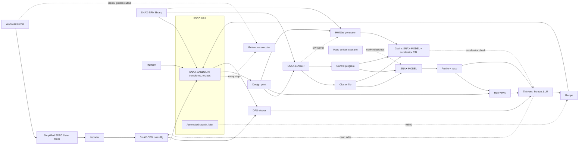

# SNAX-FORGE Architecture (Skeleton v1.2)

> This is the main skeleton of SNAX-FORGE: what the system is, its components,
> their contracts, and the order in which they are built. It is expected to
> evolve. Changes are recorded in the Decision Log (section 10) rather than by
> silently editing sections.
>
> Markers: **[OPEN]** = undecided. **[DEFAULT]** = working assumption, adopted
> unless a real kernel shows otherwise.
>
> Task-level breakdown, dependencies and acceptance criteria live in
> `docs/STATUS.md`. What the model-side artefacts mean, field by field, lives
> in `docs/CONTRACTS.md` (MOD10, D46).

---

## 1. Purpose

SNAX-FORGE is a platform for exploring how domain-specific accelerators perform
when plugged into a SNAX compute cluster, before committing to RTL.

A user brings a workload and a set of accelerator models. SNAX-FORGE imports
the workload into its own dataflow graph (SNAX-DFG, a `.snaxdfg` file), maps
it in SNAX-SANDBOX onto a configurable model of the cluster (loops split into
temporal and spatial parts, accelerators bound, memory planned; D71–D74),
runs it in a fast cycle-level Python simulation, and returns profiles, traces
and visualisations.
A human or an LLM uses these to decide the next design iteration. The chosen
accelerator can then be generated as hardware, and its RTL checked against its
model through cosimulation.

The user describes the accelerator; SNAX-FORGE models the rest of the SNAX
cluster (D51). Model cycle counts compare design points; they do not predict
the absolute timing of the real SNAX cluster.

The goal is insight into how to design domain-specific accelerators for compute
clusters: where cycles are lost, which banks conflict, which accelerators
starve, and what a design change actually buys.

## 2. Positioning

SNAX-FORGE is complementary to analytical design-space exploration frameworks
such as ZigZag and Stream (KU Leuven MICAS). What distinguishes it:

- **Cycle-level cluster microarchitecture.** Bank arbitration, affine
  streamers, FIFO back-pressure, DMA and register-level control are modelled
  explicitly rather than abstracted into analytical cost terms.
- **Arbitrary dataflow graphs**, not only DNN layers: PolyBench-style kernels,
  stencils, reductions, and later HDC workloads.
- **RTL-backed accelerator models.** A block model can carry a hardware
  binding, and the accelerator's model is checked against its RTL through
  cosim (D52).
- **A shared task sequence.** The same lowering logic drives both the model and
  the real hardware.
- **Human- and LLM-in-the-loop by design.** All artefacts are text-based and
  self-describing; the workload graph and the recipes that transform it are
  plain JSON a thinker can edit, sweep and view (D71, D72, D76).

[OPEN] Refine this positioning with the ZigZag/Stream authors' view, and decide
whether SNAX-FORGE can consume or produce their formats.

## 3. Guiding Principles

1. **Model first.** Python models are the primary artefact; hardware is
   generated from, or checked against, them. SNAX-MODEL is built before the
   components that feed it, and their contracts follow from what it needs
   (D24, D26).
2. **One slice before generality.** Every component is first built in the
   simplest form that carries `vecadd` end to end, then generalised only when a
   real kernel requires it. SNAX-MODEL is kernel-agnostic by construction: it
   only executes control programs (D6, D11).
3. **The user owns the accelerator, the model owns the platform.** The user
   supplies the accelerator's interface and timing (lanes, rates, latency,
   II); everything around it is SNAX-MODEL's model of the SNAX platform, with
   declared defaults. Model cycles compare design points; checking the
   platform model against SNAX RTL is deferred (section 7, D51).
4. **Decisions are separate from derivations.** SNAX-DSE decides, by hand in
   SNAX-SANDBOX first (D72); importers derive the SNAX-DFG and SNAX-LOWER
   derives the cluster file and command sequences; SNAX-MODEL measures. No
   stage does another's job.
5. **Everything is text and diffable.** SNAX-DFG, BRMs, recipes, platform
   files, design points, task lists, control programs, scenarios, profiles
   and traces are serialised,
   versionable and readable by humans and LLMs.
6. **Extend without editing the core.** New node kinds, attributes and
   accelerator models are added by registration, not by changing core classes.

## 4. System Overview

**Inner loop** (core, Python only):
kernel → importer → SNAX-DFG → SNAX-SANDBOX (recipe) → design point →
SNAX-LOWER → SNAX-MODEL → feedback → thinkers → recipe → SNAX-SANDBOX.

Until automated search exists (M8), thinkers close the loop by editing the
recipe, or a `.snaxdfg` by hand (D72, amends D27).

**Outer path** (later, independent of the inner loop, D52): HW/SW generator →
cosim, which checks an accelerator's RTL against its model. Nothing in the
inner loop waits on it.

## 5. Components and Contracts

Each component is defined by what it consumes and what it produces. The
artefacts between components are the contracts and must stay stable and
versioned. Until the contract freeze (M6), contracts are Python dataclasses
with plain JSON files; versioned schemas follow once two kernels have used them
(D26).

| Component | Consumes | Produces |
|---|---|---|
| Importer (workload analysis) | kernel via its simplified SDFG (later MLIR) | SNAX-DFG (`.snaxdfg`) |
| SNAX-BRM library | user-supplied block models | BRMs |
| SNAX-DSE: SNAX-SANDBOX first, automated search later | SNAX-DFG, BRMs, platform, recipe | transformed `.snaxdfg` per step, design point |
| SNAX-LOWER | design point, BRMs | cluster file, control program (later also C kernel) |
| SNAX-MODEL | cluster file, control program (or a hand-written scenario) | profile, trace, output data |
| Reference executor | SNAX-DFG, input data | golden output data |
| DFG viewer | `.snaxdfg` files | HTML view |
| Visualiser (run views) | design point, profile, trace | HTML views |
| HW/SW generator | design point, BRMs, SNAX-LOWER | accelerator RTL, SW kernel |
| Cosim | cluster file, control program, accelerator RTL | profile, trace, per-accelerator mismatch report |

### 5.1 SNAX-DFG

SNAX-FORGE's own dataflow graph: a JSON file with the extension `.snaxdfg`
(D71), independent of DaCe classes. It borrows SDFG's concepts, not its
format: the SDFG JSON carries guids, debuginfo, per-state bookkeeping and
DaCe types, which make it hard to transform by hand or by script. The
format is fixed by D77 and written down in CONTRACTS.md section 11
(`snax_forge/dfg/`).

- **A tree, not a graph** (D77): symbols, containers and an ordered `body`
  of nodes; scopes hold ordered bodies of their own, and body order is
  execution order. Memlets sit on the connectors of the nodes that use the
  data. Map entry/exit nodes, access nodes and the outer memlets SDFG
  draws on a map are derived, not stored.
- **Borrowed from SDFG**: data containers (shape, dtype, symbolic sizes),
  tasklets, map scopes with symbolic ranges, connectors, memlets
  (data-movement edges with a subset), and the order between scopes.
- **Loop kinds**: a map has one loop variable, so a multi-dimensional
  loop is nested maps. It carries `loop.kind`: absent as imported, `tile`,
  `temporal` or `spatial` once SNAX-SANDBOX maps it (D73, D77).
- **Names and expressions** (D77): every name in an expression is a symbol
  or the variable of an enclosing map. Subsets, ranges and shapes use the
  expression grammar of the BRM (`snax_forge/expr.py`), stored canonical.
  A symbol is `null` as imported and gets its value from the recipe, while
  expressions keep its name.
- **Coarse node kinds on top**, most importantly the *accelerated node*, which
  replaces a subgraph with a bound BRM instance. It does one beat: `bind`
  replaces a spatial map and its tasklet, so the node sits inside the
  temporal maps it runs over, its connectors are the BRM's ports and each
  memlet gives a port's lanes as a range. It holds the instance (BRM,
  implementation, design params, D77), what it computes (`code`, the BRM's)
  and what it replaced (`replaced`), and a split map keeps the map it was
  split from (`loop.split`), so a graph at any step can be taken back to
  the imported one (D82). Replacement can be nested: the node has a body,
  empty for a leaf block.
- **No streamer nodes.** A memlet on an accelerated node's connector becomes
  a streamer at lowering, one per port (D12, D53). The graph describes the
  workload, not the cluster.
- **Importers** derive a `.snaxdfg` and decide nothing (principle 4). The
  first (`snax_forge/dfg/import_sdfg.py`, `pixi run import-dfg <kernel>`,
  D78) reads the simplified SDFG that `pixi run forge <kernel>` writes, or
  builds the same SDFG in-process.
  DaCe's transient-plus-copy (`C[:] = A + B` gives a map into `__tmp0` and a
  copy into `C` in the raw SDFG) is already folded by simplify for vecadd;
  the importer folds only what simplify leaves, and transients stay in the
  format (dot and jacobi1d keep theirs). Containers keep the kernel's
  names, and maps, tasklets, variables and connectors get readable ones
  (`add_map`, `add`, `i`, `in1`). Symbols (`N`) stay symbolic; the recipe
  binds them. A construct it does not support is an error that names it. An MLIR importer comes later and writes
  `.snaxdfg` directly, without SDFG (open item 33).
- **Extensibility** (D19, D77):
  - The core element schema is `id`, `kind`, `inputs`, `outputs`, `attrs`,
    plus `body` for a kind that is a scope.
  - Node kinds are registered entries (attrs, whether they have a body, the
    variables they bind, a check), never subclasses: `map`, `tasklet` and
    `accelerated` so far; a sequential `loop` and a `branch` come with the
    kernels that need them (open item 36).
  - An attr without a namespace belongs to the kind, is checked by it and is
    always written. Namespaced keys (`loop.*`, `mem.*`, `hw.*`, `user.*`)
    are cross-cutting: tools read the namespaces they know and pass the rest
    through untouched.
- **Visualisable** in the DFG viewer (section 5.7, VIS5), as imported and
  after every sandbox step.

Generated `.snaxdfg` files go under `out/`, not in git (as D67); test
fixtures are the exception.

### 5.2 Reference Executor

A small NumPy interpreter that executes a SNAX-DFG directly and produces the
golden output (`snax_forge/dfg/execute.py`, D20, D79). It runs any
`.snaxdfg`, as imported, split or accelerated (an accelerated node through
its BRM's function), so SNAX-SANDBOX checks every transform step against it,
as `verify_each` does for the SDFG recipes in `transforms/` (D72). Inputs
come from the kernel's `make_inputs`; the kernel's own `reference` is what
the executor must match on the imported graph (`pixi run check-dfg FILE
--kernel K`). SNAX-MODEL output (computed through each BRM's Python
function) and later cosim output are compared against it. DaCe's CPU
reference is optional.

Maps and tasklets run over the whole iteration space at once: each map
variable is an index array on an axis of its own, and a tasklet gathers,
computes and scatters on those arrays, which is exact because map
iterations are independent. An accelerated node runs firing by firing
through the same `fn(k, ins, state, params)` SNAX-MODEL runs, over the
temporal maps around it, in order.

### 5.3 SNAX-BRM: Block Runtime Model

The primary definition of an accelerator block, supplied by the user or taken
from the library. BRMs are written by hand for now (open item 27): one JSON
file each, in `snax_forge/brm/library/` (D68). A BRM has a shared part,
common to every implementation of the accelerator, and a map of
implementations, which differ in how the accelerator is built. Its six parts
(D3):

Shared:

1. **Interface**: params and ports. A param is `design` (fixed per
   instance: lanes `W`, the op) or `runtime` (a start parameter: exactly `n`
   and every named port rate). A port has a direction, lanes, a per-port
   element rate (elements consumed or produced per beat, so reductions and
   elementwise blocks share one interface, D25) and a dtype. The register map
   follows from the runtime params (D36) and a port's interconnect ports from
   its lanes (D12); neither is written in the BRM.
2. **Dataflow**: per port, a nest in a registered notation giving the order in
   which the accelerator consumes or produces the operand's elements, in
   logical indices. It describes only the accelerator and holds no
   addresses. It checks that the memlets of the mapped SNAX-DFG deliver the
   operand in this order; the streamer values come from those memlets
   through the buffer layout (section 5.5, D73). The first notation, `affine` (D70), gives the operand's
   shape, an optional offset and loops listed outermost first, each with a
   bound, one stride per dimension and a spatial flag; the spatial loops
   come last and are the lanes. [OPEN] later notations (open item 1).
3. **Function**: a registered accelerator kind (D43) and its params, whose
   Python implementation produces real output data, and `code`: what one
   lane computes, symbolically (`out = a + b`, D82). `bind` compares a
   tasklet against the code, and the accelerated node carries it, so a
   bound graph says what each accelerator does.
4. **Pattern**: the SNAX-DFG subgraph shape the block can replace.
   SNAX-SANDBOX's `bind` matches it and extracts the design params from the
   graph, e.g. `W` from the spatial bound of a split map, so a design param
   is decided once, in the graph (D73). The `family` names a matcher
   registered in the sandbox (`snax_forge/sandbox/patterns.py`, D80) and the
   `attrs` are its parameters; `predicate` stays null.

Per implementation, beside its `source` (only `chisel` for now, open item
28) and the design-param values it supports:

5. **Timing**: `latency` (`L`) and `initiation_interval` (`II`, written `ii`
   in the cluster file), ints or expressions over design params; always
   user-supplied, analytic or measured from RTL (D5).
6. **Hardware binding** (optional): how to obtain RTL, e.g. a Chisel
   generator with parameters. Null until M10.

Designs that differ only in timing, supported values or RTL source are
implementations of one BRM; different ports, rates or data order make a
different BRM. Choosing an implementation is a SNAX-DSE decision, so a
design point instance names the BRM, the implementation and the design
params.

Each part serves one component: interface, function and timing give the
accelerator entry of the cluster file (SNAX-MODEL, through SNAX-LOWER,
D53); the dataflow checks the order of the memlets that give the streamer
values (SNAX-SANDBOX, SNAX-LOWER, D73); the pattern serves SNAX-SANDBOX's
`bind` and the binding the HW generator. In the cluster file the
entry is the accelerator's `lanes`, rates, `latency`, `ii` and `op`, which
is the only part of the cluster file the user is responsible for (D51);
until BRMs exist it is written by hand. A BRM is accepted when, plugged
into the model, it gives the same cycles and data as the matching generic
stub.

The existing Chisel elementwise modules (loop, spatial, tiled-spatial) and the
accumulator are the reference implementations for the first BRMs. The first
library file is `elementwise_add` (BRM3): `W` lanes, 4 by default, one
implementation `chisel_tiled_spatial` (`ElementwiseTiledSpatial`, L = 0,
II = 1), resolving to exactly the adder of `scenarios/clusters/alu4.json`.
Library files are kept in the form `Brm.to_json` writes.

### 5.4 SNAX-DSE: Design Space Exploration

SNAX-DSE only makes decisions. It never computes register values or command
sequences. It comes in two parts (D72):

- **SNAX-SANDBOX** (M3): where decisions are made by hand. Registered
  transforms act on a `.snaxdfg` and write a new one. A **recipe** is an
  ordered JSON list of transforms with their parameters, applied to an
  imported `.snaxdfg`; the reference executor checks every step. A thinker
  edits the recipe, or a `.snaxdfg` directly. Only a recipe can be swept: a
  sweep is one recipe with a parameter taking several values (open item 34
  for hand edits). Recipes live in `recipes/`; `pixi run sandbox
  recipes/vecadd.json [--set W=8]` writes every step to
  `out/sandbox/<recipe>/` (`snax_forge/sandbox/`, D80).
- **Automated search** (M8): drives the same transforms and writes recipes,
  so everything it finds can be replayed, viewed and diffed.

**Inputs**: SNAX-DFG, BRM library, the platform (L1, L2, DMA, controller,
streamer defaults; [OPEN] a file of its own or a first recipe step, open
item 35) and the recipe, which also binds the symbols (`N`).

**Transforms** (registered, extensible; the first two in SBX1):

- `split_map`: split a loop into an outer loop tagged `temporal` and an inner
  one tagged `spatial` (`loop.kind`, D73)
- `bind`: replace a subgraph matching a BRM's pattern with an accelerated
  node bound to an instance (BRM, implementation, design params extracted
  from the graph, D68, D73)
- `unbind`, `join_map`: the inverses of `bind` and `split_map`, from what
  the graph records (D82)
- tile: an outer loop over L1-sized tiles
- place: a layout per container and memory (the memory plan, D74)

The three loop levels map onto the cluster as follows: a tile is a
repetition of the tasks with a DMA per tile, a temporal loop is a streamer
temporal loop and part of the accelerator's `n`, a spatial loop is lanes
(streamer `n_ports`).

**Decisions** (extensible):

- which subgraphs are replaced by which BRMs, and which implementation of each
- BRM parameters (lanes, tiling)
- accelerator instance count and concurrency
- chaining between accelerators
- buffer placement across banks, double buffering
- cluster parameters (section 5.6)

**Output: the design point** (D74), written by the sandbox, not edited by
hand:

1. the mapped SNAX-DFG
2. the memory plan: a layout per container and memory (base address, shape,
   one byte stride per dimension); banks follow from addresses under the
   fixed address map (open item 18) and are not stated
3. accelerator instances: BRM, implementation and design params, as the
   accelerated nodes of the mapped SNAX-DFG hold them (D77)
4. the platform

Loads and stores are not in the design point: SNAX-LOWER inserts them for
containers that have both an L2 and an L1 layout (section 5.5).

Exploration is manual (recipes) first. Automated search comes later.

### 5.5 SNAX-LOWER: Lowering

A separate step between SNAX-DSE and SNAX-MODEL, comparable to a compiler
backend. It turns a design point into the two inputs of a model run: the
cluster file and the control program (D53). It derives both and decides
nothing (principle 4).

**Cluster file.** One accelerator entry per accelerator instance, filled
from its BRM's interface and timing parts and the instance's parameters; one
streamer per accelerator port (D12), with `n_ports` equal to the port's lanes
and attached to it; the xbar, L1, L2, DMA and controller from the cluster
configuration in the design point; the register map. A streamer serving
port `p` of instance `i` is named `i_p` (D75). Its layout is the one of
`scenarios/clusters/alu4.json` (CONTRACTS.md section 2) and may change
later.

**Control program.** It:

- orders tasks by the execution order of the mapped SNAX-DFG, one group of
  tasks per accelerated node and tile, sequential per tile by default
  (double buffering is a later recipe choice); a task is named
  `<node>_<component>`, a DMA task `load_<container>` or
  `store_<container>` (D75)
- computes streamer registers from the memlets on each accelerated node's
  connectors and the memory plan: the memlet's index through the container's
  layout (`snax_forge/lower/streams.py`, D70, D73); the BRM's nest checks the
  order
- computes accelerator register values from BRM parameters and the loop
  bounds
- inserts L2↔L1 DMA transfers from the memory plan: a container with both an
  L2 and an L1 layout is loaded before its first read and stored after its
  last write (the simple case in LOW1a, general insertion in LOW3)
- inserts a wait at every dependency crossing an accelerator or DMA boundary

The control program is a JSON list of commands:

- `csr_write`
- `csr_read`
- `wait`, which either polls a block's `busy` register or blocks on its
  completion signal

There is no separate `start` or `dma` command: every block (streamer,
accelerator, DMA) is programmed through the uniform register interface
(section 5.6, D36), and writing 1 to its `start` register launches it
(D37).

It works in two steps (D45): the design point gives an ordered task list
(which block starts with which register values, and where waits go), and the
task list is expanded into the plain command list with the same per-kind
adapters the model uses (D36). A task list can also be written by hand before
the design point exists, and the second step is built first (D63).

**Task list** (`snax_forge/lower/`, D64, CONTRACTS.md section 9). An ordered
list of steps: `configure` declares a task on one component (its `type`,
`after` dependencies, `wait_mode` and `values` in the type's own terms) and
writes its registers at that point; `start` launches one or more configured
tasks together; `sync` waits there for a task; `read` samples a register.
`lower_program(tasks, cluster)` emits the commands in that order and adds
only the waits correctness needs: before each start, one per component for
the `after` tasks and for busy components, where a wait on a writer
streamer also covers the accelerator and readers started with it. Where
configures, starts and syncs go is the task list's choice, so a hand-written
or generated list can overlap programming with running blocks.

Its first acceptance test is reproducing the hand-written `scenarios/vecadd`:
its cluster file and its program.

**Later**, a C backend emits the SW library kernel for real hardware from the
same logic, so the model and the chip are driven by the same task sequence.
It maps the model's register blocks by name onto the real interfaces:
ReqRspManager CSRs for streamers and accelerators, iDMA instructions for the
DMA (open item 9).

### 5.6 SNAX-MODEL: Cluster Model

A pure-Python model of the SNAX cluster. There is no CPU; a controller executes
the control program through the register interface. The model has no knowledge
of kernels: it runs whatever the control program and cluster configuration
describe.

**Ownership (D51).** The accelerator entry of the cluster file is the user's.
Everything else is the model of the SNAX platform: its behaviour is fixed
here, and its parameters (bank count, FIFO depth, DMA bandwidth, ...) are
design knobs for SNAX-DSE (D7), not something the user has to supply. Their
defaults are declared, not measured: one 512-bit DMA beat per cycle, 1-cycle
L1 and L2 reads, and small fixed controller costs (CONTRACTS.md section 2
lists every default).

**Time model.** Cycle-level and event-driven. Each component with pending work receives a per-cycle tick, and cycle ranges with no pending work are skipped. Round-robin arbitration is resolved exactly. Each cycle runs in fixed phases (control, compute, request, arbitrate, memory, response). A component may take part in several phases. Components compute their next state during ticks and apply it in a commit at the end of the cycle; shared elements such as FIFOs commit the same way (D29).

**Sub-models, in build order:**

1. **L1 memory banks.** RTL-like SRAM: one access per bank per cycle; configurable count, width and read latency; replaceable address-to-bank map (default word-interleaved); base address configurable, 0 by default. A shared element touched by its requester, not a ticked component (D30).
2. **Interconnect.** TCDM-like: parallel access to distinct banks, round-robin
   arbitration on conflicts. Ports have a width: a narrow port (64 bits)
   reaches one bank, a wide port an aligned group of banks (512 bits = one
   superbank of 8 banks, used by the DMA). Wide port with per-cycle
   superbank priority: wider wins per cycle and per bank group, so narrow
   ports to other superbanks, and to the same superbank in cycles the wide
   port does not use it, proceed (D31, D33). Every conflict and stall is
   recorded, with stalls caused by a wider grant counted separately.
3. **Streamers.** One per accelerator port, configured by raw register values
   (base, bounds and strides per loop). Affine address generation, FIFO
   buffering (configurable depth), valid/ready interface, configurable
   interconnect ports per streamer. A reader with temporal stride 0 on loop
   0 reads each group once and hands it out `tbound[0]` times (D69).
4. **Accelerator models.** Instances of the accelerator interface (ports with
   per-port element rate, `L`, `II`, Python function), advancing according to
   their timing and producing data through their function. Generic
   elementwise and reduce stubs exist before any BRM. An accelerator sits
   between its streamers' FIFOs; its L-stage pipeline stalls globally on a
   full output (D35).
5. **DMA and L2.** A flat L2 with fixed read latency and a DMA between L2
   and L1 on one wide port of the interconnect. Source and destination are
   affine beat patterns; timing is per beat for now (D34).
6. **Register interface and controller.** A uniform register interface: every
   block (streamer, accelerator, DMA, any later block) has an aligned window
   with `start`, `busy` and `busy_cycles` at offsets 0–2 and buffered
   configuration registers after them, listed by a per-kind adapter (D36).
   The controller executes `csr_write`, `csr_read` and `wait` one at a time,
   each with a per-kind cost, and keeps control overhead separate from
   waiting (D37).

**Scenario runner** (`snax_model/scenario.py`, D41–D44). Before the upstream
components exist, the model is driven by scenario files. A cluster file holds
the hardware: L1, optional L2, the ordered component list (its order is the
registration, xbar port and trace source order) and the register map. A
scenario file holds one run's inputs: a reference to the cluster file, initial
memory (inline words, `.npy` files or seeded random fills) and the control
program as a plain command list. Expected results live in the tests, not in
the scenario. Accelerators are named by a registered kind with parameters.
`python -m snax_forge.snax_model run SCENARIO --out DIR` dumps the profile,
the trace and the final memory; the files are byte-identical on every run and
with skipping on and off. Scenarios live under `scenarios/`, one folder each
with the `scenario.py` that makes it and the hand-written task list its
program is lowered from (D64, D65, D66); block-level helpers expand into
register writes only there, through SNAX-LOWER, never inside the model.
`scenarios/make.py` writes the scenario files, their input data and the
cluster files; they are generated, not kept in git (D67).

**Model-side contracts (D26, D46).** The cluster configuration, streamer
register layout, accelerator interface, control program, scenario, profile and
trace are written down in `docs/CONTRACTS.md` (MOD10). They define what
SNAX-BRM, SNAX-DSE and SNAX-LOWER must produce; section 8 of that file holds
the rules a new block kind must follow to keep the skipping honest (D47).
Every configuration class carries its own `to_dict` / `from_dict`, and every
snippet in the document is checked against the file it came from
(`tests/snax_model/test_contracts.py`).

**Data granularity.** The unit of transfer is a bank word; in v1 one element
occupies one word. Element type and elements per word are part of the data
model from the start, so sub-word packing (e.g. int8 in 64-bit banks) can be
enabled later without restructuring.

**Configurable cluster parameters**:

- bank count, width, and read latency
- port bandwidths: port widths (64 to `wide_bits`, 512 by default)
- interconnect ports per streamer
- FIFO depth and number of streamer loops
- L2 size and latency
- DMA bandwidth (`beat_interval`), startup and latencies

**Performance path [DEFAULT]:**

- The exact sequential simulator is the source of truth.
- Internal state is kept as struct-of-arrays so later acceleration is possible
  without changing results. That is about state, not about the work of one
  cycle: at cluster sizes, per-cycle NumPy calls on tens of elements cost more
  than they save, so the hot path (xbar pointers, locks, wires and counters)
  is plain Python (D48).
- Later options, in order:
  1. precomputed affine address and bank streams
  2. vectorised conflict estimates that assume no back-pressure, used as bounds
     for pruning
  3. batched lockstep simulation across design points (GPU via JAX or PyTorch)
  4. steady-state extrapolation of periodic phases

### 5.7 Feedback and Visualisation

**Profile** (`snax_model/profile.py`, built from the components' own
counters, D38):

- total latency
- per component (accelerator, streamer, DMA, controller) its cycle classes;
  per accelerator utilisation (busy / total, where busy is a firing plus
  its II gap, D59) and its firing count
- per bank reads, writes, grants, conflicts, stalls and cycles blocked by a
  wider grant; per interconnect port grants, stalls and stalls caused by a
  wider grant
- FIFO occupancy per lane: max, time-weighted mean and histogram (D40)
- DMA traffic in beats and bytes, L2 reads and writes
- control overhead (controller command cycles), reported apart from wait
  cycles and every wait listed
- functional check result against the reference executor (empty until E2E1)

**Trace** (`snax_model/trace.py`, D39): a JSON event log with cycle
timestamps, at a level chosen per run: off, task (commands, starts, dones,
cycle-class intervals) or beat (adds L1 grants and stalls with address,
banks and row, read responses (D62), accelerator firings, DMA beats, polls,
FIFO count changes).
Cycle-class intervals are stored per component beside the events. Beat events
can be filtered by source and by cycle window (`--trace-source`,
`--trace-window`), which a long run needs at roughly a kilobyte per cycle;
task events and the profile are never filtered (D49). The compressed summary
for LLM use is VIS7.

**Visualiser** (`snax_forge/viz/`, D55): a local server plus a static viewer,
for humans; LLMs read the profile and later VIS7's summary. The server
(stdlib `http.server`, bound to 127.0.0.1, no new dependency) loads the run
directories given on the command line once and answers a small JSON API;
the viewer is plain HTML, JS modules and CSS with no build step and no
external file, so it works offline. Reload is a button that re-reads the
directories; nothing watches the files. Views:

- the profile report of a run (VIS1)
- the schedule: per component its activity over time, HLS-schedule style,
  with a selected cycle the cluster view follows (VIS2, D57)
- the cluster view: banks, interconnect, streamers, accelerator, DMA and
  controller at the selected cycle, under the schedule on the same page,
  with each memory hop split into request and read data (VIS3, D61, D62)
- the design point (memory map, accelerator instances)
- a diff between two runs (design point and profile; recipe changes once
  automated search writes recipes, VIS8)

`python -m snax_forge.viz DIR [DIR ...]` (pixi `view`) takes several runs
from the start, which the diff needs. The visualiser comes in two parts
(D54). The run views (M4a: VIS1–VIS3) read only a model run's output
directory and are built before M3. The design point view, the diff, the
LLM summary and the first manual loop (M4b) follow M3, so one full manual
loop is still possible before `dot`. Until the contract freeze, views read the
same Python dataclasses as the model rather than raw JSON: a run's output
files are loaded back with `read_outputs` and each class's `from_dict` (D38,
D50). FIFO occupancy is also shown over the FIFO's busy window (D56), which
needs a task or beat trace.

**DFG viewer** (`snax_forge/viz/dfg/`, VIS5, D76, D81): a second mode of the
same server for `.snaxdfg` files instead of run directories.
`python -m snax_forge.viz.dfg FILE|DIR ...` (pixi `view-dfg`, port 8766)
shows several graphs side by side, e.g. every step of a recipe from
`out/sandbox/<name>/`; Reload re-reads them, so the loop is transform or
edit, reload, inspect, and a file that does not load shows its error in its
own panel. A graph is drawn top to bottom in execution order: containers,
maps as nested boxes coloured by loop kind (untagged, tile, temporal,
spatial), tasklets and accelerated nodes inside them with their connectors
on top and below, each connector carrying its subset; an edge between a
container and a connector stops at the outer box of the top-level node,
straight above or below the connector (D82). Python works out the
rows (a container gets a new version after each top-level node that writes
it and is shown again above a later reader, so every edge joins neighbouring
rows) and the edge list; the browser places the HTML boxes, and the edges
are one SVG layer per panel measured from them, with no library, so the
offline rule of D55 holds. Hovering a node or a container highlights it in
every panel. It is built in M3, since SNAX-SANDBOX is used through it.

### 5.8 Thinkers

Humans and a commercial LLM (Claude, ChatGPT, Gemini) read the feedback and
close the loop in SNAX-SANDBOX: they edit the recipe, or a `.snaxdfg`
directly (D72, amends D27). Recipes can be replayed and swept, hand edits
cannot (open item 34). Automated search (M8) later writes recipes itself.

### 5.9 Outer Path (later, independent of the inner loop)

- **HW/SW generator.** Accelerator RTL through each BRM's hardware binding
  (Chisel first), grouped into one accelerator top. The SW kernel comes from
  SNAX-LOWER's C backend. The SNAX cluster itself is not generated.
- **Cosim (D52).** SNAX-MODEL with accelerator models replaced by RTL through
  cocotb (Verilator, Questasim). It checks each accelerator's output and its
  declared `latency` and `ii` against its RTL. It says nothing about the SNAX
  platform's own timing, and nothing in M3–M9 waits on it. Integrating a
  generated accelerator into the real SNAX cluster is outside the current
  plan.
- **HW cost estimator.** Post-synthesis, technology-dependent, from a cost
  database. Built last.

## 6. Correctness Strategy

Three levels, each checked against the one above it:

1. **Reference executor**: golden output of the workload (SNAX-DFG in NumPy),
   equal to the kernel's own reference on the imported graph and run after
   every sandbox step (D72).
2. **SNAX-MODEL**: the same workload through BRM functions, streamers and
   memory. Its output must match level 1 exactly.
3. **Cosim**: the same run with RTL accelerators. Output must match; each
   accelerator's deviation from its declared `latency` and `ii` is reported
   (D52). This checks the accelerator, not the platform model.

**Reductions [DEFAULT] (D28).** Exact matching with floating point depends on
accumulation order. Reductions use integer types first; for floating point, the
BRM defines its accumulation order and the reference executor follows it.

## 7. Model Validation Anchor (deferred until after M10, D51)

The anchor would check the *platform* model — interconnect, streamers, DMA
and controller — against the real SNAX cluster RTL. Cosim does not do this:
it replaces only the accelerator (D52). Until the anchor runs, the platform
parameters are declared defaults (section 5.6) and model cycle counts are for
comparing design points, not for predicting SNAX cycle counts.

When it runs, after M10, the plan is:

- run `vecadd` on the real SNAX cluster RTL and record the cycle counts per
  phase, with one core issuing every task in order as the model's single
  controller does (D37)
- run the same configuration in SNAX-MODEL
- document the deviation and its causes

The RTL counts include CSR programming by the Snitch core, which SNAX-MODEL
does not model (D6). The report compares accelerator-active phases separately
from control overhead. The error target (open item 3) is fixed before the
first comparison.

## 8. Build Order (milestones, not a schedule)

See `docs/STATUS.md` for the task breakdown of each milestone.

Order: M1, M4a, M3, M4b, M5–M10, then M2 (D51, D54). The run views come
first, then `vecadd` is closed end to end, then the rest of the visualiser.
Since D76, M3 closes `vecadd` from the kernel forwards: the SNAX-DFG and its
importer, the reference executor, the DFG viewer and SNAX-SANDBOX come
before the design point and SNAX-LOWER.

**M1: SNAX-MODEL, kernel-agnostic.** Scheduler, banks, interconnect,
streamers, accelerator interface with elementwise and reduce stubs, DMA/L2,
CSRs and controller, profile and trace, scenario runner. Ends with the
model-side contracts written down.

**M4a: Run views.** HTML scaffold, timeline, utilisation and bank conflicts,
all from a model run's output directory; tested on the M1 scenarios.

**M3: Close `vecadd` end to end.** Elementwise-add BRM and task-list
lowering (done); the `.snaxdfg` format and the SDFG importer for vecadd, the
reference executor, the DFG viewer, SNAX-SANDBOX (`split_map`, `bind`,
recipes), the design point, derived names, and SNAX-LOWER (cluster file and
task list, D53). Accepted when the kernel runs end to end with its reference
output and the cycles of the hand-written `scenarios/vecadd`, whose cluster
file and task list the design point reproduces (D76).

**M4b: Remaining views and first manual loop.** Design point and diff views;
LLM trace summary; one documented design iteration on `vecadd`, made by
editing a recipe.

**M5: `dot`.** Reduction in SNAX-DFG, its import and the reference executor,
accumulator BRM, chaining waits and general DMA insertion in SNAX-LOWER.

**M6: Contract freeze.** Package layout and CI conventions, versioned schemas
for all contracts (`.snaxdfg`, recipes and the design point included),
registries and namespaced attributes.

**M7: Remaining front ends.** The SDFG importer for the constructs of
`jacobi1d`, and named errors for unsupported ones; the vecadd and dot imports
come with M3 and M5 (D76).

**M8: Automated DSE.** Search over recipes: pattern-based replacement across
the BRM library, parameter and memory-plan policies, sweeps.

**M9: `jacobi1d`.** Stencil reuse and double buffering.

**M10: Outer path.** HW/SW generator from BRM bindings, cocotb cosim of the
accelerators (D52). Independent of M3–M9.

**M2: Anchor (deferred, D51).** `vecadd`, then `dot`, against the real SNAX
cluster RTL (section 7), with a regression test.

**Later:**

- MLIR front end (open item 33)
- GPU-batched simulation
- sub-word packing
- HW cost estimator
- HDC workloads

## 9. Non-Goals (for now)

- Modelling a RISC-V core or executing real software on one.
- Generating the SNAX cluster itself.
- Automated design-space search before manual exploration works.
- Bit-level accuracy inside SNAX-MODEL; that is the job of cosim.
- Predicting absolute SNAX cycle counts before the anchor (D51).
- Integrating generated accelerators into the real SNAX cluster (D52).

## 10. Decision Log

| # | Decision | Round |
|---|---|---|
| D1 | SNAX-DFG is its own serialisable, SDFG-inspired, extensible format | 1 |
| D2 | Node granularity starts at SDFG level, with coarse accelerated nodes on top | 1 |
| D3 | BRM = interface + dataflow + timing + function + pattern + optional HW binding | 1 |
| D4 | Model first: the RTL library is folded into BRM hardware bindings | 1 |
| D5 | Cycle numbers are user-supplied, analytic or measured | 1 |
| D6 | SNAX-MODEL is Python with banks, TCDM interconnect, streamers, DMA/L2, CSRs; no CPU | 1 |
| D7 | Cluster parameters are part of the design space | 1 |
| D8 | AI thinker = commercial LLM; all artefacts text-based | 1 |
| D9 | First targets: vecadd, dot, then jacobi1d | 1 |
| D10 | Time model: cycle-level events, ticking only components with pending work | 2 |
| D11 | Control program: JSON; wait by CSR polling or completion signal | 2 |
| D12 | One streamer per accelerator port; interconnect ports per streamer configurable | 2 |
| D13 | Unit of transfer = bank word; 1 element per word in v1, packing-ready data model | 2 |
| D14 | Thinkers act through declarative config files; GUI shows design-point diffs | 2 |
| D15 | Per-port exact affine loop nest in BRMs (notation to iterate) | 2 |
| D16 | SNAX-DFG is visualisable | 2 |
| D17 | DaCe CPU reference is optional; correctness via Python and later cosim | 2 |
| D18 | Control program produced by SNAX-LOWER, which later also emits the SW kernel | 3 |
| D19 | Extensibility by core schema + registered kinds + namespaced attrs [DEFAULT] | 4 |
| D20 | NumPy reference executor of SNAX-DFG as golden output [DEFAULT] | 4 |
| D21 | Exact sequential simulator first, array-friendly state, acceleration later [DEFAULT] | 4 |
| D22 | Vertical `vecadd` slice first; model validated against real RTL early | 4 |
| D23 | Positioned as complementary to ZigZag/Stream (cycle-level, RTL-backed) | 4 |
| D24 | Build order: kernel-agnostic SNAX-MODEL first (incl. DMA/L2), anchor next, upstream built backwards to close `vecadd`, visualiser before `dot`, contract freeze after `dot`. Refines how D22 is carried out | 5 |
| D25 | Accelerator interface has per-port element rates, so reductions and elementwise blocks share it | 5 |
| D26 | Model-side contracts are defined by SNAX-MODEL; dataclasses + plain JSON until the M6 freeze, versioned schemas after | 5 |
| D27 | Until SNAX-DSE exists, thinkers edit the design point directly (interim to D14) | 5 |
| D28 | Reductions use integer types first; float reductions follow a BRM-defined order [DEFAULT] | 5 |
| D29 | RTL-like cycle semantics: fixed phases per cycle; reads see previous-cycle state and wires from earlier phases; components and touched shared elements commit at cycle end; next_wake answers must not depend on when they are asked | 6 |
| D30 | L1 banks are a shared state element touched by their requester, not a ticked component; read data is held keyed by its ready cycle; a same-bank double access at the L1 is an error, and arbitration and stalling belong to the interconnect | 7 |
| D31 | Interconnect copies the SNAX SparseInterconnect per-bank arbiter: priority mask, then round-robin with pointer = last selection (reset on an idle bank cycle), lock on a refused selection; no added latency. It is a Component awake exactly when one of its port owners is; a refused request must be held unchanged | 8 |
| D32 | Streamer copies the SNAX readerWriter timing: ports advance independently (per-port address queue and credit); a reader port may have `fifo_depth` reads in flight or buffered, and a pop frees credit in the same cycle; FIFOs are touched per-lane elements with flow = false, pipe on the reader side only; start in s gives the first request in s+2; `busy` drops the cycle after the last grant. A reader blocked on credit wakes with its FIFO's consumer. Not copied yet: dynamic TCDM priority, reader repeat on temporal stride 0 | 9 |
| D33 | Multi-width interconnect ports (extends D31): a w-bit port covers the aligned group of w / bank-width banks (64 = 1, 128 = 2, 256 = 4, 512 = 8); w is a power-of-two multiple of the bank width and at most `L1Config.wide_bits` = 512, and `n_banks` must be a multiple of the group (checked per port). Arbitration works on bank sets in one xbar method (`_priority`): wider wins absolutely, per cycle and per group (as mem_wide_narrow_mux); equal widths use the D31 arbiter per (width, group); a request refused by a wider grant locks as in D31. D30 reads with it: the xbar passes at most one access per bank per cycle, and a wide grant is one access on each bank of its group. `block_bank` is removed; stalls caused by a wider grant are counted separately | 10 |
| D34 | DMA: a Component on one `wide_bits` port (never refused under the default policy), started by `start(descriptor, cycle)`, busy from cycle + 1. Descriptor = direction (L2→L1 or L1→L2) plus source and destination affine beat patterns (base, bounds, strides; `address_stream`), equal beat counts, every beat aligned to the wide beat. Per-beat timing first: decoupled read and write sides, one beat per `beat_interval`, `startup`, source latency, `done_latency`; for N uncontended beats, done − start = startup + Ls + k(N − 1) + 2 + done_latency. L2 = flat element touched by its requester, one read and one write per cycle, fixed read latency. snax_alu's DMA is the Snitch iDMA; its burst cost and 2D shape are not copied yet (open item 7) | 10 |
| D35 | Accelerator sits between FIFOs as a COMPUTE component: per port direction, lanes (= streamer n_ports) and rate (one beat every `rate` firings, int or start parameter); stubs are configs. Join on inputs as in snax_alu; pipeline of L slots with a global stall (head cannot be pushed → nothing advances, fires or pops); II counts wall-clock cycles; start in s gives busy from s+1, done the cycle after the last push. Cycle classes busy > stall_out > idle (II gap) > stall_in > idle; drain after the last firing is idle. Not copied yet: per-stage ready, the Accumulator's drain cycle | 10 |
| D36 | Uniform register interface (builds on D11; does not copy ReqRspManager or iDMA instructions). Every block is a register block with the same shape in an aligned window of `window` registers (default 32, one word each, addresses are register indices): `start` (write-only, 1 launches the block) at offset 0, `busy` and `busy_cycles` (read-only) at 1 and 2, configuration registers from 3. Configuration registers are buffered: a start copies them, so the next task can be programmed while the block runs; start while busy is an error. A per-kind adapter in ctrl.py lists the configuration registers from the component's config and decodes them into its start argument (streamer: base, temporal bounds and strides, spatial strides, spatial bounds design-time and given to the adapter; accelerator: `n` and named rates; DMA: direction and source/destination loops for `DmaConfig.dims`); component classes do not change. Register names are the contract; `RegisterMap.to_dict` lists them, and mapping them onto the real SNAX interfaces is left to SNAX-LOWER's C backend (D18, GEN2) | 11 |
| D37 | Controller timing: a Phase.CONTROL component executing the program in order from cycle 0, one command at a time. A command beginning in t with cost c covers [t, t+c−1] and takes effect in its last cycle; costs per command kind, write and read costs settable per block kind, all placeholders until ANC2. A start landing in w calls `start(arg, w)` (busy from w+1). Reads sample committed state; `busy_cycles` = min(r, done) − start − 1. Wait poll: sample i in t + iP + c_r − 1, ending on the first 0; wait signal: [t, max(t, done) + S − 1]. Poll and signal give the same data; the cycle difference follows from these formulas. Cycle classes command (control overhead) / wait / idle. While blocked on a signal the controller sleeps (next_wake None) and wakes from the block's committed `done_cycle`, without calling the block's next_wake | 11 |
| D38 | Profile from counters, trace cross-checked: `build_profile(cluster)` only reads the counters the components already keep (cycle classes, L1 reads/writes, xbar bank and port counts, DMA beats and max_buffered, L2 reads/writes, controller spans, waits, reads and polls) and never recounts. The trace is an independent event log written from each cycle's final wires in commit; tests check it against the counters. Profile and trace are dataclasses with `to_dict` / `from_dict` (D26); writing files and the CLI are MOD9. Both are identical with skipping on and off, and results are identical with tracing off, task or beat. `skip_idle` is not part of the profile. The accelerator has no firing count: a busy cycle is a firing cycle. The functional check is an empty field until E2E1 | 12 |
| D39 | Trace levels and events: off (default), task (`cmd`, `start`, `done` and the class intervals), beat (adds `grant`, `stall`, `fire`, `dma_beat`, `poll`, `fifo`). Each event is a flat dict `t`, `k`, `src`, then its fields. An action event carries the cycle it happens in (`cmd`: its first cycle, with `last`); a state change (`done`, `fifo`) the first cycle its new state is visible. Order inside a cycle: state changes, then phase, then source in registration order, then emission order. `grant` / `stall` are the L1 accesses (`mem`, `w`, `addr` of lane 0, `banks`, `row` from the run's address map); no separate L1 access event, since the xbar serves a grant in the same cycle (D31, D33). Components emit through `_trace` only in commit (or when a start lands), so no tick, touch or next_wake changes. Kinds are added with `register_event` | 12 |
| D40 | Class intervals and FIFO occupancy under skipping: `cycles` is a `ClassLog`; commit and on_gap both call `add(cls, start, stop)`, which keeps the totals and, when traced, the merged runs `[cls, start, stop)`, raising if a range does not continue the previous one. Runs cover [0, total) and are identical with skipping on and off; they are stored per component in `Trace.intervals`, not as events, because on_gap reports a gap only when it ends. FIFO occupancy: per lane a histogram of cycles per count, updated in `Fifo.commit` (the only place counts change, in both skip modes) and closed at `total` on a copy; the profile reports max, mean and histogram | 12 |
| D41 | Scenario format (MOD9): two JSON files. The cluster file (`ClusterConfig`) holds `l1`, optional `l2`, `components` (one ordered list of every ticked component, xbar and controller included; the builder adds them in exactly that order, which fixes tick order, xbar port order (D31) and trace source order (D39)) and `register_map` (window, blocks, bases, spatial bounds); the register map is built at the controller, so its blocks come before it. The scenario file (`Scenario`) holds `name`, optional `max_cycles`, `cluster` (path relative to the scenario file, or inline), `memory` and `program`. A scenario holds inputs only; expected results are computed in pytest (an optional `expect` section is deferred). Memory fills: `mem`, byte `addr`, and one of inline `data`, a `.npy` file relative to the scenario, or a seeded integer `random` fill. Configs are plain dataclasses with `to_dict` / `from_dict` (D26); every field is written, missing keys take defaults, unknown keys are errors. Amends the first plan of one file per scenario, so one cluster serves many programs and input sizes | 13 |
| D42 | The program in a scenario is a plain list of `csr_write`, `csr_read` and `wait`, one command each as the controller runs it; a register is given by raw `addr` or by name `reg` (`"dma.src_base"`), and each command keeps its form through a round trip. Nothing expands inside the model (principle 4): block-level helpers (`RegisterMap.config_writes` / `start_writes`) are used only by Python generators such as `scenarios/make.py`, whose output is checked against the checked-in files | 13 |
| D43 | Registries (principle 6): `register_component(kind, builder)` (xbar, streamer, dma, accel, controller), `register_accel(kind, factory)` with `factory(**params) -> AccelConfig` (`elementwise` and `reduce` = the stubs, params are their keyword arguments, `op` by name), `register_op(name, fn)` (add, sub, mul, min, max, and, or, xor). An accelerator's ports are attached by name to streamers listed before it | 13 |
| D44 | CLI and output files: `python -m snax_forge.snax_model run SCENARIO --out DIR [--trace off\|task\|beat] [--no-skip] [--max-cycles N]` (pixi `model-run`), exit 0 / 1 simulation failed or timed out / 2 bad scenario. DIR gets `run.json` (scenario, trace level, total cycles, register map, `csr_read` values), `profile.json`, `trace.jsonl` (one event per line) and `trace_meta.json` (level, sources, intervals) when traced, and `l1.npy` / `l2.npy` (flat words `[n_words, elems_per_word]` in address order). Files a run does not produce are removed. Output is byte-identical on every run and with skipping on and off: nothing written depends on the skip mode, JSON keeps insertion order with small containers on one line, `np.save` is deterministic | 13 |
| D45 | SNAX-LOWER derives the program in two steps: design point → ordered task list (LOW1a), task list → plain command list (LOW1b) through the model's per-kind adapters (D36), the same path as the Python generators. Task lists can be hand-written before SNAX-DSE and the design point exist; the model only ever reads plain command lists (D42). Refines D18 | 13 |
| D46 | Model-side contracts are written down in `docs/CONTRACTS.md`: conventions, cluster configuration, streamer registers, accelerator interface, control program, scenario, profile and trace, plus the rules for a new block kind. Every snippet is copied from a checked-in file or from a run and is checked by `test_contracts.py`, and every config class carries its own `to_dict` / `from_dict`. Refines D26 | 14 |
| D47 | Gap rules (CONTRACTS.md section 8): `next_wake` is a pure answer about committed state and gives the same answer however often it is asked in a cycle; a shared element changes only in a cycle in which the component changing it is ticked; a component wakes at every cycle its own class can change and classifies a whole gap with the class of its first cycle; `build_profile` checks on every run that each component's class runs cover `[0, total)`; a start before the run is setup only and is not traced. Refines D29, D40 | 14 |
| D48 | Everything touched every cycle is plain Python, not NumPy: xbar pointers, locks, wires and counters (read back as arrays through properties), and `L1Memory.dump` is one reshape instead of a loop over words. Arrays stay where they hold data or address streams. Results are bit-identical, proved by the existing tests; measured 1.4x on a large vecadd. Refines D21, which still holds for persistent state | 14 |
| D49 | Beat-level trace filter by source and by cycle window, in `Trace.emit` only and recorded in `trace_meta.json`; task-level events, class intervals and every profile number are never filtered. Amends D39, closes open item 12 | 14 |
| D50 | `run.json` also records the cluster configuration and the cluster file path, so an output directory says on its own which hardware produced it (VIS6). Amends D44 | 14 |
| D51 | Ownership and the anchor. The user supplies the accelerator: its entry in the cluster file (`lanes`, rates, `latency`, `ii`, `op`), later its BRM (D5). Everything else is SNAX-MODEL's model of the SNAX platform, whose behaviour is fixed and whose parameters stay design knobs for SNAX-DSE (D7). The platform defaults are declared, not measured: one 512-bit DMA beat per cycle, 1-cycle L1 and L2 reads, small fixed controller costs. Model cycles compare design points and do not predict SNAX's absolute timing. The anchor (M2), which checks the platform model against SNAX RTL, is deferred to after M10; the milestone order is M1, M3–M10, M2. Amends D22, D24, principle 3 and section 7 | 15 |
| D52 | Cosim is independent of the inner loop: nothing in M3–M9 waits on it. It replaces only the accelerator with its RTL and checks the accelerator's output and its declared `latency` / `ii`; it checks nothing about the platform. Integrating generated accelerators into the real SNAX cluster is outside the current plan. Amends section 5.9 and section 6 level 3 | 15 |
| D53 | SNAX-LOWER produces both inputs of a model run: the cluster file (accelerator entries from each BRM's interface and timing parts, one streamer per port with `n_ports` = lanes, platform parts from the design point's cluster configuration, register map) and the control program. Deriving the cluster file decides nothing, so principle 4 holds. The layout is that of `scenarios/clusters/alu4.json` for now. Refines D18, D45 | 15 |
| D54 | The visualiser is split. M4a (VIS1–VIS3: scaffold, timeline, utilisation and bank conflicts) reads only a model run's output directory, loaded back into the model's dataclasses, and is built before M3: model outputs have been stable since MOD10, and the views help debug M3's runs. M4b (VIS4–VIS7, LOOP1) needs the design point or the DFG and follows M3. VIS1 is tested on `scenarios/vecadd` instead of E2E1. Order M1, M4a, M3, M4b, M5–M10, M2. Amends D24, D51 (order) and section 5.7 | 15 |
| D55 | The visualiser is a local server plus a static viewer, for humans only (LLMs read the profile and later VIS7). Package `snax_forge/viz/`: `server.py` (stdlib `ThreadingHTTPServer` bound to 127.0.0.1, no new dependency), `api.py` (plain functions the server calls), `__main__.py` and `static/` (index.html, plain JS modules, CSS; no npm, no build step, no external file, works offline). CLI `python -m snax_forge.viz DIR [DIR ...] [--port 8765]`, pixi `view`; several run directories from the start (VIS6). Runs are loaded once with `read_outputs` plus `ClusterConfig.from_dict(run["cluster"])` (D50, D54); a Reload button re-reads them, no file watching. Routes: `/api/runs`, `/api/run/<name>` (run.json, profile, class intervals), `/api/run/<name>/events?from=A&to=B&src=...` (A <= t < B by bisect on the sorted events, D39), `/api/run/<name>/fifo` (D56), `POST /api/reload`. Tests are Python-only: the API, not HTML or drawing, which is checked by eye. M4a is regrouped: VIS1 = server, CLI, viewer shell and profile report; VIS2 = schedule; VIS3 = cluster view. Amends section 5.7 ("Python-generated HTML"), D54 (VIS1's snapshot test) and the VIS1–VIS3 rows | 16 |
| D56 | FIFO busy window. For a streamer's FIFO, the window is the union over tasks of [first start, last done) of the streamer and the accelerators attached to it (`attach`), from the task-level `start` / `done` events; the k-th task of each owner is taken together, and extra tasks of one owner are windows on their own. Outside the window the FIFO is empty, so the window histogram is the run histogram with the count-0 bucket reduced by the cycles outside it; if that bucket would go negative the window numbers are withheld with a reason. Needs at least a task trace (task events are never filtered, D49); at level `off` only the whole-run statistics are shown. Closes the VIS3 part of open item 11 | 16 |
| D57 | Schedule view (VIS2). One row per classified component in registration order, one column per cycle over a window [from, to): the class runs from the trace intervals with idle left blank, a line per task from its `start` to its `done`, and the controller's commands with their registers. At beat level, detail rows for components that ran a task: one per xbar port they own (grants, stalls, bank numbers), the FIFO (largest lane count), firings, DMA read and write beats, polls. Default window: the whole run at task level, the first 400 cycles at beat level. View state (run, view, window, zoom, selected cycle) lives in the URL hash; the selected cycle is what the cluster view (VIS3) follows, and a panel lists every component's class and every event in it. The events route gets a kind filter `k=` so the task events of the whole run and the FIFO counts before the window come without the beat events in between. Needs at least a task trace. Amends D55 (routes) | 17 |
| D58 | Schedule view details (VIS2). Port detail rows are labelled by what they show: `<owner>.target_banks` for a component with one xbar port (the DMA), `<port>.target_banks` otherwise (`ra.0.target_banks`); the tooltip keeps the port name and width. A DMA's main row names each task's direction (L2 → L1, L1 → L2), taken in `api.dma_tasks` from the last `csr_write` to `<dma>.direction` ending before the start (registers reset to 0, D36) and given with `/api/run/<name>` as `dma_tasks`; it needs task events. The mouse wheel over the chart zooms around the pointer (shift + wheel and sideways swipes scroll), and zoom never goes below the fit of the window. Amends D55 (run detail) and D57 | 18 |
| D59 | An accelerator's `busy` class includes the II gap: a firing occupies the datapath for `ii` cycles, so the firing cycle and the `ii` − 1 cycles after it count as `busy` while the task runs (`stall_out` still comes first; a gap reaching past `done_cycle` ends there). Order: `busy` (firing) > `stall_out` > `busy` (II gap) > `stall_in` > `idle`. Utilisation is `busy / total`, the share of cycles the datapath is occupied, so a multi-cycle unit (`ii` = 5) is busy for all 5 cycles. The profile gets `firings` per accelerator, equal to `busy` only when `ii` = 1 (a profile without it reads as 0). With `ii` = 1 nothing changes, so every existing scenario keeps its numbers. Amends D35 (cycle classes) and D38 (no firing count) | 19 |
| D60 | The run detail (`/api/run/<name>`) carries `tasks`: per block that ran a task, its tasks as `start` / `done`, a DMA's also with its direction (D58). They are paired once in Python when a run is loaded, so the viewer no longer pairs `start` and `done` events itself and the FIFO busy window (D56) reuses the same pairs. Replaces D58's `dma_tasks`. Amends D55 and D58 | 20 |
| D61 | Cluster view (VIS3). Drawn under the schedule on the same page, not as a tab, and showing its selected cycle (hash `cycle`, D57); with no cycle in the hash it shows the first cycle any block is busy. Top to bottom: L1 banks grouped by superbank (`wide_bits / width_bits`); an interconnect box with the cycle's status in the middle (grey without requests, green with requests and no conflict, red with one line per conflict, served port first, `(wider grant)` marked) and a fixed description in the top-right corner (requester-side ports by width, banks and width, superbank size, arbitration rule); the requesters (streamers with port chips and FIFO lanes drawn as `depth` slots, the DMA with L2 beside it); the accelerators as plain boxes over their attached streamers; the controller. Arrows are straight and sit in the grid column of the bank or block they point at, so the view is plain HTML and CSS with nothing measured and no SVG; they point the way data moves (down for reads, up for writes). A hop is drawn from the event that shows it: bank and requester arrows from `grant` / `stall`, streamer → accelerator from a `fire`, accelerator → writer from a rise of a writer lane's count (no push event, open item 25), L2 ↔ DMA and DMA ↔ L1 per DMA side from `dma_beat` (D34). A conflict turns the stalled streamer, its arrow and the arrow into the contested bank red; the served side stays green. Every view uses one set of colours for the same meaning: busy, grant, beat and firing green, memory stall and conflict red (was orange), flow stall violet, FIFO lilac, controller blue. The layout is built from the cluster configuration and the profile's port list once per run and updated in place on a cycle change, which also moves the schedule's cursor without a redraw and lets the FIFO slots animate; the arrow keys step the cycle, and a cycle outside the schedule's window moves the window to it with the same width. Data: the run detail, the whole-run task events, the whole-run `fifo` events (one fetch per run, a bisect per lane) and the beat events of the cycle, all through the existing routes. Level task shows classes, tasks and commands only, level off the structure only; a source or cycle dropped by the beat filter (D49) is marked not traced, and a FIFO count set before a trace window is `?`, in the schedule too. No data values (open item 23). Amends D57 and section 5.7 | 21 |
| D62 | Read responses are traced and drawn apart from requests. New beat event `resp` (`mem`, `addr`, then `port`, `banks`, `row` for L1 or `i` for L2), in the cycle a read's data returns, emitted by whoever records the request: the xbar for L1 reads (`grant` + `L1Config.read_latency`, same port and words; the xbar keeps each outstanding read's address for it and is awake then because the port's owner wakes for its data), the DMA for its L2 reads (`dma_beat` read + `L2Config.read_latency`, same `i`). Writes have none. It sorts in the RESPONSE phase and is emitted in commit, so results and skipping are unchanged; `test_profile` checks one `resp` per read at that cycle with the same words. In the views a memory hop has two lanes that can both be on in one cycle: the request (teal `--req`, dashed arrow pointing to memory, red when stalled) and the read data coming back (green, solid, pointing back). A bank names the port it accepted and, under it, the port its data goes to; a port chip is teal for a request, red for a stall and underlined green for data back; the DMA and L2 show read request, data back and write request lines. In the schedule a port row's request cells are teal with a green strip under the cell when data comes back, and the DMA's rows show requests the same way. A streamer's port, FIFO slots and count share one grid column per lane. Amends D39, D61 and CONTRACTS.md section 7 | 22 |
| D63 | LOW1b before LOW1a. The task-list format (D64) and the lowering of a task list into a command list are built first, on hand-written task lists (D45 allows them), before the design point (DP1) exists. LOW1b depends on MOD10 only; LOW1a depends on DP1 and LOW1b and is accepted against the checked-in `scenarios/vecadd/tasks.json`. D45 and D53 are unchanged. Amends the M3 order in STATUS.md | 23 |
| D64 | Task list and its lowering (LOW1b, closes open item 19). A task list is `name` plus ordered `steps`, each with an `op`: `configure` (`task_name`, `type`, `component`, `after`, `wait_mode`, `values`) declares a task on one component and writes its configuration registers at that point; `start` (`tasks`) launches the listed tasks together, in list order; `sync` (`task`, `mode`) waits there for the task's component and is always emitted (a synchronisation point on one task, not a barrier); `read` (`reg`) is a `csr_read`. `type` is the component's adapter kind (`streamer`, `accel`, `dma`) and says how `values` are read, in the type's own terms (streamer base and loops, DMA direction and source and destination patterns, accelerator parameters); unused loops are padded by the adapter, and `register_values` adds a type (principle 6). The lowering turns values into the adapter's start argument and writes them with `config_writes`, the path of the Python generators (D36, D45). Structural rules: task names are unique; `after`, `start` and `sync` refer to tasks configured earlier; a component has at most one configured task that has not started (buffered registers, D36); a task's `after` tasks have started before it does; every configured task is started. `lower_program(tasks, cluster)` adds, before each start, one wait per component: for every `after` task and every listed component whose latest task is not yet covered, ordered by when the task the wait ends on was started, in that task's `wait_mode`. A wait covers its component's latest task and every earlier one; a wait on a writer streamer also covers the accelerator it is attached to and that accelerator's readers, for the tasks the same start launched (from `attach` and the streamer's `write` flag; if their sizes do not match, the model raises a start while busy). Where configures, starts and syncs go, and every dependency including the reuse of a buffer, are the task list's (principle 4). Dataclasses with `to_dict` / `from_dict`, every field written, unknown keys errors (D26, D41); controller costs stay in the cluster file (D51). `scenarios/make.py` writes every scenario but fmul as a task list (`tasks.json`) and its lowered program, byte-identical to before (open item 26). Refines D45; amends section 5.5 | 23 |
| D65 | One folder per scenario, task lists written by hand. Each scenario folder holds the script that makes it, `scenario.py` with `make()` returning the `Scenario` and its input arrays (seeded data, memory, cluster, `max_cycles`), next to its inputs and outputs. A folder with a `tasks.json` is a task-list scenario: the task list is the hand-written source, and `scenario.py` lowers it into the program (`lower_program`, D64). `scenarios/make.py` is a driver: it writes `clusters/<stem>.json` from `clusters/clusters.py` (the builders and `CTL`) and every folder's `scenario.json` and `.npy` files, and never writes a `tasks.json`; `--check` and `test_scenario` compare the files it writes, so a task list edited without rerunning it is caught. Shared helpers are `scenarios/common.py`. `scenario.json` keeps its format and stays the model's only input (D41, D42); its program is derived output. Every checked-in file is byte-identical to before. Amends D64 (make.py built the task lists in Python), closes open item 24 except the move of the cluster builders into SNAX-LOWER (LOW1c) | 23 |
| D66 | fmul as a task list, and a covered wait left out. When a start needs several waits, a wait that another of them covers is left out, so a wait on a writer streamer replaces the waits on the accelerator and readers started with it even when they come first in the start (before, fmul's tiles got extra waits on `ra` and `rb`). With it, `scenarios/fmul/tasks.json` lowers to exactly the program fmul was scheduled by hand with (525 cycles); six of its syncs are there only to keep that program (one cycle each, 519 without them). Every scenario is now a task list. Amends D64 (wait rule), closes open item 26 | 23 |
| D67 | Generated scenario files are not in git. `scenarios/*/scenario.json`, their `.npy` inputs and `scenarios/clusters/*.json` are written by `scenarios/make.py` and ignored by git; the sources are each folder's `scenario.py` and `tasks.json`, `scenarios/common.py` and `scenarios/clusters/clusters.py`. They are written again by `pixi run scenarios`, by `pixi run model-run` before it runs (`depends-on`), and at the start of every test session (`tests/conftest.py`, in the controlling process only, each file replaced in one step). Because a scenario's program is now always its task list lowered, the LOW1b acceptance compares vecadd's lowered task list with its hand-scheduled program written out in the test, and `tests/lower` pins every scenario's cycle count. A lowered program is no longer seen in a diff of a commit; `pixi run scenarios` and a local diff show it. Amends D41 and D65 (checked-in scenario files) | 23 |
| D68 | BRM format (BRM1). A BRM is a hand-written JSON file with a shared part (interface, function, dataflow, pattern) and a map of implementations (`source`, `supports`, `timing`, `binding`). Designs that differ only in timing, supported values or RTL source are implementations of one BRM; different ports, rates or data order make a different BRM; only `source: chisel` is accepted for now. Params are `design` (fixed per instance, end up in the cluster file) or `runtime` (exactly `n` and every named rate, the start parameters of CONTRACTS.md section 4). Value fields hold an int or an expression over params (names and `+ - * //`, parsed with `ast`, no string literals: a fixed string is a design param with one allowed value); lanes, timing and function params use design params only, a rate is an int or a runtime param name. The function part names a registered accelerator kind (D43) and its factory params without timing; the accelerator entry is those params resolved plus the implementation's `latency` and `ii`, so the cluster file keeps naming the model's kind and the model is unchanged. Timing is `latency` and `initiation_interval` in the BRM, `ii` in the cluster file. The register map and interconnect ports are derived, not declared. The dataflow part is a registered notation plus one nest per port, describing only the accelerator in logical indices; the pattern is descriptive (`family`, `attrs`) with its predicate null until DFG2; the binding may be null until M10. Every field is written, a missing part is rejected by name, unknown keys are errors. A design point instance names BRM, implementation and design params; `Brm.resolve` makes it, checking every design param against its type, `values`, the implementation's `supports` and its default, and rejecting runtime params, which are the task's. The instance's entry is checked against the `AccelConfig` its registered kind builds: the same ports in the same order (name, direction, lanes, rate) and the same `latency` and `ii`, so an instance that exists is consistent with the model. Amends section 5.3 (parts, CSR map derived) and 5.4 (implementation choice) | 24 |
| D69 | Reader repeat on temporal stride 0, copied from snax_cluster's Reader and HandShakeRepeater (at `8ebd422`). A reader whose loop-0 temporal stride is 0 runs its AGU with `tbound[0]` = 1, so it reads each group once, and its FIFO hands the head beat to the accelerator `tbound[0]` times, popping it only on the last hand-out, with no added latency. Credit, the FIFO's `pipe` and its occupancy see only that pop (the RTL's `dataFifoPopped` is the buffer's pop). The hand-out count restarts at every start and wins over a hand-out counted in the same cycle (the counter's reset). Writers do not repeat. A zero bound still means no beats: the RTL's stride 0 with bound 0 is not copied. No existing scenario uses it, so every cycle count is unchanged. Amends D32 (not copied yet), CONTRACTS.md section 3 and section 5.6; closes the repeat half of open item 5 | 24 |
| D70 | Affine dataflow notation (BRM2), the first version of open item 1. Per port a nest gives the operand's logical `shape`, an optional `offset` and `loops` listed outermost first, each with a `bound`, one stride per operand dimension and a `spatial` flag: index = offset + Σ i_l · strides_l, affine by construction. Temporal loops come first (one step of them is one beat, the last one innermost), spatial loops last (the lanes, the last one lane dimension 0). Values are ints or expressions over params; spatial bounds use design params only. Checked when the BRM is made (structure), by `resolve` (the spatial product is the port's lanes) and per task by `task_nest` (task values are exactly the registers, `n` is a multiple of the rate, the nest gives n / rate beats, every index lies inside the shape). Strides may be 0 or negative. The nest describes only the accelerator; that the ports agree on element positions is the BRM author's responsibility. A notation may register `check_instance` and `normalize` hooks, and nests are kept with every field written. SNAX-LOWER maps a nest through a buffer `Layout` (base, shape, one byte stride per dimension; provisional until DP1, open item 29) onto a streamer task's `values` (`streamer_values`): base = the layout at the offset, each loop's byte stride = its strides dotted with the layout's, temporal loops innermost first, spatial fastest first. Nothing is adjusted: a component that is not a streamer, a reader for an output port or a writer for an input port, spatial bounds other than the streamer's, more temporal loops than it has, a layout of another shape, unaligned to the word, outside L1 or on packed words (open item 21) is an error. Amends sections 5.3 and 5.5 and CONTRACTS.md section 3 | 24 |
| D71 | SNAX-DFG is its own JSON format, `.snaxdfg`, not a copy of the SDFG JSON. It borrows SDFG's containers, tasklets, map scopes with symbolic ranges, connectors and memlets, and leaves out guids, debuginfo, per-state bookkeeping and DaCe types, so it is easy to transform by hand or by script. A graph comes from an importer, which derives and decides nothing: the first reads the simplified SDFG of `pixi run forge <kernel>` (the existing ingest in `snax_forge/sdfg/`) and folds DaCe's transient-plus-copy into a direct write; symbols stay symbolic; an MLIR importer later writes `.snaxdfg` directly (open item 33). Streamers are not nodes: a memlet on an accelerated node's connector becomes a streamer at lowering (D12, D53). Generated `.snaxdfg` files live under `out/`, not in git (as D67); test fixtures are the exception. The format is fixed in DFG1. Refines D1, D2; amends section 5.1 | 25 |
| D72 | SNAX-SANDBOX is SNAX-DSE's manual decision layer, built in M3. Registered transforms act on a `.snaxdfg` and write a new one (first `split_map` and `bind`, then tile and place). A recipe is an ordered JSON list of transforms with parameters, applied to an imported graph, which also binds its symbols; the reference executor checks every step, as `verify_each` does for the SDFG recipes in `transforms/`. Thinkers edit the recipe or a `.snaxdfg` by hand; a sweep is one recipe with a parameter over several values, and hand edits cannot be swept (open item 34). The platform is an input beside the recipe (open item 35). Automated search (M8) later drives the same transforms and writes recipes. Amends D14, D27, principle 4 and section 5.4; closes the single-point-or-sweep half of open item 2 | 25 |
| D73 | Loop kinds, binding and the source of streamer values. `split_map` splits a loop into an outer loop tagged `loop.kind: temporal` and an inner one tagged `spatial`. `bind` matches a BRM's pattern and extracts its design params from the graph (`W` from the spatial bound), so a design param is decided once, in the graph; a value the BRM does not allow is rejected by `resolve` (D68). Three loop levels: tile (a repetition of the tasks with a DMA per tile), temporal (streamer temporal loops and the accelerator's `n`), spatial (lanes, `n_ports`). Streamer values come from the memlets on an accelerated node's connectors, mapped through the container's layout by `streams.py`; the BRM's per-port nest (D70) checks that the memlets deliver the operand in its order. Amends D70 (the input of the mapping) and section 5.3 (dataflow, pattern) | 25 |
| D74 | The design point is SNAX-SANDBOX's output, written to disk and not edited by hand: the mapped SNAX-DFG, the memory plan, the accelerator instances (BRM, implementation, design params, D68) and the platform. The memory plan holds a layout per container and memory (base address, shape, one byte stride per dimension: the form of `lower/layout.py`, which stays where it is), set by the recipe's place step, explicitly or by a default policy. Banks follow from addresses under the fixed word-interleaved map (open item 18) and are not stated, so validation checks addresses against the memory's size, overlaps between containers in one memory, and unknown BRMs and implementations. Loads and stores are not in it: SNAX-LOWER inserts them for containers with both an L2 and an L1 layout. Amends section 5.4 and DP1's acceptance ("out-of-range banks" becomes out-of-range addresses); DP1 closes open item 29 | 25 |
| D75 | Derived names. The streamer serving port `p` of instance `i` is `i_p` (an underscore, since register names split on the first dot, D42), a task is `<node>_<component>` and a DMA task `load_<container>` or `store_<container>`, with node and container names as the imported graph has them; SNAX-LOWER derives all of them and the design point names none. The existing scenarios are renamed in NAME1, before LOW1c and LOW1a: alu4's and mul1's `ra`, `rb`, `wr` become `acc_a`, `acc_b`, `acc_out`, red4's `ra`, `wr` become `acc_in`, `acc_out`, and the task names of every `tasks.json` follow the scheme. Component order is kept, so every cycle count is unchanged. Amends D53 | 25 |
| D76 | DFG viewer and the M3 order. The viewer of D55 gets a second mode for `.snaxdfg` files, `python -m snax_forge.viz.dfg FILE [FILE ...]` (pixi `view-dfg`): several graphs side by side, a Reload button, the same server, colours and offline rule. Containers are nodes, maps nested boxes coloured by loop kind, tasklets and accelerated nodes sit inside them, memlets are edges labelled with their subset; edges use SVG and a small layered layout in plain JS with no library (D61's no-SVG rule is the cluster view's; open item 32). VIS5 moves from M4b into M3. M3 closes vecadd from the kernel forwards: DFG1, IMP1, REF1, VIS5, SBX1 (absorbs DFG2), DP1, NAME1, LOW1c, LOW1a, E2E1. The SDFG import of vecadd moves from M7 (FE1) into M3, that of dot into M5; M7 keeps the remaining front ends and M8 becomes automated search over recipes. Amends D24, D54, D55 and section 8 | 25 |
| D77 | SNAX-DFG format (DFG1), fixing D71's open format. A `.snaxdfg` is `name`, `symbols` (name → int or null: null as imported, set by the recipe, while expressions keep the name), `containers` (`shape` over symbols, `dtype` a NumPy dtype name, `transient`, namespaced `attrs`; no strides or storage, which are the memory plan's) and an ordered `body`. It is a tree: a node is `id`, `kind`, `inputs`, `outputs`, `attrs` and, for a scope kind, `body`, in execution order; a memlet is `{data, subset}` on a node's connector, one dimension per container dimension, an index or a range `begin:end[:step]` with the end exclusive. Map entry/exit nodes, access nodes and outer memlets are not stored: they are derived (propagation, body order). Kinds are registered with their attrs, whether they have a body, the variables they bind and a check: `map` (one `var` over a `range`, parallel iterations, no connectors, `loop.kind` absent, `tile`, `temporal` or `spatial`), `tasklet` (`code`, one `output = expression` per output over the input connectors, one element per connector) and `accelerated` (`instance`, `brm`, `implementation`, design `params`; one beat of the BRM, its connectors the BRM's ports, each memlet a port's lanes as a range, sitting inside the temporal maps it runs over; a body for a nested block, empty for a leaf). Attrs without a namespace are the kind's, checked and always written; namespaced attrs pass through untouched. Names: every name in an expression is a symbol or the `var` of an enclosing map; symbols, containers and variables never share a name; node ids are unique identifiers (D75). Expressions use the BRM grammar, moved to `snax_forge/expr.py` and extended with NumPy integer arrays in `evaluate` (REF1), `canonical`, `substitute` (`split_map`) and `linear` (constant and int coefficients per variable, for `bind` and LOW1a); the stored form is canonical (`ast.unparse`, an expression without names as an int). Every field is written, missing keys take defaults, unknown keys are errors; `body` is written exactly for scope kinds. An accelerated node's connectors and params are checked against its BRM by `bind` and REF1, not by the format; two nodes on one instance must agree. Amends D19 (core schema gains `body`; the attrs rule), D71 (the importer folds only what DaCe's simplify leaves: the simplified vecadd has no transient), D73 (`loop.kind` gains `tile`) and D74 (the instances are the ones the mapped DFG's accelerated nodes hold); closes the format half of D71 | 26 |
| D78 | SDFG importer (IMP1). `import_sdfg(sdfg, name)` maps a simplified SDFG onto D77's format and decides nothing: free symbols become `symbols` (null); arrays become containers (shape, NumPy dtype name, transient); the one state becomes the body, in topological order; a map entry/exit pair becomes one `map` node whose body is the map's scope, again in topological order; a tasklet keeps its code and gets its incident memlets on its connectors; access nodes, map connectors and outer memlets are dropped (derived, D77). DaCe's inclusive range ends become exclusive with the arithmetic done by sympy (`0:N`, not `0:N - 1 + 1`), and a subset dimension of one element becomes an index. Names: containers keep the kernel's names, a transient loses its underscores (`__tmp0` → `tmp0`); maps and tasklets take their DaCe label without underscores in lower case (`_Add__map` → `add_map`, `_Add_` → `add`), `_1`, `_2` on a clash; map variables are named by depth (`i`, `j`, `k`, `l`), skipping symbols, containers and enclosing variables, so sibling maps both use `i`; connectors lose their underscores (`__in1` → `in1`) and the code is rewritten to match. Supported: one state, arrays with default strides and no offset, one-parameter maps with a positive constant step, Python tasklets in the expression grammar, plain memlets. Everything else raises `SdfgImportError` naming the construct and, where there is one, the task or open item that adds it: several states (36), library nodes such as dot's `Reduce` (DFG3), write-conflict resolution (DFG3), maps over several parameters, scalars, nested SDFGs, copies between containers, dynamic memlets, code outside the grammar (37). DaCe's simplify already folds vecadd's transient-plus-copy, so nothing is folded here. `import_kernel(name)` builds the kernel's simplified SDFG in-process as `pixi run forge` does; `python -m snax_forge.dfg import KERNEL ... \| --sdfg PATH --name NAME [--out DIR]` (pixi `import-dfg`) writes `out/dfg/<name>.snaxdfg`. The vecadd kernel becomes `int64` (closes open item 30), so its import equals `tests/dfg/fixtures/vecadd.snaxdfg`; the legacy SDFG → RTL flow then elaborates its descriptor-driven vecadd modules at 64 bits, and CI's name checks follow (`ElementwiseLoop_w64_t32_add` and the like). Amends D71 (the importer does not fold) and section 5.1 | 27 |
| D79 | Reference executor (REF1). `execute(graph, inputs)` runs a `.snaxdfg` in NumPy and returns every container. Inputs are one array per non-transient container, of its dtype and shape; a symbol the graph binds keeps its value and must agree with the input shapes, a null one is read off them (a shape entry that is a bare symbol); transients start as zeros; only integer containers run (D28). The body runs in order, each node to completion; how a kind runs is registered (`register_executor`, principle 6). `map`: its variable becomes an index array on an axis of its own and its body runs once over the whole grid (exact, since map iterations are independent); a range may not depend on an enclosing variable. `tasklet`: gather each input at its subset's index arrays, evaluate `code` with `expr.evaluate`, write each output back cast to the container's dtype (integer overflow wraps as in C); all reads come before all writes, and two iterations writing one element is an error (a write conflict, DFG3). `accelerated`: firing by firing through the instance's `accel_config().fn`, the function SNAX-MODEL runs; the `temporal` maps directly around the node are its firing loop, outermost first as the BRM nest orders them (D70), `k` counts firings, `state` lives for one task, `n` is the task's firing count, and maps further out (a tile, an untagged map) start a new task per iteration; each beat is the memlet's elements row-major. Checked on the way, with errors naming the node: indices inside their container (NumPy would wrap a negative one), connectors equal the BRM's ports, a beat has the port's lanes, the port's dtype is the container's, no spatial map around an accelerated node, no element written twice. Not run yet: ports with a rate other than 1 (dot's accumulator, DFG3 / BRM4) and a nested accelerated body. `python -m snax_forge.dfg check FILE ... --kernel K [--n N] [--seed S]` (pixi `check-dfg`) runs files on the kernel's `make_inputs` and compares the kernel's `inout` containers with its `reference`; without `--n` it uses the size a file binds. The imported, split and accelerated vecadd all equal the kernel's reference; the imported one also for N = 10, not a multiple of the lanes (open item 31). Amends section 5.2 | 28 |
| D80 | SNAX-SANDBOX (SBX1). A recipe is a hand-written JSON file in `recipes/`: `name`, `kernel` (whose import it starts from), `params` (recipe params, int or string), `symbols` (ints or expressions over the params) and `steps`, each a `transform` and its `params`. A transform is registered with `register_transform(name, fn, ints)`, `fn(graph, **params) -> graph` never changing its input; the params it lists in `ints` take an int or an expression over the recipe params (`"factor": "W"`), the rest are taken as written. `--set W=8` overrides a recipe param, so one recipe runs one point of a sweep (the sweep runner is DSE5). Running a recipe binds its symbols in the input graph (step 0), applies the steps in order, and after every step runs the new graph and the input graph in the reference executor (D79) on seeded random integers of each container's dtype and shape: every non-transient container must be equal, or the recipe stops at that step, named. The CLI (`python -m snax_forge.sandbox RECIPE [--graph FILE] [--set NAME=VALUE] [--out DIR] [--seed S]`, pixi `sandbox`) starts from the import of the recipe's kernel (IMP1) or a `.snaxdfg`, and writes `<i>_<transform>.snaxdfg` per step and the `recipe.json` it ran to `out/sandbox/<name>/`. `split_map(map, factor)`: a map `v` over `b:e` with step 1 and no `loop.kind` becomes an outer map `v_t` over `0:(e - b) // factor` tagged `temporal`, keeping the id and attrs, and an inner map `<id>_s` over `0:factor` tagged `spatial`, with `v` replaced by `b + factor * v_t + v_s` in the body; a length that is not a multiple of the factor for the bound symbols is rejected (open item 31). `bind(node, brm, implementation, instance, params)`: a tasklet that is the only node of a spatial map becomes an accelerated node with the tasklet's id; the BRM's `pattern.family` names a matcher registered in `snax_forge/sandbox/patterns.py` (`register_pattern`), which checks the tasklet against `pattern.attrs` and maps connectors onto ports (`elementwise`: one operator folding distinct inputs, `op` and `arity`, inputs onto input ports in fold order); `pattern.predicate` stays null. The lanes design param (the ports' `lanes`, a bare name) is read off the spatial bound, the other design params come from `params` or their defaults, and `Brm.resolve` checks them all (D68); the node's `params` are every resolved design param. Each memlet's spatial variable becomes the lanes' range (`4 * i_t:4 * i_t + 4`, a stride other than 1 as the range's step), the container's dtype must be the port's, and the memlet over the temporal maps and the lanes must give the elements in the order of the port's nest for n = the temporal iteration count (`task_nest`, D70), relative to its first element. SBX1 comes before VIS5, which it does not need (amends D76's order); the platform is left to DP1 (open item 35). Amends section 5.3 (pattern) and section 5.4; closes DFG2's half of D76 | 29 |
| D81 | DFG viewer (VIS5). `snax_forge/viz/dfg/` (api.py, server.py, `__main__.py`) with `static/dfg.html` and `static/dfg.js` on the viewer's `Handler` and static files (the handler's page at `/` is now per server); `python -m snax_forge.viz.dfg FILE|DIR ...`, pixi `view-dfg`, port 8766 by default so it runs beside the run viewer. A directory stands for its `.snaxdfg` files in natural order; entries are named by stem, `-2`, `-3` on a clash; a file that does not load is kept with its error, shown in its panel, and Reload reads every file again. Routes `/api/graphs`, `/api/graph/<name>`, `POST /api/reload`. A graph is drawn top to bottom in execution order, not left to right: the containers the first top-level node reads (and those nothing uses), the node, the containers it writes and those the next node reads, the next node, and so on. A write makes a new version of a container in the row after the top-level node (`A@1`), so an in-place update has no upward edge; a container read further down is shown again above its reader (`B@0~1`), so every edge joins neighbouring rows and never passes behind a node; inside one top-level node a read of data written earlier there is an edge straight from the writer's connector. Within a row, containers follow the next node's connector order. The rows, the boxes and the edges (one per memlet) are computed in Python and tested; nodes are nested HTML boxes laid out by CSS, a map with its variable, range, loop kind and iteration count when the symbols are bound, a tasklet with its code, an accelerated node with its instance line and params; connectors sit on top (inputs) and below (outputs) and carry the subset, rather than a label on the edge; the edges are one SVG layer per panel under the boxes, measured from them by `dfg.js` and redrawn on resize. Loop kinds have colour tokens of their own (`--loop-*`), since green, red and violet mean busy and stalls in the run views (D61). Hovering a node, connector or container highlights every element and edge with that name in every panel, following one node through a recipe's steps. Amends D76 (vertical layout, rows in Python, subsets on connectors, directories, port) and section 5.7 | 30 |
| D82 | What an accelerator computes, and going back. The BRM's function part gets `code`: one `output = expression` per output port over the input ports, per lane of one firing, in the expression grammar, stored canonical (`elementwise_add`: `out = a + b`); null for a BRM that cannot say it per lane yet (a reduction, DFG3 / BRM4), which cannot be bound; the library tests check it against the registered kind. `bind` renames the tasklet's code onto the ports the pattern matcher gave and requires it to equal the BRM's code (so `op` and the pattern are no longer the only word on what is computed). The accelerated node gets two kind-owned attrs: `code` (required; the BRM's code over the node's connectors, checked like a tasklet's; the reference executor checks it against the BRM) and `replaced` (default null; the subtree `bind` replaced, in stored form, checked in the node's scope as history: never run, ids may repeat live ones). `split_map` writes `loop.split` (`var` and `range` before the split) on the temporal map, checked by the map kind. Two new registered transforms undo the first two: `unbind(node)` puts the `replaced` subtree back, and `join_map(map)` turns a temporal map with `loop.split` and its only child, the spatial map, back into the map it was, writing each index `k + c * (b + f * v_t + v_s)` back as `k + c * v` (an index in another form is an error). Transforms that substitute variables also rewrite `replaced` and `loop.split`. From `vecadd_accelerated.snaxdfg` alone, `unbind` gives `vecadd_split.snaxdfg` and `join_map` the imported graph, byte for byte; `recipes/vecadd_undo.json` does it through the sandbox. The DFG viewer: an edge between a container and a connector stops at the outer box of the top-level node, above or below the connector (edge field `stop`), so it never crosses the text inside; container boxes are labelled "data container" ("transient data") and have a colour of their own (`--data`) and legend entries; an accelerated node shows `acc = <brm>`, then `impl = <implementation>` and its params on lines of their own, its code in the tasklet style, and what it replaced. Amends D68 (function part), D77 (accelerated attrs, `loop.split`), D80 (bind's check, the inverses) and D81 (edges, containers, the accelerated node) | 31 |

## 11. Open Items

Numbers are never reused: a closed item keeps its place and says what closed
it.

1. BRM per-port affine loop nest notation and its mapping to streamer registers
   (streamer register layout fixed in MOD10; first notation `affine` and the
   mapping in BRM2, D70; closed in M6).
2. DSE config format, and single design point vs sweep. The sweep half is
   closed by D72: a sweep is one recipe with a parameter over several
   values, and the recipe format is fixed in SBX1. What automated search
   reads (DSE1, M8) is still open.
3. Acceptable model-vs-RTL error target, decided with the deferred anchor (D51) before its first comparison.
4. Positioning details relative to ZigZag/Stream.
5. Streamer dynamic TCDM priority (D32): copy or keep out, decided with the deferred anchor (D51); not copied until then. The reader repeat on temporal stride 0 is closed by D69.
6. Priority manager for ports of different widths: N wide and M narrow accesses per bank group (a share instead of the absolute priority of D33). Decided with the deferred anchor (D51), or earlier if a kernel's profile shows absolute priority costing cycles; it replaces only `Xbar._priority`.
7. DMA features of the Snitch iDMA not copied yet (D34): AXI bursts (`NumAxInFlight = 3` bursts in flight, split at 256 beats and 4 KiB; short bursts such as the row-by-row pattern are slower in RTL); its 2D shape with one inner length shared by both sides (more general patterns need several descriptors, each with its own startup); back-pressure from its 3-deep buffer; L1→L1 and unaligned transfers; the transaction limit of the `tb_memory_axi` atomics filter; XDMA as an alternative engine; the real values of `startup`, L2 read latency, `l1_read_extra` and `done_latency`. Decided with the deferred anchor (D51); until then the model has none of these features and its values are declared defaults.
8. Accelerator per-stage ready instead of the global stall, and the Accumulator's drain cycle (in.ready low while the result waits, T+1 cycles per back-to-back reduction) (D35): copy or keep out, decided with the deferred anchor (D51); the drain cycle at the latest in BRM4.
9. Mapping the register blocks (D36) onto the real SNAX interfaces in SNAX-LOWER's C backend (GEN2): streamer and accelerator registers onto ReqRspManager CSRs, DMA registers onto iDMA instructions.
10. Calibrating the controller costs (D37): write and read cost per block kind (DMA programming separately), poll interval and signal latency. Calibrated with the deferred anchor (D51); until then they are declared defaults. The checked-in scenarios use 1 cycle per `csr_write` and `csr_read` on every block kind and a poll every 4 cycles (`CTL` in `scenarios/clusters/clusters.py`); `test_profile` keeps non-default costs to exercise the D37 formulas.
11. Statistics that need the class intervals rather than totals (D38, D40): the overlap of accelerator-active phases with control overhead for the anchor report (section 7, deferred). The FIFO busy-window part is closed by D56 (VIS1).
12. ~~A beat-level trace filter by source or cycle window~~ — closed by D49 (MOD10): `--trace-source` and `--trace-window`, in `Trace.emit` only.
13. The functional check field of the profile (D38): filled once the reference executor exists (REF1, E2E1); MOD9 can already compare final memory against NumPy.
14. Starts made before a run (`start(..., cycle=None)`, tests only) are not traced (D39).
15. An optional `expect` section in scenarios (D41): expected memory regions, `csr_read` values and a cycle target with tolerance. Deferred; the memory part is covered by the functional check once E2E1 exists, the cycle target may be wanted for the deferred anchor.
16. ~~Move the generic config dict helpers of scenario.py next to each config class, and write the model-side contracts down~~ — closed by D46 (MOD10): `snax_model/config.py` and `docs/CONTRACTS.md`.
17. ~~ANC2 builds on `scenarios/vecadd`~~ — closed by D51: M3 builds on it instead (LOW1b, E2E1); its costs and DMA timing are declared defaults.
18. A non-default L1 address map (`AddressMap`) cannot be chosen in a scenario yet; add a registered map kind when a kernel needs one.
19. ~~Task-list format for SNAX-LOWER (D45), decided in LOW1~~ — closed by D64 (LOW1b): `configure`, `start`, `sync` and `read` steps (CONTRACTS.md section 9).
20. A streamer port is always one bank wide: section 5.6 lists port width as a cluster parameter, but only the DMA uses a wide port, and `StreamerConfig` has no width. Add one when a kernel needs it (the xbar already takes 128 and 256).
21. `elems_per_word > 1` (D13) is exercised at the L1 only; the streamers, the accelerator and the DMA have never moved packed words. Decided with sub-word packing.
22. `L1Config.base_addr` other than 0 works but is not tested end to end; add a scenario with a nonzero base when one is needed.
23. Data values on beat-level `grant` and `fire` events (the words moved, the operands and results), so the cluster view can show them. Amends D39 and CONTRACTS.md section 7 when done; decided after VIS3 has been used.
24. ~~`scenarios/make.py` holds every scenario's layout and program by hand, plus shared helpers, and grows with each scenario~~ — closed by D65: one folder per scenario with its own `scenario.py`, shared helpers in `scenarios/common.py`, cluster builders in `scenarios/clusters/clusters.py`, `Program` and the lowering in `snax_forge/lower/` (D64). The cluster builders move into SNAX-LOWER with LOW1c (D53); the layout helpers (`contiguous`, `unit`) are BRM2 / LOW1a's.
25. No trace event for an accelerator's push into its output FIFO: the cluster view (VIS3, D61) draws the accelerator → writer arrow when a writer lane's count rises, so a push and a pop in the same cycle show no arrow. A beat `push` event would make it exact (amends D39 and CONTRACTS.md section 7); decided after VIS3 has been used, together with open item 23.
26. ~~`scenarios/fmul` is scheduled by hand with `Program`, not written as a task list~~ — closed by D66: `fmul/tasks.json` lowers to the same program, 525 cycles; its six syncs that only keep that program are listed in `fmul/scenario.py` (519 cycles without them).
27. Generating a BRM from Chisel, SystemVerilog or HLS sources instead of writing it by hand (D68). Far future.
28. Implementations whose `source` is SystemVerilog or HLS (D68): only `chisel` is accepted until one is needed.
29. The design point's memory plan needs a layout per buffer (shape and a byte stride per dimension, covering storage order and padding), not only an address and banks, for SNAX-LOWER to map a BRM's nest into streamer values. Decided with DP1; trivial for the 1D targets (vecadd, dot, jacobi1d). Until then `snax_forge/lower/layout.py` holds a provisional `Layout` in that form (D70). D74 takes that form for the memory plan; closed when DP1 lands.
30. ~~Kernel and model dtypes disagree: `kernels/polybench/vecadd.py` uses `int32`, while the model's L1 and `elementwise_add` use `int64` with one element per word. Decided in IMP1: change the kernel, or give the L1 and the BRM port `int32` (still one element per word, open item 21). ~~ — closed by D78 (IMP1): the vecadd kernel is `int64`, so the model, `elementwise_add` and the streamer strides of `scenarios/vecadd` stay as they are; dot and jacobi1d keep `int32` until M5 and M9.
31. A loop whose bound is not a multiple of the spatial bound (N not a multiple of W): `split_map` rejects it for now (D73); a tail task or padding later. The reference executor still runs such N (REF1).
32. The DFG viewer's layout: rows computed in Python, nested HTML boxes, SVG edges between neighbouring rows, no library (D76, D81). Revisit if graphs outgrow it (edge crossings in wide rows, very deep nesting).
33. An MLIR importer that writes `.snaxdfg` directly, without SDFG (D71).
34. A hand-edited `.snaxdfg` cannot be replayed or swept (D72); whether a recipe may start from an edited file is decided when it is needed.
35. Where the platform lives: a platform file beside the recipe, or a first recipe step (D72). Decided in SBX1 or DP1.
36. Control flow in the SNAX-DFG (D77): a sequential `loop` kind (`var`, `range`, a body; iterations in order, unlike a map) for jacobi1d's time steps, which the importer finds with DaCe's `find_for_loop`, and a `branch` kind whose body holds `case` nodes, each with a `cond` and a body. Registered when a kernel needs them (M9); state machines that are neither get a named error in the importer.
37. The expression grammar (D68, D77) has `+ - * //` only: a tail tile needs `min` (open item 31), a branch needs comparisons, and jacobi1d's tasklet a cast (`dace.int64(x) // 3`). Extended when a kernel needs it.
