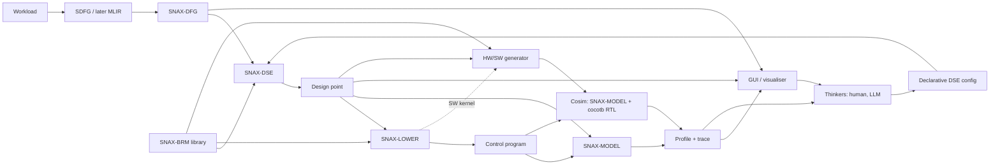

# SNAX-FORGE Architecture (Skeleton v1.0)

> This is the main skeleton of SNAX-FORGE: what the system is, its components,
> their contracts, and the order in which they are built. It is expected to
> evolve. Changes are recorded in the Decision Log (section 10) rather than by
> silently editing sections.
>
> Markers: **[OPEN]** = undecided. **[DEFAULT]** = working assumption, adopted
> unless a real kernel shows otherwise.

---

## 1. Purpose

SNAX-FORGE is a platform for exploring how domain-specific accelerators perform
when plugged into a SNAX compute cluster, before committing to RTL.

A user brings a workload and a set of accelerator models. SNAX-FORGE maps the
workload onto a configurable model of the cluster, runs it in a fast
cycle-level Python simulation, and returns profiles, traces and visualisations.
A human or an LLM uses these to decide the next design iteration. The chosen
design can then be generated as hardware and software and checked against real
RTL through cosimulation.

The goal is insight into how to design domain-specific accelerators for compute
clusters: where cycles are lost, which banks conflict, which accelerators
starve, and what a design change actually buys.

## 2. Positioning

SNAX-FORGE is complementary to analytical design-space exploration frameworks
such as ZigZag and Stream (KU Leuven MICAS). What distinguishes it:

- **Cycle-level cluster microarchitecture.** Bank arbitration, affine
  streamers, FIFO back-pressure, DMA and register-level control are modelled
  explicitly rather than abstracted into analytical cost terms.
- **Arbitrary dataflow graphs**, not only DNN layers: PolyBench-style kernels,
  stencils, reductions, and later HDC workloads.
- **RTL-backed accelerator models.** Every block model has a hardware binding,
  and the model is checked against real RTL through cosim.
- **A shared task sequence.** The same lowering logic drives both the model and
  the real hardware.
- **Human- and LLM-in-the-loop by design.** All artefacts are text-based and
  self-describing.

[OPEN] Refine this positioning with the ZigZag/Stream authors' view, and decide
whether SNAX-FORGE can consume or produce their formats.

## 3. Guiding Principles

1. **Model first.** Python models are the primary artefact; hardware is
   generated from, or checked against, them.
2. **One slice before generality.** Every component is first built in the
   simplest form that carries `vecadd` end to end, then generalised only when a
   real kernel requires it.
3. **Anchor to reality early.** The model's cycle counts are validated against
   real SNAX RTL on a simple kernel before the design space is explored at
   scale (section 7).
4. **Decisions are separate from derivations.** SNAX-DSE decides; SNAX-LOWER
   derives command sequences; SNAX-MODEL measures. No stage does another's job.
5. **Everything is text and diffable.** SNAX-DFG, BRMs, configs, design points,
   control programs, profiles and traces are serialised, versionable and
   readable by humans and LLMs.
6. **Extend without editing the core.** New node kinds, attributes and
   accelerator models are added by registration, not by changing core classes.

## 4. System Overview

**Inner loop** (core, Python only):
DFG → DSE → LOWER → MODEL → feedback → thinkers → config → DSE.

**Outer path** (commit and check): HW/SW generator → cosim → feedback.

## 5. Components and Contracts

Each component is defined by what it consumes and what it produces. The
artefacts between components are the contracts and must stay stable and
versioned.

| Component | Consumes | Produces |
|---|---|---|
| Workload analysis | workload via SDFG (later MLIR) | SNAX-DFG |
| SNAX-BRM library | user-supplied block models | BRMs |
| SNAX-DSE | SNAX-DFG, BRMs, DSE config | design point |
| SNAX-LOWER | design point, BRMs | control program (later also C kernel) |
| SNAX-MODEL | design point, control program | profile, trace, output data |
| Reference executor | SNAX-DFG, input data | golden output data |
| Visualiser | SNAX-DFG, design point, profile, trace | HTML views |
| HW/SW generator | design point, BRMs, SNAX-LOWER | accelerator RTL, SW kernel |
| Cosim | design point, control program, RTL | profile, trace, mismatch report |

### 5.1 SNAX-DFG

SNAX-FORGE's own serialisable dataflow graph (JSON or equivalent), independent
of DaCe classes.

- **SDFG-inspired base** so SDFG → SNAX-DFG translation is direct: data
  containers, compute nodes, map/loop scopes with symbolic ranges, memlets
  (data-movement edges), and control/state ordering.
- **Coarse node kinds on top**, most importantly the *accelerated node*, which
  replaces a subgraph with a bound BRM instance. Replacement can be nested.
- **Extensibility [DEFAULT]:**
  - The core element schema is only `id`, `kind`, `inputs`, `outputs`, `attrs`.
  - Node kinds are registered entries (name, attribute schema, optional Python
    behaviour), never subclasses.
  - `attrs` uses namespaced keys (`loop.*`, `mem.*`, `hw.*`, `user.*`). Tools
    read the namespaces they know and pass the rest through untouched.
  - Each kind validates its own attributes against its registered schema.
- **Visualisable** before and after DSE.

### 5.2 Reference Executor [DEFAULT]

A small NumPy interpreter that executes a SNAX-DFG directly and produces the
golden output. SNAX-MODEL output (computed through each BRM's Python function)
and later cosim output are compared against it. DaCe's CPU reference is
optional.

### 5.3 SNAX-BRM: Block Runtime Model

The primary definition of an accelerator block, supplied by the user or taken
from the library. A BRM has six parts:

1. **Interface**: ports, direction, data types and widths, CSR map, parameters
   (e.g. lanes `W`, trip count `T`), and interconnect ports needed per port.
2. **Dataflow**: per port, an exact affine loop nest giving the order in which
   elements are consumed or produced. Streamer configuration is derived from
   it. [OPEN] exact notation.
3. **Timing**: cycles as a function of parameters (latency `L`, initiation
   interval `II`, throughput per beat), analytic or measured from RTL; always
   user-supplied.
4. **Function**: a Python implementation that produces real output data.
5. **Pattern**: the SNAX-DFG subgraph shape the block can replace, with its
   predicate and parameter extraction.
6. **Hardware binding** (optional): how to obtain RTL, e.g. a Chisel generator
   with parameters, or hand-written SystemVerilog.

The existing Chisel elementwise modules (loop, spatial, tiled-spatial) and the
accumulator are the reference implementations for the first BRMs.

### 5.4 SNAX-DSE: Design Space Exploration

SNAX-DSE only makes decisions. It never computes register values or command
sequences.

**Inputs**: SNAX-DFG, BRM library, declarative DSE config written by the
thinkers. [OPEN] config format (YAML, TOML or JSON) and whether one config
describes a single design point or a sweep.

**Decisions** (extensible):

- which subgraphs are replaced by which BRMs
- BRM parameters (lanes, tiling)
- accelerator instance count and concurrency
- chaining between accelerators
- buffer placement across banks, double buffering
- cluster parameters (section 5.6)

**Output: the design point**:

1. optimised SNAX-DFG
2. memory allocation plan (L1 addresses and banks, L2 addresses)
3. accelerator instances with BRM parameters
4. cluster configuration

Exploration is manual (config-driven) first. Automated search comes later.

### 5.5 SNAX-LOWER: Lowering

A separate step between SNAX-DSE and SNAX-MODEL, comparable to a compiler
backend. It turns a design point into a generated sequence of tasks. It:

- orders tasks by the dependencies and execution order of the optimised SNAX-DFG
- computes streamer registers from each BRM's per-port affine loop nest and the
  memory plan
- computes accelerator CSR values from BRM parameters
- inserts L2↔L1 DMA transfers required by the memory plan
- inserts a wait at every dependency crossing an accelerator or DMA boundary

**Output: the control program**, a JSON list of commands:

- `csr_write`
- `csr_read`
- `dma`
- `start`
- `wait`, which either polls a busy CSR or blocks on a completion signal

**Later**, a C backend emits the SW library kernel for real hardware from the
same logic, so the model and the chip are driven by the same task sequence.

### 5.6 SNAX-MODEL: Cluster Model

A pure-Python model of the SNAX cluster. There is no CPU; a controller executes
the control program through the register interface.

**Time model.** Cycle-level and event-driven. Each component with pending work
receives a per-cycle tick, and cycle ranges with no pending work are skipped.
Round-robin arbitration is resolved exactly.

**Sub-models, in build order:**

1. **L1 memory banks.** RTL-like SRAM: one access per bank per cycle;
   configurable count, width and read latency.
2. **Interconnect.** TCDM-like: parallel access to distinct banks, round-robin
   arbitration on conflicts. Every conflict and stall is recorded.
3. **Streamers.** One per accelerator port. Affine address generation
   (configurable loop count, bounds, strides), FIFO buffering (configurable
   depth), valid/ready interface, configurable interconnect ports per streamer.
4. **Accelerator models.** BRM instances advancing according to their timing
   model and producing data through their Python function.
5. **DMA and L2.** A global memory and a DMA between L2 and L1, sharing the
   interconnect.
6. **Register interface and controller.** CSRs per accelerator and streamer,
   and the controller executing the control program.

**Data granularity.** The unit of transfer is a bank word; in v1 one element
occupies one word. Element type and elements per word are part of the data
model from the start, so sub-word packing (e.g. int8 in 64-bit banks) can be
enabled later without restructuring.

**Configurable cluster parameters**:

- bank count and width
- port bandwidths
- interconnect ports per streamer
- FIFO depth and number of streamer loops
- L2 size and latency
- DMA bandwidth

**Performance path [DEFAULT]:**

- The exact sequential simulator is the source of truth.
- Internal state is kept as struct-of-arrays so later acceleration is possible
  without changing results.
- Later options, in order:
  1. precomputed affine address and bank streams
  2. vectorised conflict estimates that assume no back-pressure, used as bounds
     for pruning
  3. batched lockstep simulation across design points (GPU via JAX or PyTorch)
  4. steady-state extrapolation of periodic phases

### 5.7 Feedback and Visualisation

**Profile**:

- total latency
- per-accelerator busy, idle and stalled time, and utilisation
- accesses and conflicts per bank
- FIFO occupancy
- DMA traffic
- control overhead
- functional check result against the reference executor

**Trace**: a data-level JSON event log with cycle timestamps, plus a compressed
summary for LLM use.

**Visualiser** (Python-generated HTML), with views for:

- SNAX-DFG (original and optimised)
- the design point (memory map, accelerator instances)
- a timeline
- utilisation
- bank conflicts
- a diff between two design points

### 5.8 Thinkers

Humans and a commercial LLM (Claude, ChatGPT, Gemini) read the feedback and
edit the DSE config, closing the loop.

### 5.9 Outer Path (later)

- **HW/SW generator.** Accelerator RTL through each BRM's hardware binding
  (Chisel first), grouped into one accelerator top. The SW kernel comes from
  SNAX-LOWER's C backend. The SNAX cluster itself is not generated.
- **Cosim.** SNAX-MODEL with accelerator models replaced by RTL through cocotb
  (Verilator, Questasim). It reports functional and cycle mismatches between
  each BRM and its RTL.
- **HW cost estimator.** Post-synthesis, technology-dependent, from a cost
  database. Built last.

## 6. Correctness Strategy

Three levels, each checked against the one above it:

1. **Reference executor**: golden output of the workload (SNAX-DFG in NumPy).
2. **SNAX-MODEL**: the same workload through BRM functions, streamers and
   memory. Its output must match level 1 exactly.
3. **Cosim**: the same design point with RTL accelerators. Output must match;
   cycle deviations from the BRM timing are reported.

## 7. Model Validation Anchor

SNAX-MODEL is only useful if its cycle counts track reality. Before the design
space is explored at scale:

- run `vecadd` on the real SNAX cluster RTL (existing SNAX simulation flow) and
  record the cycle counts
- run the same configuration in SNAX-MODEL
- document the deviation and its causes

This is repeated for `dot` once reductions are supported. [OPEN] acceptable
error target.

## 8. Build Order (milestones, not a schedule)

**M1: Vertical slice, `vecadd`.**

- minimal SNAX-DFG and reference executor
- one BRM (elementwise add)
- a hand-written design point (no DSE yet)
- SNAX-LOWER producing a control program
- SNAX-MODEL with banks, interconnect, streamers, accelerator and controller
- a basic text profile and JSON trace

**M2: Anchor.** Validate M1's cycle counts against real SNAX RTL (section 7).

**M3: `dot`.** A reduction BRM and chaining barriers, plus DMA/L2 in SNAX-MODEL.

**M4: SDFG front end.** SDFG → SNAX-DFG translation, reusing the existing
ingest.

**M5: DSE via config.** Declarative configs, pattern-based replacement,
parameter and memory-plan choices.

**M6: Visualiser.** DFG, timeline, bank-conflict and diff views; LLM summary
of the trace.

**M7: `jacobi1d`.** Stencil reuse and double buffering.

**M8: Outer path.** HW/SW generator from BRM bindings, cocotb cosim.

**Later:**

- MLIR front end
- automated search
- GPU-batched simulation
- sub-word packing
- HW cost estimator
- HDC workloads

## 9. Non-Goals (for now)

- Modelling a RISC-V core or executing real software on one.
- Generating the SNAX cluster itself.
- Automated design-space search before manual exploration works.
- Bit-level accuracy inside SNAX-MODEL; that is the job of cosim.

## 10. Decision Log

| # | Decision | Round |
|---|---|---|
| D1 | SNAX-DFG is its own serialisable, SDFG-inspired, extensible format | 1 |
| D2 | Node granularity starts at SDFG level, with coarse accelerated nodes on top | 1 |
| D3 | BRM = interface + dataflow + timing + function + pattern + optional HW binding | 1 |
| D4 | Model first: the RTL library is folded into BRM hardware bindings | 1 |
| D5 | Cycle numbers are user-supplied, analytic or measured | 1 |
| D6 | SNAX-MODEL is Python with banks, TCDM interconnect, streamers, DMA/L2, CSRs; no CPU | 1 |
| D7 | Cluster parameters are part of the design space | 1 |
| D8 | AI thinker = commercial LLM; all artefacts text-based | 1 |
| D9 | First targets: vecadd, dot, then jacobi1d | 1 |
| D10 | Time model: cycle-level events, ticking only components with pending work | 2 |
| D11 | Control program: JSON; wait by CSR polling or completion signal | 2 |
| D12 | One streamer per accelerator port; interconnect ports per streamer configurable | 2 |
| D13 | Unit of transfer = bank word; 1 element per word in v1, packing-ready data model | 2 |
| D14 | Thinkers act through declarative config files; GUI shows design-point diffs | 2 |
| D15 | Per-port exact affine loop nest in BRMs (notation to iterate) | 2 |
| D16 | SNAX-DFG is visualisable | 2 |
| D17 | DaCe CPU reference is optional; correctness via Python and later cosim | 2 |
| D18 | Control program produced by SNAX-LOWER, which later also emits the SW kernel | 3 |
| D19 | Extensibility by core schema + registered kinds + namespaced attrs [DEFAULT] | 4 |
| D20 | NumPy reference executor of SNAX-DFG as golden output [DEFAULT] | 4 |
| D21 | Exact sequential simulator first, array-friendly state, acceleration later [DEFAULT] | 4 |
| D22 | Vertical `vecadd` slice first; model validated against real RTL early | 4 |
| D23 | Positioned as complementary to ZigZag/Stream (cycle-level, RTL-backed) | 4 |

## 11. Open Items

1. BRM per-port affine loop nest notation and its mapping to streamer registers.
2. DSE config format, and single design point vs sweep.
3. Acceptable model-vs-RTL error target.
4. Positioning details relative to ZigZag/Stream.

# Document Evolution
- This document can evolve in time when new ideas or features thought of needs to be considered.