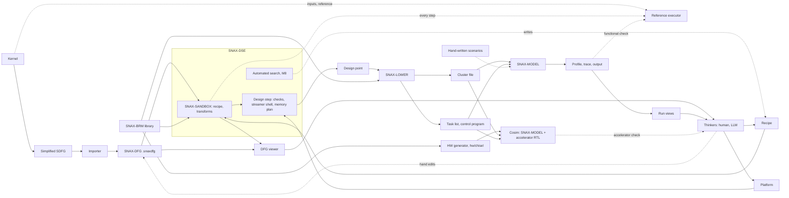

# SNAX-FORGE Architecture

> What SNAX-FORGE is, its components and how they fit together, as it is now.
> The decisions behind it are in `docs/DECISIONS.md` (cited as Dn); every
> artefact's fields are in `docs/CONTRACTS.md` (cited as C§n); milestones,
> tasks and open items are in `docs/STATUS.md`. A change to this file comes
> with a decision in `docs/DECISIONS.md` (D93).
>
> Markers: **[OPEN]** = undecided. **[DEFAULT]** = working assumption, adopted
> unless a real kernel shows otherwise.

---

## 1. Purpose

SNAX-FORGE is a platform for exploring how domain-specific accelerators perform
when plugged into a SNAX compute cluster, before committing to RTL.

A user brings a workload and a set of accelerator models. SNAX-FORGE imports
the workload into its own dataflow graph (SNAX-DFG, a `.snaxdfg` file), maps
it by hand in SNAX-SANDBOX (loops split into temporal and spatial parts,
accelerators bound), pairs it with a platform in the design step (cluster
parameters, streamers, memory plan), derives the cluster file and control
program in SNAX-LOWER, runs them in a cycle-level Python model of the cluster,
and returns profiles, traces and views. A human or an LLM uses these to decide
the next design iteration. The chosen accelerator can later be generated as
hardware and its RTL checked against its model through cosimulation.

The user describes the accelerator; SNAX-FORGE models the rest of the SNAX
cluster (D51). Model cycle counts compare design points; they do not predict
the absolute timing of the real SNAX cluster.

The goal is insight into how to design domain-specific accelerators for compute
clusters: where cycles are lost, which banks conflict, which accelerators
starve, and what a design change actually buys.

## 2. Positioning

SNAX-FORGE complements analytical design-space exploration frameworks such as
ZigZag and Stream (KU Leuven MICAS, D23). What distinguishes it:

- **Cycle-level cluster microarchitecture.** Bank arbitration, affine
  streamers, FIFO back-pressure, DMA and register-level control are modelled
  explicitly rather than abstracted into analytical cost terms.
- **Arbitrary dataflow graphs**, not only DNN layers: PolyBench-style kernels,
  stencils, reductions, and later HDC workloads.
- **RTL-backed accelerator models.** A BRM can carry a hardware binding, and
  the accelerator's model is checked against its RTL through cosim (D52).
- **A shared task sequence.** The same lowering logic drives the model and,
  later, the real hardware (D18).
- **Human- and LLM-in-the-loop.** Every artefact is text; the workload graph,
  the recipes that transform it and the platform are plain JSON a thinker can
  edit, sweep and view.

[OPEN] How far SNAX-FORGE can consume or produce ZigZag/Stream formats
(open item 4).

## 3. Guiding Principles

1. **Model first.** Python models are the primary artefact; hardware is
   generated from, or checked against, them (D4). The contracts follow from
   what SNAX-MODEL needs (D26).
2. **One slice before generality.** Every component is first built in the
   simplest form that carries `vecadd` end to end, then generalised only when a
   real kernel requires it. SNAX-MODEL is kernel-agnostic: it only executes
   control programs.
3. **The user owns the accelerator, the model owns the platform.** The user
   supplies the accelerator's interface and timing (lanes, rates, latency,
   II) as a BRM; everything around it is SNAX-MODEL's model of the SNAX
   platform, with declared defaults (D51).
4. **Decisions are separate from derivations.** SNAX-SANDBOX and the design
   step decide; importers derive the SNAX-DFG, SNAX-LOWER derives the cluster
   file and command sequences; SNAX-MODEL measures. No stage does another's
   job.
5. **Everything is text and diffable.** SNAX-DFG, BRMs, recipes, platforms,
   design points, task lists, control programs, scenarios, profiles and traces
   are serialised, versionable and readable by humans and LLMs.
6. **Extend without editing the core.** Node kinds, transforms, checks,
   memory passes, accelerator kinds and block kinds are added by registration.

## 4. System Overview

```mermaid
flowchart LR
    W[Kernel] --> IR[Simplified SDFG] --> IMP[Importer] --> DFG[SNAX-DFG .snaxdfg]
    W -. inputs, reference .-> REF[Reference executor]
    subgraph DSE[SNAX-DSE]
        SBX[SNAX-SANDBOX: recipe, transforms]
        DES[Design step: checks, streamer shell, memory plan]
        SRCH[Automated search, M8]
    end
    DFG --> SBX
    REC[Recipe] --> SBX
    BRM[SNAX-BRM library] --> SBX
    SBX -. every step .-> REF
    SBX --> DES
    PLAT[Platform] --> DES
    SRCH -. writes .-> REC
    DES --> DP[Design point]
    DP --> LOWER[SNAX-LOWER]
    BRM --> LOWER
    LOWER --> CF[Cluster file]
    LOWER --> CP[Task list, control program]
    CF --> MODEL[SNAX-MODEL]
    CP --> MODEL
    SC[Hand-written scenarios] -.-> MODEL
    MODEL --> FB[Profile, trace, output]
    FB -. functional check .-> REF
    DFG --> GV[DFG viewer]
    SBX --> GV
    FB --> VIS[Run views]
    GV --> T[Thinkers: human, LLM]
    VIS --> T
    T --> REC
    T --> PLAT
    T -. hand edits .-> DFG
    BRM --> GEN[HW generator, hw/chisel]
    GEN --> COSIM[Cosim: SNAX-MODEL + accelerator RTL]
    CF --> COSIM
    CP --> COSIM
    COSIM -. accelerator check .-> T
```

**Inner loop** (Python only): kernel → importer → SNAX-DFG → SNAX-SANDBOX
(recipe) → design step (platform) → design point → SNAX-LOWER → SNAX-MODEL →
feedback → thinkers → recipe or platform. `pixi run flow` runs it once, from
the kernel to a checked model run (section 5.10). Until automated search exists
(M8), thinkers close the loop by editing the recipe, the platform, or a
`.snaxdfg` by hand (D72, D84).

**Outer path** (later, independent of the inner loop, D52): HW generator →
cosim, which checks an accelerator's RTL against its model. Nothing in the
inner loop waits on it.

## 5. Components and Contracts

Each component is defined by what it consumes and what it produces. The
artefacts between them are the contracts (`docs/CONTRACTS.md`). Until the
contract freeze (M6) they are Python dataclasses with plain JSON files;
versioned schemas follow (D26).

| Component | Package | Consumes | Produces |
|---|---|---|---|
| Importer | `dfg/import_sdfg.py` | a kernel's simplified SDFG | SNAX-DFG (`.snaxdfg`) |
| Reference executor | `dfg/execute.py` | SNAX-DFG, input data | golden output |
| SNAX-BRM | `brm/` | hand-written block models | BRMs, accelerator instances |
| SNAX-SANDBOX | `sandbox/` | SNAX-DFG, BRMs, recipe | a `.snaxdfg` per step |
| Design step | `design/` | bound `.snaxdfg`, platform | design point |
| SNAX-LOWER | `lower/` | design point, BRMs | cluster file, task list, control program |
| SNAX-MODEL | `snax_model/` | cluster file, control program | profile, trace, output data |
| Flow | `flow/` | recipe, platform | all of the above, checked |
| Viewers | `viz/` | run directories, `.snaxdfg` files | local HTML views |
| HW generator (M10) | `hw/chisel/` | BRM hardware bindings | accelerator RTL |
| Cosim (M10) | | cluster file, program, accelerator RTL | per-accelerator mismatch report |

All packages are under `snax_forge/` except `hw/chisel/`; `snax_forge/sdfg/`
holds the SDFG ingest the importer reads (`pixi run forge <kernel>`).

### 5.1 SNAX-DFG

SNAX-FORGE's own dataflow graph: a JSON file with the extension `.snaxdfg`,
independent of DaCe classes (D71, D77; C§11). It borrows SDFG's concepts, not
its JSON.

- **A tree:** symbols, containers and an ordered `body` of nodes; scopes hold
  ordered bodies of their own, and body order is execution order. Memlets sit
  on the connectors of the nodes that use the data. Map entry/exit nodes,
  access nodes and outer memlets are derived, not stored.
- **Node kinds** are registered: `map` (one variable over a range, parallel
  iterations), `tasklet` (`output = expression` per output) and
  `accelerated` (one beat of a bound BRM instance, sitting inside the temporal
  maps it runs over, with the code it computes and what it replaced, D82).
  A sequential `loop` and a `branch` come with the kernels that need them
  (open item 36).
- **Loop kinds:** a map carries `loop.kind`: absent as imported, `tile`,
  `temporal` or `spatial` once SNAX-SANDBOX maps it (D73).
- **Expressions** in subsets, ranges and shapes use one grammar shared with the
  BRM (`snax_forge/expr.py`: ints, names, `+ - * //`, open item 37), stored
  canonical. A symbol is `null` as imported and gets its value from the recipe.
- **No streamer nodes.** A memlet on an accelerated node's connector becomes a
  streamer at lowering, one per port (D12, D53). The graph describes the
  workload, not the cluster.
- **Extension** (D19, D77): the core element is `id`, `kind`, `inputs`,
  `outputs`, `attrs` and, for a scope, `body`. An attr without a namespace
  belongs to its kind; namespaced attrs (`loop.*`, `mem.*`, `hw.*`, `user.*`)
  pass through tools that do not know them.

**Importer** (D78, `pixi run import-dfg <kernel>`). It reads the simplified
SDFG that `pixi run forge <kernel>` writes (or builds it in-process), keeps the
kernel's container names and gives maps, tasklets, variables and connectors
readable names (`add_map`, `add`, `i`, `in1`). It decides nothing, and a
construct it does not support is an error that names it. An MLIR importer
writing `.snaxdfg` directly may come later (open item 33).

Generated `.snaxdfg` files go under `out/`; test fixtures in
`tests/dfg/fixtures/` are the exception.

### 5.2 Reference Executor

A NumPy interpreter that runs any `.snaxdfg`, as imported, split or
accelerated, and gives the golden output (D20, D79; `pixi run check-dfg FILE
--kernel K`). Maps run over their whole iteration space at once; an
accelerated node runs firing by firing through the same function SNAX-MODEL
runs. On the imported graph it must equal the kernel's own `reference`;
SNAX-SANDBOX checks every transform step against it, and the flow checks every
model run against it. Only integer containers run for now (D28).

### 5.3 SNAX-BRM: Block Runtime Model

The definition of an accelerator block: one hand-written JSON file per BRM in
`snax_forge/brm/library/` (D68; C§10; generating one from RTL is open item
27). A BRM has a shared part, common to every implementation, and a map of
implementations.

Shared:

1. **Interface:** params and ports. A param is `design` (fixed per instance:
   lanes `W`, the op) or `runtime` (a start parameter: `n` and every named
   port rate). A port has a direction, lanes, a per-port element rate
   (D25) and a dtype. The register map and a port's interconnect ports follow
   from these and are not written in the BRM.
2. **Dataflow:** per port, a nest in a registered notation giving the order in
   which the accelerator consumes or produces the operand's elements, in
   logical indices, without addresses. The first notation is `affine` (D70):
   the operand's shape, an optional offset and loops listed outermost first,
   each with a bound, one stride per dimension and a spatial flag; the spatial
   loops come last and are the lanes. It checks that the memlets deliver the
   operand in this order (D73). Later notations: open item 1.
3. **Function:** a registered accelerator kind and its params, whose Python
   implementation produces real output data, and `code`, what one lane
   computes (`out = a + b`, D82).
4. **Pattern:** the SNAX-DFG shape the block can replace: a matcher registered
   in the sandbox (`family`) and its parameters (`attrs`).

Per implementation: its `source` (only `chisel` for now, open item 28), the
design-param values it supports, its **timing** (`latency` and
`initiation_interval`, ints or expressions over design params; always the
user's numbers, D5) and an optional **hardware binding** (null until M10).

Designs that differ only in timing, supported values or RTL source are
implementations of one BRM; different ports, rates or data order make a
different BRM. `Brm.resolve` turns one implementation and its design params
into the accelerator entry of the cluster file, checked against the model's
registered kind, so an instance that exists fits the model (D68). The library
holds `elementwise_add` (W lanes, 4 by default; implementation
`chisel_tiled_spatial`, L = 0, II = 1), whose reference implementation is
`ElementwiseTiledSpatial` in `hw/chisel/`.

### 5.4 SNAX-DSE: SNAX-SANDBOX and the design step

SNAX-DSE makes the decisions and never computes register values or command
sequences. Decisions are made by hand first; automated search (M8) will drive
the same transforms and write recipes, so everything it finds can be replayed,
viewed and diffed (D72).

**SNAX-SANDBOX** (`snax_forge/sandbox/`, D72, D80; C§12). Registered
transforms act on a `.snaxdfg` and write a new one. A **recipe** in `recipes/`
names a kernel, recipe params, the symbol values and an ordered list of
transforms with their parameters; `--set W=8` overrides a param, so a sweep is
one recipe with a parameter over several values. After every step the new
graph and the input graph run in the reference executor and must agree. `pixi
run sandbox RECIPE` writes every step to `out/sandbox/<name>/`. A hand-edited
`.snaxdfg` cannot be replayed or swept (open item 34).

Transforms so far:

- `split_map`: a map becomes an outer `temporal` map and an inner `spatial`
  one (a length that is not a multiple of the factor is refused, open item 31)
- `bind`: a tasklet alone in a spatial map becomes an accelerated node bound
  to a BRM instance; the BRM's pattern matches it, its code must equal the
  tasklet's, and the lanes design param is read off the spatial bound, so it
  is decided once, in the graph (D73, D82)
- `unbind`, `join_map`: their inverses, from what the graph records (D82)
- later: a tile transform, with a DMA per tile

The three loop levels map onto the cluster as follows: a tile is a repetition
of the tasks with a DMA per tile, a temporal loop is a streamer temporal loop
and part of the accelerator's `n`, a spatial loop is lanes (streamer
`n_ports`).

**The design step** (`snax_forge/design/`, D84–D87; C§13–15). It pairs the
recipe's bound graph with a **platform**, a file of its own in `platforms/`
(L1, L2, xbar, DMA, controller, register window, wait mode and the streamer
shell). The recipe never names a platform and the platform never names a
recipe, so either can change without the other. `pixi run design GRAPH
--platform P`:

1. resolves the **streamer shell**: one streamer per port of every accelerated
   node's instance, named `<instance>_<port>`, with the platform's defaults
   and per-streamer overrides;
2. makes the **memory plan** from registered residency, layout and placement
   passes, contiguous by default, with pins such as `--set
   memory.C.l1.base=1152`; passes see every port's element-index stream so
   later policies can avoid bank conflicts without running the model (D86);
3. runs every registered **design check** on the platform, the graph, their
   pairing and the memory plan, and reports every problem with its fix (D85);
4. writes working copies of the platform (`--set platform.PATH=VALUE`) and the
   memory plan under `out/design/<name>/`, and the **design point**
   (`design_point.json`: graph, platform, streamers, memory plan), which is
   checked again when loaded (D87). `design save` keeps a platform working
   copy under `platforms/`.

Banks follow from addresses under the fixed word-interleaved address map
(open item 18) and are not stated. Loads and stores are not in the design
point: SNAX-LOWER inserts them.

**Decisions** SNAX-DSE covers, now or later: which subgraphs become which BRMs
and implementations; BRM parameters (lanes, tiling); instance count and
concurrency; chaining between accelerators; buffer placement across banks and
double buffering; cluster parameters (D7).

### 5.5 SNAX-LOWER: Lowering

Turns a design point into the two inputs of a model run, and decides nothing
(D53). Names are derived: the streamer serving port `p` of instance `i` is
`i_p`, a task `<node>_<component>`, a DMA task `load_<container>` or
`store_<container>` (D75).

**Cluster file** (`lower/cluster.py`, D88; `pixi run lower cluster POINT`):
per accelerator, in the order the graph first uses its instance, its
streamers in the BRM's port order and then its accelerator entry
(`Brm.resolve`); the xbar, DMA (with an L2) and controller from the platform;
the register map. The checked-in scenario clusters are built by the same code;
vecadd's design point gives `alu4.json` byte for byte.

**Task list** (`lower/derive.py`, D89; `pixi run lower tasks POINT`; C§9): one
group of tasks per accelerated node in execution order. A group loads its
inputs that are not in L1 yet, configures one streamer per port with values
from the memlet through the container's L1 layout (checked against the BRM's
nest by address), configures the accelerator with `n` = its firing count,
starts them, and stores each output after its last write. `after` holds data
dependences only. For now every map around a node must be a temporal firing
loop (a single tile); tiles and general DMA insertion come with LOW3.

**Control program** (`lower/commands.py`, D45, D64, D66). The task list's
steps (`configure`, `start`, `sync`, `read`) are expanded into `csr_write`,
`csr_read` and `wait` commands through the model's own register adapters.
Before each start the lowering adds only the waits correctness needs, one per
component; a wait on a writer streamer covers the accelerator and readers
started with it. Where configures, starts and syncs go is the task list's
choice, so a list can overlap programming with running blocks. Task lists can
also be written by hand, as every scenario's is.

There is no separate `start` or `dma` command: every block is programmed
through the uniform register interface and launched by writing 1 to its
`start` register (D36, D37).

**Later**, a C backend emits the SW kernel for real hardware from the same
task list, mapping the model's register blocks onto SNAX's ReqRspManager CSRs
and iDMA instructions (GEN2, open item 9).

### 5.6 SNAX-MODEL: Cluster Model

A pure-Python model of the SNAX cluster (D6). There is no CPU; a controller
executes the control program through the register interface. The model knows
nothing about kernels: it runs whatever the cluster file and control program
describe.

**Ownership (D51).** The accelerator entry of the cluster file is the user's
(from the BRM). Everything else is the model of the SNAX platform: its
behaviour is fixed here, and its parameters are design knobs set by the
platform. Their defaults are declared, not measured: one 512-bit DMA beat per
cycle, 1-cycle L1 and L2 reads and small fixed controller costs (C§2 lists
every default).

**Time model** (D10, D29). Cycle-level and event-driven: only components with
pending work are ticked, and idle cycle ranges are skipped. Each cycle runs in
fixed phases (control, compute, request, arbitrate, memory, response);
components compute their next state in ticks and apply it in a commit at the
end of the cycle, so results are identical with skipping on and off. The rules
a block must follow for that are in C§8 (D47).

**Sub-models** (the module docstrings hold the timing):

1. **L1 banks** (`mem.py`, D30): one access per bank per cycle; count, width
   and read latency configurable; word-interleaved address map.
2. **Interconnect** (`xbar.py`, D31, D33): TCDM-like, parallel access to
   distinct banks, the SNAX per-bank arbiter on conflicts. A port covers an
   aligned group of banks by its width (the DMA's 512 bits = 8 banks), and the
   wider port wins per cycle and group. Every conflict and stall is recorded.
3. **Streamers** (`streamer.py`, D12, D32, D69): one per accelerator port,
   programmed by raw register values (base, bounds and strides per loop);
   affine address generation, FIFO buffering, valid/ready.
4. **Accelerators** (`accel.py`, D25, D35, D59): ports with a per-port element
   rate, latency, II and a Python function producing real data; between the
   streamers' FIFOs, with an L-stage pipeline that stalls on a full output.
   Generic `elementwise` and `reduce` kinds stand in where no BRM exists yet.
5. **DMA and L2** (`dma.py`, `l2.py`, D34): a flat L2 and a DMA on one wide
   interconnect port moving affine beat patterns (open item 7 lists the iDMA
   features not copied).
6. **Register interface and controller** (`ctrl.py`, D36, D37): every block
   has a window with `start`, `busy`, `busy_cycles` and buffered configuration
   registers; the controller executes commands one at a time with per-kind
   costs and keeps control overhead apart from waiting.

**Scenarios** (`snax_model/scenario.py`, D41–D44; C§2, C§6). A cluster file
holds the hardware (L1, optional L2, the ordered component list, the register
map); a scenario file holds one run's inputs (initial memory and the control
program) and may name its data: `regions`, one per container and memory, in
the form of a memory-plan layout. The model ignores them and copies them into
`run.json`, so the views know where the data lives (D95). `pixi run model-run
SCENARIO --out DIR` writes the run record, the profile, the trace and the
final memory, byte-identical on every run. The flow writes a scenario for
every run, with its regions from the memory plan; the hand-written ones under
`scenarios/` (one folder each, with `scenario.py` and a hand-written
`tasks.json`, D65) test the model and try platform features before a kernel
needs them. Their files are generated by `scenarios/make.py`, not kept in git
(D67).

**Data granularity** (D13). The unit of transfer is a bank word, one element
per word for now; element type and elements per word are part of the data
model, so sub-word packing can come later (open item 21).

**Configurable platform parameters:** bank count, width and read latency;
port widths; FIFO depth and streamer loop count per streamer; L2 size and
latency; DMA timing; controller costs; register window.

**Performance path [DEFAULT]** (D21, D48). The exact sequential simulator is
the source of truth. Persistent state is array-friendly; the per-cycle hot
path is plain Python, which is faster at cluster sizes. Later options, in
order: precomputed address and bank streams; vectorised conflict estimates as
bounds for pruning; batched simulation across design points (GPU via JAX or
PyTorch); steady-state extrapolation of periodic phases.

### 5.7 Feedback and Visualisation

**Profile** (`snax_model/profile.py`, D38, D59; C§7), built from the
components' own counters: total cycles; per component its cycle classes; per
accelerator utilisation and firings; per bank and interconnect port grants,
conflicts and stalls (stalls caused by a wider grant apart); FIFO occupancy
per lane; DMA and L2 traffic; control overhead apart from waiting; and the
flow's functional check.

**Trace** (`snax_model/trace.py`, D39, D49, D62; C§7): a JSON event log at a
level chosen per run: `off`, `task` (commands, starts, dones, cycle-class
intervals) or `beat` (adds grants, stalls, read responses, firings, DMA beats,
polls, FIFO counts). Beat events can be filtered by source and cycle window;
task events and the profile never are. A compressed summary for LLMs is VIS7.

**Run views** (`snax_forge/viz/`, D54, D55; `pixi run view DIR ...`, port
8765): a local server bound to 127.0.0.1 plus a static viewer, stdlib only,
with no build step and no external file, so it works offline. Reload re-reads
the run directories. Views:

- the profile report (VIS1), with FIFO occupancy also over each FIFO's busy
  window (D56)
- the schedule: per component its classes, tasks and commands over a cycle
  window, with a selected cycle (VIS2, D57, D58, D60)
- the cluster view: banks, interconnect, streamers, accelerators, DMA and
  controller at the selected cycle, requests and read data apart (VIS3, D61,
  D62)
- the memory tab (VIS4a, D95, D96): per memory a scale bar and a table of
  the regions a run names (extent, bytes, share, banks and rows touched),
  then its rows, L1 as banks × rows through the model's address map and L2
  as rows of one DMA beat, each word in its region's colour with the
  element's index; rows that repeat with one constant step per region are
  folded in Python and opened on a click, 256 rows at a time
  (`/api/run/<name>/memory`, `.../memory/<mem>/rows`). With regions, the
  cluster view's tooltips also name the element each L1 access touches
- data movement (VIS4b, D97), read off a beat trace and the regions: one
  element's journey (every hop in every memory, the firings it fed or came
  from and their operands), residency per region and memory (arrival, use,
  departure, waits), per port and task the addresses as an affine nest with
  the cycles held back and what the bank served instead, and the L1
  conflicts placed on the layout (`/api/run/<name>/movement`,
  `.../journey`, `.../conflicts`). The memory tab draws them on a
  beat-level run: the selected cycle (shared with the schedule, stepped by
  the arrow keys) outlines the words requested teal, read back green and
  held back red, with each conflict's waiting and served word; a mode
  colours the words by conflict count (with a count per bank) or by
  arrival, first use or wait, the rows then folding by equal counts or by
  one time step (`.../memory?marks=...`); clicking a word opens a drawer
  with its element's journey, firings and conflict cycles, each cycle
  selectable there or in the schedule
- later (M4b): a diff between two runs (VIS6)

Views read the model's own dataclasses, loaded back from a run directory, not
raw JSON (D38, D50).

**DFG viewer** (`snax_forge/viz/dfg/`, D76, D81; `pixi run view-dfg FILE|DIR
...`, port 8766): the same server for `.snaxdfg` files, several side by side,
e.g. every step of a recipe. A graph is drawn top to bottom in execution
order, maps as nested boxes coloured by loop kind, connectors carrying their
subsets; the rows and edges are computed in Python and the edges are drawn in
SVG, with no library (open item 32). Hovering a node highlights it in every
panel.

### 5.8 Thinkers

Humans and a commercial LLM (D8) read the feedback and close the loop: they
edit the recipe, the platform (`--set` and working copies), or a `.snaxdfg`
directly. Recipes can be replayed and swept, hand edits cannot (open item 34).
Automated search (M8) later writes recipes itself.

### 5.9 Outer Path (later, independent of the inner loop)

- **HW generator** (M10, GEN1). Accelerator RTL from each BRM's hardware
  binding, through `Emit` and the Chisel blocks in `hw/chisel/`, a project of
  its own (D91). The SNAX cluster itself is not generated.
- **SW kernel** (GEN2). From SNAX-LOWER's C backend (section 5.5).
- **Cosim** (D52). SNAX-MODEL with the accelerator models replaced by RTL
  through cocotb. It checks each accelerator's output and its declared latency
  and II against its RTL, and says nothing about the SNAX platform's timing.
  Integrating a generated accelerator into the real SNAX cluster is outside
  the current plan.
- **HW cost estimator.** Post-synthesis, technology-dependent. Built last.

### 5.10 The flow

`pixi run flow RECIPE --platform P [--set ...]` (`snax_forge/flow/`, D90) runs
the inner loop once and decides nothing: the sandbox on the kernel's import,
the design step on the last graph and the platform (a failing check stops the
flow with its problems named), SNAX-LOWER, a scenario whose inputs are the
kernel's `make_inputs` placed by the memory plan, and SNAX-MODEL. Every output
container is read back and compared with the kernel's reference and the
reference executor; the result goes into the profile and the exit code. A
`--set` without a dot is a recipe param; `platform.` and `memory.` ones go to
the design step. Everything goes to `out/flow/<name>/`, and the scenario there
runs again on its own. The default name carries every `--set` (`vecadd_W8`,
`vecadd_B.l1.base576`), so runs that differ in any setting sit side by side,
and the viewer names a flow's `run/` after that folder; the design point and
task list keep the recipe's name and params only. The run is traced at `task`
level unless `--trace` says otherwise, so it opens with a schedule (D94).

## 6. Correctness Strategy

Three levels, each checked against the one above it:

1. **Reference executor:** golden output of the workload, equal to the
   kernel's own reference on the imported graph and run after every sandbox
   step.
2. **SNAX-MODEL:** the same workload through BRM functions, streamers and
   memory; its output must match level 1 exactly (the flow checks it).
3. **Cosim:** the same run with RTL accelerators; output must match, and each
   accelerator's deviation from its declared latency and II is reported
   (D52). This checks the accelerator, not the platform model.

**Reductions [DEFAULT]** (D28). Exact matching with floating point depends on
accumulation order. Reductions use integer types first; for floating point,
the BRM defines its accumulation order and the reference executor follows it.

## 7. Model Validation Anchor (deferred until after M10, D51)

The anchor would check the *platform* model (interconnect, streamers, DMA,
controller) against the real SNAX cluster RTL; cosim does not, since it
replaces only the accelerator. Until the anchor runs, the platform parameters
are declared defaults and model cycle counts compare design points only.

When it runs, after M10: run `vecadd` on the SNAX cluster RTL and record the
cycles per phase, with one core issuing every task in order as the model's
single controller does; run the same configuration in SNAX-MODEL; document
the deviation and its causes. The RTL counts include CSR programming by the
Snitch core, which SNAX-MODEL does not model, so accelerator-active phases are
compared apart from control overhead. The error target (open item 3) is fixed
before the first comparison.

## 8. Build Order (milestones, not a schedule)

Order: M1, M4a, M3, M4b, M5–M10, then M2 (D24, D51, D54, D76). Done: M1
(SNAX-MODEL), M4a (run views), M3 (`vecadd` from the kernel to a checked
model run). `docs/STATUS.md` has the tasks of every milestone.

- **M4b:** design point and diff views, LLM trace summary, one documented
  design iteration on `vecadd` made by editing a recipe.
- **M5: `dot`.** Reduction in SNAX-DFG and its import, the accumulator BRM,
  chaining, general DMA insertion.
- **M6: contract freeze.** Versioned schemas for every contract, registries
  and namespaced attributes.
- **M7: remaining front ends.** The SDFG import of `jacobi1d`'s constructs,
  named errors for unsupported ones.
- **M8: automated DSE.** Search over recipes: pattern-based replacement across
  the BRM library, parameter and memory-plan policies, sweeps.
- **M9: `jacobi1d`.** Stencil reuse and double buffering.
- **M10: outer path.** HW generator from BRM bindings, cocotb cosim of the
  accelerators. Independent of M3–M9.
- **M2: anchor** (section 7).
- **Later:** MLIR front end (open item 33), GPU-batched simulation, sub-word
  packing, HW cost estimator, HDC workloads.

## 9. Non-Goals (for now)

- Modelling a RISC-V core or executing real software on one.
- Generating the SNAX cluster itself.
- Automated design-space search before manual exploration works.
- Bit-level accuracy inside SNAX-MODEL; that is the job of cosim.
- Predicting absolute SNAX cycle counts before the anchor (D51).
- Integrating generated accelerators into the real SNAX cluster (D52).
