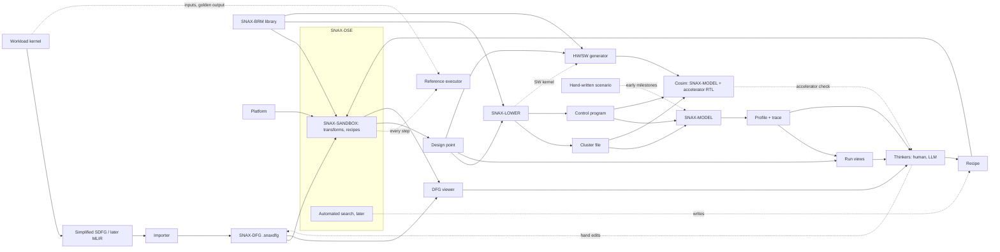

# SNAX-FORGE Architecture (Skeleton v1.2)

> This is the main skeleton of SNAX-FORGE: what the system is, its components,
> their contracts, and the order in which they are built. It is expected to
> evolve. Changes are recorded in `docs/DECISIONS.md` rather than by silently
> editing sections.
>
> Markers: **[OPEN]** = undecided. **[DEFAULT]** = working assumption, adopted
> unless a real kernel shows otherwise.
>
> Task-level breakdown, dependencies and acceptance criteria live in
> `docs/STATUS.md`. What the model-side artefacts mean, field by field, lives
> in `docs/CONTRACTS.md` (MOD10, D46).

---

## 1. Purpose

SNAX-FORGE is a platform for exploring how domain-specific accelerators perform
when plugged into a SNAX compute cluster, before committing to RTL.

A user brings a workload and a set of accelerator models. SNAX-FORGE imports
the workload into its own dataflow graph (SNAX-DFG, a `.snaxdfg` file), maps
it in SNAX-SANDBOX onto a configurable model of the cluster (loops split into
temporal and spatial parts, accelerators bound, memory planned; D71–D74),
runs it in a fast cycle-level Python simulation, and returns profiles, traces
and visualisations.
A human or an LLM uses these to decide the next design iteration. The chosen
accelerator can then be generated as hardware, and its RTL checked against its
model through cosimulation.

The user describes the accelerator; SNAX-FORGE models the rest of the SNAX
cluster (D51). Model cycle counts compare design points; they do not predict
the absolute timing of the real SNAX cluster.

The goal is insight into how to design domain-specific accelerators for compute
clusters: where cycles are lost, which banks conflict, which accelerators
starve, and what a design change actually buys.

## 2. Positioning

SNAX-FORGE is complementary to analytical design-space exploration frameworks
such as ZigZag and Stream (KU Leuven MICAS). What distinguishes it:

- **Cycle-level cluster microarchitecture.** Bank arbitration, affine
  streamers, FIFO back-pressure, DMA and register-level control are modelled
  explicitly rather than abstracted into analytical cost terms.
- **Arbitrary dataflow graphs**, not only DNN layers: PolyBench-style kernels,
  stencils, reductions, and later HDC workloads.
- **RTL-backed accelerator models.** A block model can carry a hardware
  binding, and the accelerator's model is checked against its RTL through
  cosim (D52).
- **A shared task sequence.** The same lowering logic drives both the model and
  the real hardware.
- **Human- and LLM-in-the-loop by design.** All artefacts are text-based and
  self-describing; the workload graph and the recipes that transform it are
  plain JSON a thinker can edit, sweep and view (D71, D72, D76).

[OPEN] Refine this positioning with the ZigZag/Stream authors' view, and decide
whether SNAX-FORGE can consume or produce their formats.

## 3. Guiding Principles

1. **Model first.** Python models are the primary artefact; hardware is
   generated from, or checked against, them. SNAX-MODEL is built before the
   components that feed it, and their contracts follow from what it needs
   (D24, D26).
2. **One slice before generality.** Every component is first built in the
   simplest form that carries `vecadd` end to end, then generalised only when a
   real kernel requires it. SNAX-MODEL is kernel-agnostic by construction: it
   only executes control programs (D6, D11).
3. **The user owns the accelerator, the model owns the platform.** The user
   supplies the accelerator's interface and timing (lanes, rates, latency,
   II); everything around it is SNAX-MODEL's model of the SNAX platform, with
   declared defaults. Model cycles compare design points; checking the
   platform model against SNAX RTL is deferred (section 7, D51).
4. **Decisions are separate from derivations.** SNAX-DSE decides, by hand in
   SNAX-SANDBOX first (D72); importers derive the SNAX-DFG and SNAX-LOWER
   derives the cluster file and command sequences; SNAX-MODEL measures. No
   stage does another's job.
5. **Everything is text and diffable.** SNAX-DFG, BRMs, recipes, platform
   files, design points, task lists, control programs, scenarios, profiles
   and traces are serialised,
   versionable and readable by humans and LLMs.
6. **Extend without editing the core.** New node kinds, attributes and
   accelerator models are added by registration, not by changing core classes.

## 4. System Overview

```mermaid
flowchart LR
    W[Workload kernel] --> IR[Simplified SDFG / later MLIR] --> IMP[Importer]
    IMP --> DFG[SNAX-DFG .snaxdfg]
    W -. inputs, golden output .-> REF[Reference executor]
    subgraph DSE[SNAX-DSE]
        SBX[SNAX-SANDBOX: transforms, recipes]
        SRCH[Automated search, later]
    end
    DFG --> SBX
    BRM[SNAX-BRM library] --> SBX
    PLAT[Platform] --> SBX
    REC[Recipe] --> SBX
    SRCH -. writes .-> REC
    SBX -. every step .-> REF
    SBX --> PLAN[Design point]
    PLAN --> LOWER[SNAX-LOWER]
    BRM --> LOWER
    LOWER --> CF[Cluster file]
    LOWER --> CP[Control program]
    CF --> MODEL[SNAX-MODEL]
    CP --> MODEL
    SC[Hand-written scenario] -. early milestones .-> MODEL
    MODEL --> FB[Profile + trace]
    DFG --> GV[DFG viewer]
    SBX --> GV
    PLAN --> VIS[Run views]
    FB --> VIS
    FB --> T[Thinkers: human, LLM]
    GV --> T
    VIS --> T
    T --> REC
    T -. hand edits .-> DFG
    PLAN --> GEN[HW/SW generator]
    BRM --> GEN
    LOWER -. SW kernel .-> GEN
    GEN --> COSIM[Cosim: SNAX-MODEL + accelerator RTL]
    CF --> COSIM
    CP --> COSIM
    COSIM -. accelerator check .-> T
```

**Inner loop** (core, Python only):
kernel → importer → SNAX-DFG → SNAX-SANDBOX (recipe) → design point →
SNAX-LOWER → SNAX-MODEL → feedback → thinkers → recipe → SNAX-SANDBOX.

Until automated search exists (M8), thinkers close the loop by editing the
recipe, or a `.snaxdfg` by hand (D72, amends D27).

**Outer path** (later, independent of the inner loop, D52): HW/SW generator →
cosim, which checks an accelerator's RTL against its model. Nothing in the
inner loop waits on it.

## 5. Components and Contracts

Each component is defined by what it consumes and what it produces. The
artefacts between components are the contracts and must stay stable and
versioned. Until the contract freeze (M6), contracts are Python dataclasses
with plain JSON files; versioned schemas follow once two kernels have used them
(D26).

| Component | Consumes | Produces |
|---|---|---|
| Importer (workload analysis) | kernel via its simplified SDFG (later MLIR) | SNAX-DFG (`.snaxdfg`) |
| SNAX-BRM library | user-supplied block models | BRMs |
| SNAX-DSE: SNAX-SANDBOX first, automated search later | SNAX-DFG, BRMs, platform, recipe | transformed `.snaxdfg` per step, design point |
| SNAX-LOWER | design point, BRMs | cluster file, control program (later also C kernel) |
| SNAX-MODEL | cluster file, control program (or a hand-written scenario) | profile, trace, output data |
| Reference executor | SNAX-DFG, input data | golden output data |
| DFG viewer | `.snaxdfg` files | HTML view |
| Visualiser (run views) | design point, profile, trace | HTML views |
| HW/SW generator | design point, BRMs, SNAX-LOWER | accelerator RTL, SW kernel |
| Cosim | cluster file, control program, accelerator RTL | profile, trace, per-accelerator mismatch report |

### 5.1 SNAX-DFG

SNAX-FORGE's own dataflow graph: a JSON file with the extension `.snaxdfg`
(D71), independent of DaCe classes. It borrows SDFG's concepts, not its
format: the SDFG JSON carries guids, debuginfo, per-state bookkeeping and
DaCe types, which make it hard to transform by hand or by script. The
format is fixed by D77 and written down in CONTRACTS.md section 11
(`snax_forge/dfg/`).

- **A tree, not a graph** (D77): symbols, containers and an ordered `body`
  of nodes; scopes hold ordered bodies of their own, and body order is
  execution order. Memlets sit on the connectors of the nodes that use the
  data. Map entry/exit nodes, access nodes and the outer memlets SDFG
  draws on a map are derived, not stored.
- **Borrowed from SDFG**: data containers (shape, dtype, symbolic sizes),
  tasklets, map scopes with symbolic ranges, connectors, memlets
  (data-movement edges with a subset), and the order between scopes.
- **Loop kinds**: a map has one loop variable, so a multi-dimensional
  loop is nested maps. It carries `loop.kind`: absent as imported, `tile`,
  `temporal` or `spatial` once SNAX-SANDBOX maps it (D73, D77).
- **Names and expressions** (D77): every name in an expression is a symbol
  or the variable of an enclosing map. Subsets, ranges and shapes use the
  expression grammar of the BRM (`snax_forge/expr.py`), stored canonical.
  A symbol is `null` as imported and gets its value from the recipe, while
  expressions keep its name.
- **Coarse node kinds on top**, most importantly the *accelerated node*, which
  replaces a subgraph with a bound BRM instance. It does one beat: `bind`
  replaces a spatial map and its tasklet, so the node sits inside the
  temporal maps it runs over, its connectors are the BRM's ports and each
  memlet gives a port's lanes as a range. It holds the instance (BRM,
  implementation, design params, D77), what it computes (`code`, the BRM's)
  and what it replaced (`replaced`), and a split map keeps the map it was
  split from (`loop.split`), so a graph at any step can be taken back to
  the imported one (D82). Replacement can be nested: the node has a body,
  empty for a leaf block.
- **No streamer nodes.** A memlet on an accelerated node's connector becomes
  a streamer at lowering, one per port (D12, D53). The graph describes the
  workload, not the cluster.
- **Importers** derive a `.snaxdfg` and decide nothing (principle 4). The
  first (`snax_forge/dfg/import_sdfg.py`, `pixi run import-dfg <kernel>`,
  D78) reads the simplified SDFG that `pixi run forge <kernel>` writes, or
  builds the same SDFG in-process.
  DaCe's transient-plus-copy (`C[:] = A + B` gives a map into `__tmp0` and a
  copy into `C` in the raw SDFG) is already folded by simplify for vecadd;
  the importer folds only what simplify leaves, and transients stay in the
  format (dot and jacobi1d keep theirs). Containers keep the kernel's
  names, and maps, tasklets, variables and connectors get readable ones
  (`add_map`, `add`, `i`, `in1`). Symbols (`N`) stay symbolic; the recipe
  binds them. A construct it does not support is an error that names it. An MLIR importer comes later and writes
  `.snaxdfg` directly, without SDFG (open item 33).
- **Extensibility** (D19, D77):
  - The core element schema is `id`, `kind`, `inputs`, `outputs`, `attrs`,
    plus `body` for a kind that is a scope.
  - Node kinds are registered entries (attrs, whether they have a body, the
    variables they bind, a check), never subclasses: `map`, `tasklet` and
    `accelerated` so far; a sequential `loop` and a `branch` come with the
    kernels that need them (open item 36).
  - An attr without a namespace belongs to the kind, is checked by it and is
    always written. Namespaced keys (`loop.*`, `mem.*`, `hw.*`, `user.*`)
    are cross-cutting: tools read the namespaces they know and pass the rest
    through untouched.
- **Visualisable** in the DFG viewer (section 5.7, VIS5), as imported and
  after every sandbox step.

Generated `.snaxdfg` files go under `out/`, not in git (as D67); test
fixtures are the exception.

### 5.2 Reference Executor

A small NumPy interpreter that executes a SNAX-DFG directly and produces the
golden output (`snax_forge/dfg/execute.py`, D20, D79). It runs any
`.snaxdfg`, as imported, split or accelerated (an accelerated node through
its BRM's function), so SNAX-SANDBOX checks every transform step against it
(D72, D80). Inputs come from the kernel's `make_inputs`; the kernel's own `reference` is what
the executor must match on the imported graph (`pixi run check-dfg FILE
--kernel K`). SNAX-MODEL output (computed through each BRM's Python
function) and later cosim output are compared against it. DaCe's CPU
reference is optional.

Maps and tasklets run over the whole iteration space at once: each map
variable is an index array on an axis of its own, and a tasklet gathers,
computes and scatters on those arrays, which is exact because map
iterations are independent. An accelerated node runs firing by firing
through the same `fn(k, ins, state, params)` SNAX-MODEL runs, over the
temporal maps around it, in order.

### 5.3 SNAX-BRM: Block Runtime Model

The primary definition of an accelerator block, supplied by the user or taken
from the library. BRMs are written by hand for now (open item 27): one JSON
file each, in `snax_forge/brm/library/` (D68). A BRM has a shared part,
common to every implementation of the accelerator, and a map of
implementations, which differ in how the accelerator is built. Its six parts
(D3):

Shared:

1. **Interface**: params and ports. A param is `design` (fixed per
   instance: lanes `W`, the op) or `runtime` (a start parameter: exactly `n`
   and every named port rate). A port has a direction, lanes, a per-port
   element rate (elements consumed or produced per beat, so reductions and
   elementwise blocks share one interface, D25) and a dtype. The register map
   follows from the runtime params (D36) and a port's interconnect ports from
   its lanes (D12); neither is written in the BRM.
2. **Dataflow**: per port, a nest in a registered notation giving the order in
   which the accelerator consumes or produces the operand's elements, in
   logical indices. It describes only the accelerator and holds no
   addresses. It checks that the memlets of the mapped SNAX-DFG deliver the
   operand in this order; the streamer values come from those memlets
   through the buffer layout (section 5.5, D73). The first notation, `affine` (D70), gives the operand's
   shape, an optional offset and loops listed outermost first, each with a
   bound, one stride per dimension and a spatial flag; the spatial loops
   come last and are the lanes. [OPEN] later notations (open item 1).
3. **Function**: a registered accelerator kind (D43) and its params, whose
   Python implementation produces real output data, and `code`: what one
   lane computes, symbolically (`out = a + b`, D82). `bind` compares a
   tasklet against the code, and the accelerated node carries it, so a
   bound graph says what each accelerator does.
4. **Pattern**: the SNAX-DFG subgraph shape the block can replace.
   SNAX-SANDBOX's `bind` matches it and extracts the design params from the
   graph, e.g. `W` from the spatial bound of a split map, so a design param
   is decided once, in the graph (D73). The `family` names a matcher
   registered in the sandbox (`snax_forge/sandbox/patterns.py`, D80) and the
   `attrs` are its parameters; `predicate` stays null.

Per implementation, beside its `source` (only `chisel` for now, open item
28) and the design-param values it supports:

5. **Timing**: `latency` (`L`) and `initiation_interval` (`II`, written `ii`
   in the cluster file), ints or expressions over design params; always
   user-supplied, analytic or measured from RTL (D5).
6. **Hardware binding** (optional): how to obtain RTL, e.g. a Chisel
   generator with parameters. Null until M10.

Designs that differ only in timing, supported values or RTL source are
implementations of one BRM; different ports, rates or data order make a
different BRM. Choosing an implementation is a SNAX-DSE decision, so a
design point instance names the BRM, the implementation and the design
params.

Each part serves one component: interface, function and timing give the
accelerator entry of the cluster file (SNAX-MODEL, through SNAX-LOWER,
D53); the dataflow checks the order of the memlets that give the streamer
values (SNAX-SANDBOX, SNAX-LOWER, D73); the pattern serves SNAX-SANDBOX's
`bind` and the binding the HW generator. In the cluster file the
entry is the accelerator's `lanes`, rates, `latency`, `ii` and `op`, which
is the only part of the cluster file the user is responsible for (D51);
until BRMs exist it is written by hand. A BRM is accepted when, plugged
into the model, it gives the same cycles and data as the matching generic
stub.

The existing Chisel elementwise modules (loop, spatial, tiled-spatial) and the
accumulator are the reference implementations for the first BRMs. The first
library file is `elementwise_add` (BRM3): `W` lanes, 4 by default, one
implementation `chisel_tiled_spatial` (`ElementwiseTiledSpatial`, L = 0,
II = 1), resolving to exactly the adder of `scenarios/clusters/alu4.json`.
Library files are kept in the form `Brm.to_json` writes.

### 5.4 SNAX-DSE: Design Space Exploration

SNAX-DSE only makes decisions. It never computes register values or command
sequences. It comes in two parts (D72):

- **SNAX-SANDBOX** (M3): where decisions are made by hand. Registered
  transforms act on a `.snaxdfg` and write a new one. A **recipe** is an
  ordered JSON list of transforms with their parameters, applied to an
  imported `.snaxdfg`; the reference executor checks every step. A thinker
  edits the recipe, or a `.snaxdfg` directly. Only a recipe can be swept: a
  sweep is one recipe with a parameter taking several values (open item 34
  for hand edits). Recipes live in `recipes/`; `pixi run sandbox
  recipes/vecadd.json [--set W=8]` writes every step to
  `out/sandbox/<recipe>/` (`snax_forge/sandbox/`, D80).
- **Automated search** (M8): drives the same transforms and writes recipes,
  so everything it finds can be replayed, viewed and diffed.

**Inputs**: SNAX-DFG, BRM library and the recipe, which also binds the
symbols (`N`). The recipe acts on the graph only: it never names a platform.

**The design step** (`snax_forge/design/`, D84, D85) pairs the recipe's last
graph with a platform: a file of its own in `platforms/` (L1, L2, xbar, DMA,
controller, register window, wait mode and the streamer shell, CONTRACTS.md
section 13). Either side can be swapped without touching the other.
`pixi run design GRAPH --platform P [--set platform.PATH=VALUE]` checks the
pairing (section 14 of CONTRACTS.md: every problem, each with its fix) and
writes a working copy of the platform with its changes under
`out/design/<name>/`; `design save` keeps a working copy under
`platforms/`. It also makes the memory plan (D86): registered residency,
layout and placement passes, contiguous by default, with pins
(`--set memory.C.l1.base=1152`) and a memory working copy of its own, and
writes the design point (D87).

**Transforms** (registered, extensible; the first two in SBX1):

- `split_map`: split a loop into an outer loop tagged `temporal` and an inner
  one tagged `spatial` (`loop.kind`, D73)
- `bind`: replace a subgraph matching a BRM's pattern with an accelerated
  node bound to an instance (BRM, implementation, design params extracted
  from the graph, D68, D73)
- `unbind`, `join_map`: the inverses of `bind` and `split_map`, from what
  the graph records (D82)
- tile: an outer loop over L1-sized tiles

The memory plan is not a transform: the design step makes it (D84, D86).

The three loop levels map onto the cluster as follows: a tile is a
repetition of the tasks with a DMA per tile, a temporal loop is a streamer
temporal loop and part of the accelerator's `n`, a spatial loop is lanes
(streamer `n_ports`).

**Decisions** (extensible):

- which subgraphs are replaced by which BRMs, and which implementation of each
- BRM parameters (lanes, tiling)
- accelerator instance count and concurrency
- chaining between accelerators
- buffer placement across banks, double buffering
- cluster parameters (section 5.6)

**Output: the design point** (D74, D84), written by the design step from a
bound graph and a platform, not edited by hand:

1. the mapped SNAX-DFG
2. the memory plan: a layout per container and memory (base address, shape,
   one byte stride per dimension); banks follow from addresses under the
   fixed address map (open item 18) and are not stated
3. accelerator instances: BRM, implementation and design params, as the
   accelerated nodes of the mapped SNAX-DFG hold them (D77)
4. the platform

Loads and stores are not in the design point: SNAX-LOWER inserts them for
containers that have both an L2 and an L1 layout (section 5.5).

Exploration is manual (recipes) first. Automated search comes later.

### 5.5 SNAX-LOWER: Lowering

A separate step between SNAX-DSE and SNAX-MODEL, comparable to a compiler
backend. It turns a design point into the two inputs of a model run: the
cluster file and the control program (D53). It derives both and decides
nothing (principle 4).

**Cluster file** (LOW1c, D88, `snax_forge/lower/cluster.py`). One
accelerator entry per accelerator instance, filled from its BRM's interface
and timing parts and the instance's parameters; one streamer per
accelerator port (D12), with `n_ports` equal to the port's lanes and
attached to it, shaped by the platform's streamer shell (D84); the xbar,
L1, L2, DMA and controller from the platform in the design point; the
register map. A streamer serving port `p` of instance `i` is named `i_p`
(D75). Its layout is the one of `scenarios/clusters/alu4.json`
(CONTRACTS.md section 2), which vecadd's design point reproduces byte for
byte; the checked-in clusters are built through the same builder.
`pixi run lower cluster DESIGN_POINT` writes `cluster.json` beside it.

**Control program.** It:

- orders tasks by the execution order of the mapped SNAX-DFG, one group of
  tasks per accelerated node and tile, sequential per tile by default
  (double buffering is a later recipe choice); a task is named
  `<node>_<component>`, a DMA task `load_<container>` or
  `store_<container>` (D75)
- computes streamer registers from the memlets on each accelerated node's
  connectors and the memory plan: the memlet's index through the container's
  layout (`snax_forge/lower/streams.py`, D70, D73); the BRM's nest checks the
  order
- computes accelerator register values from BRM parameters and the loop
  bounds
- inserts L2↔L1 DMA transfers from the memory plan: a container with both an
  L2 and an L1 layout is loaded before its first read and stored after its
  last write (the simple case in LOW1a, general insertion in LOW3)
- inserts a wait at every dependency crossing an accelerator or DMA boundary

The control program is a JSON list of commands:

- `csr_write`
- `csr_read`
- `wait`, which either polls a block's `busy` register or blocks on its
  completion signal

There is no separate `start` or `dma` command: every block (streamer,
accelerator, DMA) is programmed through the uniform register interface
(section 5.6, D36), and writing 1 to its `start` register launches it
(D37).

It works in two steps (D45): the design point gives an ordered task list
(which block starts with which register values, and where waits go), and the
task list is expanded into the plain command list with the same per-kind
adapters the model uses (D36). A task list can also be written by hand before
the design point exists, and the second step is built first (D63). The first
step is LOW1a (D89, `snax_forge/lower/derive.py`, `pixi run lower tasks
DESIGN_POINT`): one group of tasks per accelerated node, loads and stores
from the memory plan, streamer values from memlets through layouts, checked
against the BRM's nest by address.

**Task list** (`snax_forge/lower/`, D64, CONTRACTS.md section 9). An ordered
list of steps: `configure` declares a task on one component (its `type`,
`after` dependencies, `wait_mode` and `values` in the type's own terms) and
writes its registers at that point; `start` launches one or more configured
tasks together; `sync` waits there for a task; `read` samples a register.
`lower_program(tasks, cluster)` emits the commands in that order and adds
only the waits correctness needs: before each start, one per component for
the `after` tasks and for busy components, where a wait on a writer
streamer also covers the accelerator and readers started with it. Where
configures, starts and syncs go is the task list's choice, so a hand-written
or generated list can overlap programming with running blocks.

Its first acceptance test is reproducing the hand-written `scenarios/vecadd`:
its cluster file and its program.

**Later**, a C backend emits the SW library kernel for real hardware from the
same logic, so the model and the chip are driven by the same task sequence.
It maps the model's register blocks by name onto the real interfaces:
ReqRspManager CSRs for streamers and accelerators, iDMA instructions for the
DMA (open item 9).

### 5.6 SNAX-MODEL: Cluster Model

A pure-Python model of the SNAX cluster. There is no CPU; a controller executes
the control program through the register interface. The model has no knowledge
of kernels: it runs whatever the control program and cluster configuration
describe.

**Ownership (D51).** The accelerator entry of the cluster file is the user's.
Everything else is the model of the SNAX platform: its behaviour is fixed
here, and its parameters (bank count, FIFO depth, DMA bandwidth, ...) are
design knobs for SNAX-DSE (D7), not something the user has to supply. Their
defaults are declared, not measured: one 512-bit DMA beat per cycle, 1-cycle
L1 and L2 reads, and small fixed controller costs (CONTRACTS.md section 2
lists every default).

**Time model.** Cycle-level and event-driven. Each component with pending work receives a per-cycle tick, and cycle ranges with no pending work are skipped. Round-robin arbitration is resolved exactly. Each cycle runs in fixed phases (control, compute, request, arbitrate, memory, response). A component may take part in several phases. Components compute their next state during ticks and apply it in a commit at the end of the cycle; shared elements such as FIFOs commit the same way (D29).

**Sub-models, in build order:**

1. **L1 memory banks.** RTL-like SRAM: one access per bank per cycle; configurable count, width and read latency; replaceable address-to-bank map (default word-interleaved); base address configurable, 0 by default. A shared element touched by its requester, not a ticked component (D30).
2. **Interconnect.** TCDM-like: parallel access to distinct banks, round-robin
   arbitration on conflicts. Ports have a width: a narrow port (64 bits)
   reaches one bank, a wide port an aligned group of banks (512 bits = one
   superbank of 8 banks, used by the DMA). Wide port with per-cycle
   superbank priority: wider wins per cycle and per bank group, so narrow
   ports to other superbanks, and to the same superbank in cycles the wide
   port does not use it, proceed (D31, D33). Every conflict and stall is
   recorded, with stalls caused by a wider grant counted separately.
3. **Streamers.** One per accelerator port, configured by raw register values
   (base, bounds and strides per loop). Affine address generation, FIFO
   buffering (configurable depth), valid/ready interface, configurable
   interconnect ports per streamer. A reader with temporal stride 0 on loop
   0 reads each group once and hands it out `tbound[0]` times (D69).
4. **Accelerator models.** Instances of the accelerator interface (ports with
   per-port element rate, `L`, `II`, Python function), advancing according to
   their timing and producing data through their function. Generic
   elementwise and reduce stubs exist before any BRM. An accelerator sits
   between its streamers' FIFOs; its L-stage pipeline stalls globally on a
   full output (D35).
5. **DMA and L2.** A flat L2 with fixed read latency and a DMA between L2
   and L1 on one wide port of the interconnect. Source and destination are
   affine beat patterns; timing is per beat for now (D34).
6. **Register interface and controller.** A uniform register interface: every
   block (streamer, accelerator, DMA, any later block) has an aligned window
   with `start`, `busy` and `busy_cycles` at offsets 0–2 and buffered
   configuration registers after them, listed by a per-kind adapter (D36).
   The controller executes `csr_write`, `csr_read` and `wait` one at a time,
   each with a per-kind cost, and keeps control overhead separate from
   waiting (D37).

**Scenario runner** (`snax_model/scenario.py`, D41–D44). Before the upstream
components exist, the model is driven by scenario files. A cluster file holds
the hardware: L1, optional L2, the ordered component list (its order is the
registration, xbar port and trace source order) and the register map. A
scenario file holds one run's inputs: a reference to the cluster file, initial
memory (inline words, `.npy` files or seeded random fills) and the control
program as a plain command list. Expected results live in the tests, not in
the scenario. Accelerators are named by a registered kind with parameters.
`python -m snax_forge.snax_model run SCENARIO --out DIR` dumps the profile,
the trace and the final memory; the files are byte-identical on every run and
with skipping on and off. Scenarios live under `scenarios/`, one folder each
with the `scenario.py` that makes it and the hand-written task list its
program is lowered from (D64, D65, D66); block-level helpers expand into
register writes only there, through SNAX-LOWER, never inside the model.
`scenarios/make.py` writes the scenario files, their input data and the
cluster files; they are generated, not kept in git (D67).

**Model-side contracts (D26, D46).** The cluster configuration, streamer
register layout, accelerator interface, control program, scenario, profile and
trace are written down in `docs/CONTRACTS.md` (MOD10). They define what
SNAX-BRM, SNAX-DSE and SNAX-LOWER must produce; section 8 of that file holds
the rules a new block kind must follow to keep the skipping honest (D47).
Every configuration class carries its own `to_dict` / `from_dict`, and every
snippet in the document is checked against the file it came from
(`tests/snax_model/test_contracts.py`).

**Data granularity.** The unit of transfer is a bank word; in v1 one element
occupies one word. Element type and elements per word are part of the data
model from the start, so sub-word packing (e.g. int8 in 64-bit banks) can be
enabled later without restructuring.

**Configurable cluster parameters**:

- bank count, width, and read latency
- port bandwidths: port widths (64 to `wide_bits`, 512 by default)
- interconnect ports per streamer
- FIFO depth and number of streamer loops
- L2 size and latency
- DMA bandwidth (`beat_interval`), startup and latencies

**Performance path [DEFAULT]:**

- The exact sequential simulator is the source of truth.
- Internal state is kept as struct-of-arrays so later acceleration is possible
  without changing results. That is about state, not about the work of one
  cycle: at cluster sizes, per-cycle NumPy calls on tens of elements cost more
  than they save, so the hot path (xbar pointers, locks, wires and counters)
  is plain Python (D48).
- Later options, in order:
  1. precomputed affine address and bank streams
  2. vectorised conflict estimates that assume no back-pressure, used as bounds
     for pruning
  3. batched lockstep simulation across design points (GPU via JAX or PyTorch)
  4. steady-state extrapolation of periodic phases

### 5.7 Feedback and Visualisation

**Profile** (`snax_model/profile.py`, built from the components' own
counters, D38):

- total latency
- per component (accelerator, streamer, DMA, controller) its cycle classes;
  per accelerator utilisation (busy / total, where busy is a firing plus
  its II gap, D59) and its firing count
- per bank reads, writes, grants, conflicts, stalls and cycles blocked by a
  wider grant; per interconnect port grants, stalls and stalls caused by a
  wider grant
- FIFO occupancy per lane: max, time-weighted mean and histogram (D40)
- DMA traffic in beats and bytes, L2 reads and writes
- control overhead (controller command cycles), reported apart from wait
  cycles and every wait listed
- functional check result against the reference executor (empty until E2E1)

**Trace** (`snax_model/trace.py`, D39): a JSON event log with cycle
timestamps, at a level chosen per run: off, task (commands, starts, dones,
cycle-class intervals) or beat (adds L1 grants and stalls with address,
banks and row, read responses (D62), accelerator firings, DMA beats, polls,
FIFO count changes).
Cycle-class intervals are stored per component beside the events. Beat events
can be filtered by source and by cycle window (`--trace-source`,
`--trace-window`), which a long run needs at roughly a kilobyte per cycle;
task events and the profile are never filtered (D49). The compressed summary
for LLM use is VIS7.

**Visualiser** (`snax_forge/viz/`, D55): a local server plus a static viewer,
for humans; LLMs read the profile and later VIS7's summary. The server
(stdlib `http.server`, bound to 127.0.0.1, no new dependency) loads the run
directories given on the command line once and answers a small JSON API;
the viewer is plain HTML, JS modules and CSS with no build step and no
external file, so it works offline. Reload is a button that re-reads the
directories; nothing watches the files. Views:

- the profile report of a run (VIS1)
- the schedule: per component its activity over time, HLS-schedule style,
  with a selected cycle the cluster view follows (VIS2, D57)
- the cluster view: banks, interconnect, streamers, accelerator, DMA and
  controller at the selected cycle, under the schedule on the same page,
  with each memory hop split into request and read data (VIS3, D61, D62)
- the design point (memory map, accelerator instances)
- a diff between two runs (design point and profile; recipe changes once
  automated search writes recipes, VIS8)

`python -m snax_forge.viz DIR [DIR ...]` (pixi `view`) takes several runs
from the start, which the diff needs. The visualiser comes in two parts
(D54). The run views (M4a: VIS1–VIS3) read only a model run's output
directory and are built before M3. The design point view, the diff, the
LLM summary and the first manual loop (M4b) follow M3, so one full manual
loop is still possible before `dot`. Until the contract freeze, views read the
same Python dataclasses as the model rather than raw JSON: a run's output
files are loaded back with `read_outputs` and each class's `from_dict` (D38,
D50). FIFO occupancy is also shown over the FIFO's busy window (D56), which
needs a task or beat trace.

**DFG viewer** (`snax_forge/viz/dfg/`, VIS5, D76, D81): a second mode of the
same server for `.snaxdfg` files instead of run directories.
`python -m snax_forge.viz.dfg FILE|DIR ...` (pixi `view-dfg`, port 8766)
shows several graphs side by side, e.g. every step of a recipe from
`out/sandbox/<name>/`; Reload re-reads them, so the loop is transform or
edit, reload, inspect, and a file that does not load shows its error in its
own panel. A graph is drawn top to bottom in execution order: containers,
maps as nested boxes coloured by loop kind (untagged, tile, temporal,
spatial), tasklets and accelerated nodes inside them with their connectors
on top and below, each connector carrying its subset; an edge between a
container and a connector stops at the outer box of the top-level node,
straight above or below the connector (D82). Python works out the
rows (a container gets a new version after each top-level node that writes
it and is shown again above a later reader, so every edge joins neighbouring
rows) and the edge list; the browser places the HTML boxes, and the edges
are one SVG layer per panel measured from them, with no library, so the
offline rule of D55 holds. Hovering a node or a container highlights it in
every panel. It is built in M3, since SNAX-SANDBOX is used through it.

### 5.8 Thinkers

Humans and a commercial LLM (Claude, ChatGPT, Gemini) read the feedback and
close the loop in SNAX-SANDBOX: they edit the recipe, or a `.snaxdfg`
directly (D72, amends D27). Recipes can be replayed and swept, hand edits
cannot (open item 34). Automated search (M8) later writes recipes itself.

### 5.9 Outer Path (later, independent of the inner loop)

- **HW/SW generator.** Accelerator RTL through each BRM's hardware binding
  (Chisel first), grouped into one accelerator top. The SW kernel comes from
  SNAX-LOWER's C backend. The SNAX cluster itself is not generated.
- **Cosim (D52).** SNAX-MODEL with accelerator models replaced by RTL through
  cocotb (Verilator, Questasim). It checks each accelerator's output and its
  declared `latency` and `ii` against its RTL. It says nothing about the SNAX
  platform's own timing, and nothing in M3–M9 waits on it. Integrating a
  generated accelerator into the real SNAX cluster is outside the current
  plan.
- **HW cost estimator.** Post-synthesis, technology-dependent, from a cost
  database. Built last.

## 6. Correctness Strategy

Three levels, each checked against the one above it:

1. **Reference executor**: golden output of the workload (SNAX-DFG in NumPy),
   equal to the kernel's own reference on the imported graph and run after
   every sandbox step (D72).
2. **SNAX-MODEL**: the same workload through BRM functions, streamers and
   memory. Its output must match level 1 exactly.
3. **Cosim**: the same run with RTL accelerators. Output must match; each
   accelerator's deviation from its declared `latency` and `ii` is reported
   (D52). This checks the accelerator, not the platform model.

**Reductions [DEFAULT] (D28).** Exact matching with floating point depends on
accumulation order. Reductions use integer types first; for floating point, the
BRM defines its accumulation order and the reference executor follows it.

## 7. Model Validation Anchor (deferred until after M10, D51)

The anchor would check the *platform* model — interconnect, streamers, DMA
and controller — against the real SNAX cluster RTL. Cosim does not do this:
it replaces only the accelerator (D52). Until the anchor runs, the platform
parameters are declared defaults (section 5.6) and model cycle counts are for
comparing design points, not for predicting SNAX cycle counts.

When it runs, after M10, the plan is:

- run `vecadd` on the real SNAX cluster RTL and record the cycle counts per
  phase, with one core issuing every task in order as the model's single
  controller does (D37)
- run the same configuration in SNAX-MODEL
- document the deviation and its causes

The RTL counts include CSR programming by the Snitch core, which SNAX-MODEL
does not model (D6). The report compares accelerator-active phases separately
from control overhead. The error target (open item 3) is fixed before the
first comparison.

## 8. Build Order (milestones, not a schedule)

See `docs/STATUS.md` for the task breakdown of each milestone.

Order: M1, M4a, M3, M4b, M5–M10, then M2 (D51, D54). The run views come
first, then `vecadd` is closed end to end, then the rest of the visualiser.
Since D76, M3 closes `vecadd` from the kernel forwards: the SNAX-DFG and its
importer, the reference executor, the DFG viewer and SNAX-SANDBOX come
before the design point and SNAX-LOWER.

**M1: SNAX-MODEL, kernel-agnostic.** Scheduler, banks, interconnect,
streamers, accelerator interface with elementwise and reduce stubs, DMA/L2,
CSRs and controller, profile and trace, scenario runner. Ends with the
model-side contracts written down.

**M4a: Run views.** HTML scaffold, timeline, utilisation and bank conflicts,
all from a model run's output directory; tested on the M1 scenarios.

**M3: Close `vecadd` end to end.** Elementwise-add BRM and task-list
lowering (done); the `.snaxdfg` format and the SDFG importer for vecadd, the
reference executor, the DFG viewer, SNAX-SANDBOX (`split_map`, `bind`,
recipes), the design point, derived names, and SNAX-LOWER (cluster file and
task list, D53). Accepted when the kernel runs end to end with its reference
output and the cycles of the hand-written `scenarios/vecadd`, whose cluster
file and task list the design point reproduces (D76). Done: `pixi run flow`
(D90).

**M4b: Remaining views and first manual loop.** Design point and diff views;
LLM trace summary; one documented design iteration on `vecadd`, made by
editing a recipe.

**M5: `dot`.** Reduction in SNAX-DFG, its import and the reference executor,
accumulator BRM, chaining waits and general DMA insertion in SNAX-LOWER.

**M6: Contract freeze.** Package layout and CI conventions, versioned schemas
for all contracts (`.snaxdfg`, recipes and the design point included),
registries and namespaced attributes.

**M7: Remaining front ends.** The SDFG importer for the constructs of
`jacobi1d`, and named errors for unsupported ones; the vecadd and dot imports
come with M3 and M5 (D76).

**M8: Automated DSE.** Search over recipes: pattern-based replacement across
the BRM library, parameter and memory-plan policies, sweeps.

**M9: `jacobi1d`.** Stencil reuse and double buffering.

**M10: Outer path.** HW/SW generator from BRM bindings, cocotb cosim of the
accelerators (D52). Independent of M3–M9.

**M2: Anchor (deferred, D51).** `vecadd`, then `dot`, against the real SNAX
cluster RTL (section 7), with a regression test.

**Later:**

- MLIR front end (open item 33)
- GPU-batched simulation
- sub-word packing
- HW cost estimator
- HDC workloads

## 9. Non-Goals (for now)

- Modelling a RISC-V core or executing real software on one.
- Generating the SNAX cluster itself.
- Automated design-space search before manual exploration works.
- Bit-level accuracy inside SNAX-MODEL; that is the job of cosim.
- Predicting absolute SNAX cycle counts before the anchor (D51).
- Integrating generated accelerators into the real SNAX cluster (D52).

## 10. Decision Log

Moved to `docs/DECISIONS.md` (D93): every decision D1 onwards, condensed,
with the next free number.

## 11. Open Items

Numbers are never reused: a closed item keeps its place and says what closed
it.

1. BRM per-port affine loop nest notation and its mapping to streamer registers
   (streamer register layout fixed in MOD10; first notation `affine` and the
   mapping in BRM2, D70; closed in M6).
2. DSE config format, and single design point vs sweep. The sweep half is
   closed by D72: a sweep is one recipe with a parameter over several
   values, and the recipe format is fixed in SBX1. What automated search
   reads (DSE1, M8) is still open.
3. Acceptable model-vs-RTL error target, decided with the deferred anchor (D51) before its first comparison.
4. Positioning details relative to ZigZag/Stream.
5. Streamer dynamic TCDM priority (D32): copy or keep out, decided with the deferred anchor (D51); not copied until then. The reader repeat on temporal stride 0 is closed by D69.
6. Priority manager for ports of different widths: N wide and M narrow accesses per bank group (a share instead of the absolute priority of D33). Decided with the deferred anchor (D51), or earlier if a kernel's profile shows absolute priority costing cycles; it replaces only `Xbar._priority`.
7. DMA features of the Snitch iDMA not copied yet (D34): AXI bursts (`NumAxInFlight = 3` bursts in flight, split at 256 beats and 4 KiB; short bursts such as the row-by-row pattern are slower in RTL); its 2D shape with one inner length shared by both sides (more general patterns need several descriptors, each with its own startup); back-pressure from its 3-deep buffer; L1→L1 and unaligned transfers; the transaction limit of the `tb_memory_axi` atomics filter; XDMA as an alternative engine; the real values of `startup`, L2 read latency, `l1_read_extra` and `done_latency`. Decided with the deferred anchor (D51); until then the model has none of these features and its values are declared defaults.
8. Accelerator per-stage ready instead of the global stall, and the Accumulator's drain cycle (in.ready low while the result waits, T+1 cycles per back-to-back reduction) (D35): copy or keep out, decided with the deferred anchor (D51); the drain cycle at the latest in BRM4.
9. Mapping the register blocks (D36) onto the real SNAX interfaces in SNAX-LOWER's C backend (GEN2): streamer and accelerator registers onto ReqRspManager CSRs, DMA registers onto iDMA instructions.
10. Calibrating the controller costs (D37): write and read cost per block kind (DMA programming separately), poll interval and signal latency. Calibrated with the deferred anchor (D51); until then they are declared defaults. The checked-in scenarios use 1 cycle per `csr_write` and `csr_read` on every block kind and a poll every 4 cycles (`CTL` in `scenarios/clusters/clusters.py`); `test_profile` keeps non-default costs to exercise the D37 formulas.
11. Statistics that need the class intervals rather than totals (D38, D40): the overlap of accelerator-active phases with control overhead for the anchor report (section 7, deferred). The FIFO busy-window part is closed by D56 (VIS1).
12. ~~A beat-level trace filter by source or cycle window~~ — closed by D49 (MOD10): `--trace-source` and `--trace-window`, in `Trace.emit` only.
13. ~~The functional check field of the profile (D38): filled once the reference executor exists (REF1, E2E1); MOD9 can already compare final memory against NumPy.~~ — closed by D90 (E2E1): a flow run fills it against the kernel's reference and REF1.
14. Starts made before a run (`start(..., cycle=None)`, tests only) are not traced (D39).
15. An optional `expect` section in scenarios (D41): expected memory regions, `csr_read` values and a cycle target with tolerance. Deferred; the memory part is covered by the functional check once E2E1 exists, the cycle target may be wanted for the deferred anchor.
16. ~~Move the generic config dict helpers of scenario.py next to each config class, and write the model-side contracts down~~ — closed by D46 (MOD10): `snax_model/config.py` and `docs/CONTRACTS.md`.
17. ~~ANC2 builds on `scenarios/vecadd`~~ — closed by D51: M3 builds on it instead (LOW1b, E2E1); its costs and DMA timing are declared defaults.
18. A non-default L1 address map (`AddressMap`) cannot be chosen in a scenario yet; add a registered map kind when a kernel needs one.
19. ~~Task-list format for SNAX-LOWER (D45), decided in LOW1~~ — closed by D64 (LOW1b): `configure`, `start`, `sync` and `read` steps (CONTRACTS.md section 9).
20. A streamer port is always one bank wide: section 5.6 lists port width as a cluster parameter, but only the DMA uses a wide port, and `StreamerConfig` has no width. Add one when a kernel needs it (the xbar already takes 128 and 256).
21. `elems_per_word > 1` (D13) is exercised at the L1 only; the streamers, the accelerator and the DMA have never moved packed words. Decided with sub-word packing.
22. `L1Config.base_addr` other than 0 works but is not tested end to end; add a scenario with a nonzero base when one is needed.
23. Data values on beat-level `grant` and `fire` events (the words moved, the operands and results), so the cluster view can show them. Amends D39 and CONTRACTS.md section 7 when done; decided after VIS3 has been used.
24. ~~`scenarios/make.py` holds every scenario's layout and program by hand, plus shared helpers, and grows with each scenario~~ — closed by D65: one folder per scenario with its own `scenario.py`, shared helpers in `scenarios/common.py`, cluster builders in `scenarios/clusters/clusters.py`, `Program` and the lowering in `snax_forge/lower/` (D64). The cluster builders moved into SNAX-LOWER with LOW1c (D88); the layout helpers (`contiguous`, `unit`) are BRM2 / LOW1a's.
25. No trace event for an accelerator's push into its output FIFO: the cluster view (VIS3, D61) draws the accelerator → writer arrow when a writer lane's count rises, so a push and a pop in the same cycle show no arrow. A beat `push` event would make it exact (amends D39 and CONTRACTS.md section 7); decided after VIS3 has been used, together with open item 23.
26. ~~`scenarios/fmul` is scheduled by hand with `Program`, not written as a task list~~ — closed by D66: `fmul/tasks.json` lowers to the same program, 525 cycles; its six syncs that only keep that program are listed in `fmul/scenario.py` (519 cycles without them).
27. Generating a BRM from Chisel, SystemVerilog or HLS sources instead of writing it by hand (D68). Far future.
28. Implementations whose `source` is SystemVerilog or HLS (D68): only `chisel` is accepted until one is needed.
29. ~~The design point's memory plan needs a layout per buffer (shape and a byte stride per dimension, covering storage order and padding), not only an address and banks, for SNAX-LOWER to map a BRM's nest into streamer values. Decided with DP1; trivial for the 1D targets (vecadd, dot, jacobi1d). Until then `snax_forge/lower/layout.py` holds a provisional `Layout` in that form (D70). D74 takes that form for the memory plan; closed when DP1 lands.~~ — closed by D86 (DP1b): the memory plan holds a layout per container and memory in the form of `lower/layout.py`, no longer provisional.

30. ~~Kernel and model dtypes disagree: `kernels/polybench/vecadd.py` uses `int32`, while the model's L1 and `elementwise_add` use `int64` with one element per word. Decided in IMP1: change the kernel, or give the L1 and the BRM port `int32` (still one element per word, open item 21). ~~ — closed by D78 (IMP1): the vecadd kernel is `int64`, so the model, `elementwise_add` and the streamer strides of `scenarios/vecadd` stay as they are; dot and jacobi1d keep `int32` until M5 and M9.
31. A loop whose bound is not a multiple of the spatial bound (N not a multiple of W): `split_map` rejects it for now (D73); a tail task or padding later. The reference executor still runs such N (REF1).
32. The DFG viewer's layout: rows computed in Python, nested HTML boxes, SVG edges between neighbouring rows, no library (D76, D81). Revisit if graphs outgrow it (edge crossings in wide rows, very deep nesting).
33. An MLIR importer that writes `.snaxdfg` directly, without SDFG (D71).
34. A hand-edited `.snaxdfg` cannot be replayed or swept (D72); whether a recipe may start from an edited file is decided when it is needed.
35. ~~Where the platform lives: a platform file beside the recipe, or a first recipe step (D72). Decided in SBX1 or DP1.~~ — closed by D84 (DP1a): a platform file of its own in `platforms/`, paired with the recipe's bound graph by the design step.
36. Control flow in the SNAX-DFG (D77): a sequential `loop` kind (`var`, `range`, a body; iterations in order, unlike a map) for jacobi1d's time steps, which the importer finds with DaCe's `find_for_loop`, and a `branch` kind whose body holds `case` nodes, each with a `cond` and a body. Registered when a kernel needs them (M9); state machines that are neither get a named error in the importer.
37. The expression grammar (D68, D77) has `+ - * //` only: a tail tile needs `min` (open item 31), a branch needs comparisons, and jacobi1d's tasklet a cast (`dace.int64(x) // 3`). Extended when a kernel needs it.
38. The DMA moves a container as whole contiguous 64-byte beats, so a container in L2 and L1 must be contiguous and a whole number of beats (N a multiple of 8 for int64 vecadd); `memory.align` rejects the rest (D86). Strided or partial-beat transfers when a kernel needs them (a tail tile, open item 31, or a 2D tile); a check of the DMA's loop count (`dma.dims`) comes with them (D89).
